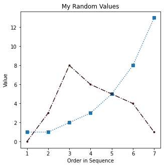
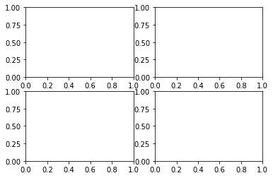
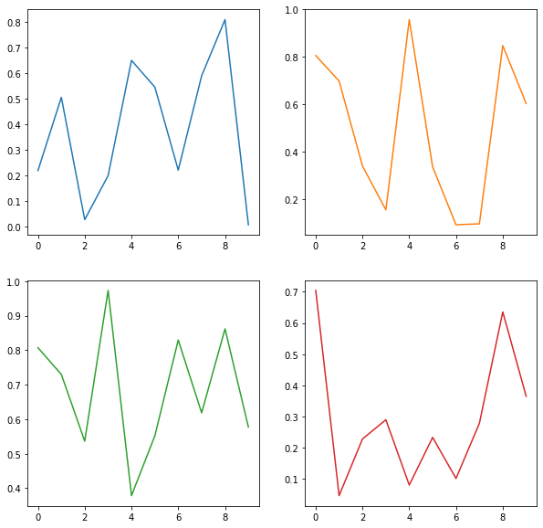
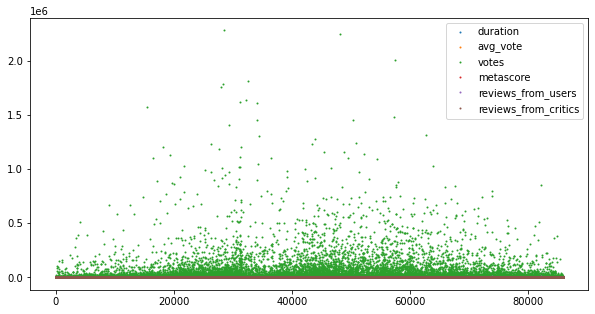
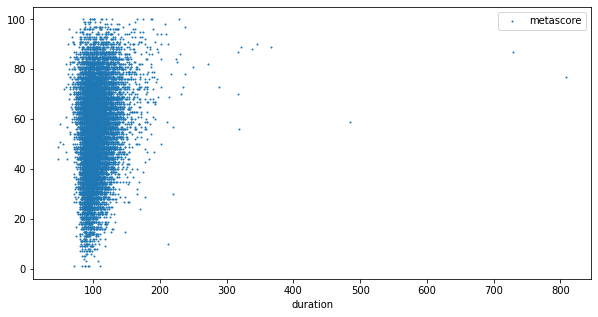
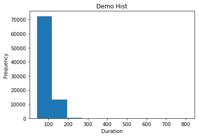
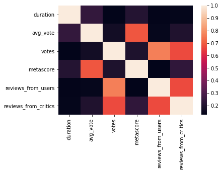

<a href="https://colab.research.google.com/github/wesleybeckner/python_foundations/blob/main/notebooks/S6_Matplotlib.ipynb" target="_parent"></a>

# Python Foundations, Session 6: Visualization
**Instructor**: Wesley Beckner

**Contact**: wesleybeckner@gmail.com
<br>

---

<br>

In this session we'll be discussing visualization strategies. And, more specifically, how we can manipulate our `pandas dataframes` to give us the visualizations we desire. Before we get there, however, we're going to start by introducing a python module called Matplotlib.

<br>

---


## 6.1 Visualization with Matplotlib

Lets start by importing our `matplotlib` module. 

Pyplot is a module of Matplotlib that provides functions to add plot elements like text, lines, and images. typically we import this module like so

```
import matplotlib.pyplot as plt
```

where `plt` is shorthand for the `matplotlib.pyplot` library


```python
import matplotlib.pyplot as plt
```

### 6.1.1 The Basics

Matplotlib is strongly object oriented and its principal objects are the **_figure_** and the **_axes_**. But before we get into that I want us to explore the _most basic_ use case. In this basic use case, we don't declare the `figure` and `axes` objects explicitly, but rather work directly in the `pyplot` namespace.

I'm going to create a list of x and y values and plot them with `pyplot`

```
x = [1,2,3,4,5,6,7]
y = [1,1,2,3,5,8,13]
plt.plot(x,y)
```


```python
x = [1,2,3,4,5,6,7]
y = [1,1,2,3,5,8,13]
plt.plot(x, y)
```


    [<matplotlib.lines.Line2D at 0x7fcd31e36250>]


    

    


We can label the axes of our figure using the `xlabel` and `ylabel` attributes, and label our title using the `title` attribute.

```
plt.plot([1,2,3,4,5,6,7],[1,1,2,3,5,8,13])
plt.title('The Fibonacci Sequence')
plt.xlabel('Order in Sequence')
plt.ylabel('Value')
```


```python
plt.plot([1,2,3,4,5,6,7],[1,1,2,3,5,8,13])
plt.title('The Fibonacci Sequence')
plt.xlabel('Order in Sequence')
plt.ylabel('Value')
```


    Text(0, 0.5, 'Value')


    

    


> What do we think about the out-of-the-box formatting of `pyplot`? What are some things we can do to make it better? Could we make it bigger? Perhaps different dimensions? Does anyone recognize that default line color?

Before we make any changes, let's become acquianted with the more appropriate way to work in `matplotlib.pyplot`. In this formality, we explicitly create our `figure` and `axes` objects.

```
# This is one way to do it...
# plt.plot([1,2,3,4,5,6,7],[1,1,2,3,5,8,13])

# but we can also do it this way, concretely declaring the figure, axes
# objects directly

# We declare the figure
fig = plt.figure()

# and then add axes 
ax = fig.add_subplot(111)
```

You can think of the `figure` as a canvas, where you specify dimensions and possibly unifying attributes of its contents, like, background color, border, etc. You use the canvas, the `figure`, to containerize your other objects, primarily your `axes`, and to save its contents with `savefig`.

You can think of an `axes` as the actual graphs or plots themselves. And when we declare these objects, we have access to all the methods of `matplotlib.pyplot` (e.g. `.plot`, `.scatter`, `.hist` etc.) You can place many of these `axes` into the `figure` container in a variety of ways.

The last component of a `pyplot` figure are the `axis`, the graphical axis we typically think of.


```python
# This is one way to do it...
# plt.plot([1,2,3,4,5,6,7],[1,1,2,3,5,8,13])

# but we can also do it this way, concretely declaring the figure, axes
# objects directly

# We declare the figure
fig = plt.figure()

# and then add axes 
ax = fig.add_subplot(111)
```


    

    


`plt.subplots` returns a `figure` and `axes` object(s) together:

```
### We can also do it in 1 line
fig, ax = plt.subplots(1, 1, figsize=(8,8))
```

and we'll go ahead and adjust the figure size with the parameter `figsize` and set it equal to a tuple containing the `x` and `y` dimensions of the figure in inches.


```python
### We can also do it in 1 line
fig, ax = plt.subplots(1, 1, figsize=(10,5))
```


    

    


To recap, by convention we typically separate our plots into three components: a Figure, its Axes, and their Axis:

* **_Figure_**: It is a whole `figure` which may contain one or more than one `axes` (plots). You can think of a `figure` as a canvas which contains plots.
* **_Axes_**: It is what we generally think of as a plot. A `figure` can contain many `axes`. It contains two or three (in the case of 3D) `axis` objects. Each `axes` has a title, an x-label and a y-label.
* **_Axis_**: They are the traditional `axis` we think of in a graph and take care of generating the graph limits.

<br> 
**Example:**
> `fig, ax = plt.subplots(1, 1, figsize=(8,8))` is creating the figure (`fig`) and axes (`ax`) explicitly, and depending on whether we create 2D or 3D plots, the axes will contain 2-3 `axis`.

#### 🏋️ Exercise 1: Adjust Figure Size

<ol type="a">
  <li>create a <code>figure</code> and <code>axes</code> using <code>plt.subplots()</code>. adjust the figure size to be 6 inches (width) by 3 inches (height). Plot the values of the fibonacci sequence we defined earlier</li>
  <li>(Bonus) Repeat, this time inverting the y-values using list splicing</li>
  <li>(Bonus) Explore other <code>plt.plot()</code> attributes using the built in Colab tooltip</li>
</ol>

Plotting building blocks for Exercise 1:
* `plt.subplots()`
* `ax.plot()`
* slicing `[::]`

```
x = [1,2,3,4,5,6,7]
y = [1,1,2,3,5,8,13]
```


```python
# Cell for Exercise 1
x = [1,2,3,4,5,6,7]
y = [1,1,2,3,5,8,13]
```

### 6.1.2 Manipulating Plot Attributes

We can manipulate many parameters of a `figure`'s `axes`: `marker`, `linestyle`, and `color`, to name a few. Each of these parameters takes string values.

```
fig, ax = plt.subplots(1,1, figsize=(5,5))
ax.plot([1,2,3,4,5,6,7],[1,1,2,3,5,8,13], marker='^', linestyle='--', 
         color='tab:blue')
ax.plot([1,2,3,4,5,6,7],[0,3,8,6,5,4,1], marker='.', linestyle='-.', 
         color='#59A41F')
ax.set_title('My Random Values')
ax.set_xlabel('Order in Sequence')
ax.set_ylabel('Value')
```

List of marker styles

```
{'': 'nothing',
 ' ': 'nothing',
 '*': 'star',
 '+': 'plus',
 ',': 'pixel',
 '.': 'point',
 0: 'tickleft',
 '1': 'tri_down',
 1: 'tickright',
 10: 'caretupbase',
 11: 'caretdownbase',
 '2': 'tri_up',
 2: 'tickup',
 '3': 'tri_left',
 3: 'tickdown',
 '4': 'tri_right',
 4: 'caretleft',
 5: 'caretright',
 6: 'caretup',
 7: 'caretdown',
 '8': 'octagon',
 8: 'caretleftbase',
 9: 'caretrightbase',
 '<': 'triangle_left',
 '>': 'triangle_right',
 'D': 'diamond',
 'H': 'hexagon2',
 'None': 'nothing',
 None: 'nothing',
 'P': 'plus_filled',
 'X': 'x_filled',
 '^': 'triangle_up',
 '_': 'hline',
 'd': 'thin_diamond',
 'h': 'hexagon1',
 'o': 'circle',
 'p': 'pentagon',
 's': 'square',
 'v': 'triangle_down',
 'x': 'x',
 '|': 'vline'}
 ```

List of line styles

```
{'': '_draw_nothing',
 ' ': '_draw_nothing',
 '-': '_draw_solid',
 '--': '_draw_dashed',
 '-.': '_draw_dash_dot',
 ':': '_draw_dotted',
 'None': '_draw_nothing'}
 ```

 List of base colors

 ```
 {'b': (0, 0, 1),
 'c': (0, 0.75, 0.75),
 'g': (0, 0.5, 0),
 'k': (0, 0, 0),
 'm': (0.75, 0, 0.75),
 'r': (1, 0, 0),
 'w': (1, 1, 1),
 'y': (0.75, 0.75, 0)}
 ```

list access

```
import matplotlib as mp
mp.markers.MarkerStyle.markers
mp.lines.lineStyles
mp.colors.BASE_COLORS
```

Taking these long lists of available parameters, I'm going to play around with a few and see how they appear in our plot.


```python
import matplotlib as mp
mp.markers.MarkerStyle.markers
# mp.lines.lineStyles
# mp.colors.BASE_COLORS
```


    {'': 'nothing',
     ' ': 'nothing',
     '*': 'star',
     '+': 'plus',
     ',': 'pixel',
     '.': 'point',
     0: 'tickleft',
     '1': 'tri_down',
     1: 'tickright',
     10: 'caretupbase',
     11: 'caretdownbase',
     '2': 'tri_up',
     2: 'tickup',
     '3': 'tri_left',
     3: 'tickdown',
     '4': 'tri_right',
     4: 'caretleft',
     5: 'caretright',
     6: 'caretup',
     7: 'caretdown',
     '8': 'octagon',
     8: 'caretleftbase',
     9: 'caretrightbase',
     '<': 'triangle_left',
     '>': 'triangle_right',
     'D': 'diamond',
     'H': 'hexagon2',
     'None': 'nothing',
     None: 'nothing',
     'P': 'plus_filled',
     'X': 'x_filled',
     '^': 'triangle_up',
     '_': 'hline',
     'd': 'thin_diamond',
     'h': 'hexagon1',
     'o': 'circle',
     'p': 'pentagon',
     's': 'square',
     'v': 'triangle_down',
     'x': 'x',
     '|': 'vline'}


```python
plt.plot([1,2,3], [4,5,6])
plt.title('title')
```


    Text(0.5, 1.0, 'title')


    

    


```python
ax.title
```


    Text(0.5, 1.0, '')


```python
fig, ax = plt.subplots(1,1, figsize=(5,5))
ax.plot([1,2,3,4,5,6,7],[1,1,2,3,5,8,13], 
        marker='s', 
        linestyle=':', 
        color='tab:blue')
ax.plot([1,2,3,4,5,6,7],[0,3,8,6,5,4,1], marker='.', 
        linestyle='-.', color='#3E1515')
ax.set_title('My Random Values')
ax.set_xlabel('Order in Sequence')
ax.set_ylabel('Value')
```


    Text(0, 0.5, 'Value')


    

    


If we want to make a *scatter plot* without any lines at all, we set the `linestyle` to an empty string

```
fig, ax = plt.subplots(1,1, figsize=(5,5))
plt.plot([1,2,3,4,5,6,7],[1,1,2,3,5,8,13], marker='*', linestyle='', color='tab:green')
ax.set_title('The Fibonacci Sequence')
ax.set_xlabel('Order in Sequence')
ax.set_ylabel('Value')
```


```python
fig, ax = plt.subplots(1,1, figsize=(5,5))
plt.plot([1,2,3,4,5,6,7],[1,1,2,3,5,8,13], marker='h', linestyle='', ms=10,
         color='tab:green')
ax.set_title('The Fibonacci Sequence')
ax.set_xlabel('Order in Sequence')
ax.set_ylabel('Value')
```


    Text(0, 0.5, 'Value')


    

    


#### 🏋️ Exercise 2: Choose Lines, Colors, and Markers

<ol type="a">
  <li>Recreate the "My Random Values" plot with a variety of markers, linestyles, and colors.</li>
  <li>(Bonus) Can you set the markers and lines to colors belonging to the Tableau 20? Try it with and without the hex values!</li>
</ol>


Plotting building blocks for Exercise 2:
* `marker=''`
* `linestyle=''`
* `color=''`


```
# Cell for Exercise 2

### DO NOT CHANGE BELOW ###
x = [1,2,3,4,5,6,7]
y1 = [1,1,2,3,5,8,13]
y2 = [0,3,8,6,5,4,1]
y3 = [10,15,12,9,3,2,1]
y4 = [2,4,2,1,2,4,5]
fig, ax = plt.subplots(1,1, figsize=(5,5))
ax.set_title('My Random Values')
ax.set_xlabel('Order in Sequence')
ax.set_ylabel('Value')
### END OF DO NOT CHANGE ###

### change these lines w/ marker, linestyle, color attributes
ax.plot(x,y1)
ax.plot(x,y2)
ax.plot(x,y3)
ax.plot(x,y4)
```


```python
# Cell for Exercise 2
 
### DO NOT CHANGE BELOW ###
x = [1,2,3,4,5,6,7]
y1 = [1,1,2,3,5,8,13]
y2 = [0,3,8,6,5,4,1]
y3 = [10,15,12,9,3,2,1]
y4 = [2,4,2,1,2,4,5]
fig, ax = plt.subplots(1,1, figsize=(5,5))
ax.set_title('My Random Values')
ax.set_xlabel('Order in Sequence')
ax.set_ylabel('Value')
### END OF DO NOT CHANGE ###
 
### change these lines w/ marker, linestyle, color attributes
ax.plot(x,y1)
ax.plot(x,y2)
ax.plot(x,y3)
ax.plot(x,y4)
```


    [<matplotlib.lines.Line2D at 0x7fcd316d14d0>]


    

    


### 6.1.3 Subplots

Remember that `fig, ax = plt.subplots()` satement we used earlier? We're now going to use that same approach but this time, the second variable that is returned (what we call `ax` in the cell bellow) is no longer an `axes` object! Instead, it is an `array` of `axes` objects.

I'm also going to introduce another module, **_random_**, to generate some random values

```
import random
fig, ax = plt.subplots(2, 2, figsize=(10,10))
ax[0,1].plot(range(10), [random.random() for i in range(10)], 
             c='tab:orange')
ax[1,0].plot(range(10), [random.random() for i in range(10)], 
             c='tab:green')
ax[1,1].plot(range(10), [random.random() for i in range(10)], 
             c='tab:red')
ax[0,0].plot(range(10), [random.random() for i in range(10)],
             c='tab:blue')
```

**_quick note:_** In the above cell we use something called **_list comprehension_** to quickly populate a list of objects (in this case those objects are floats). We won't dive too deeply into that now, but you can think of list comprehension as a more concise way of writing a `for()` loop. In future cases where list comprehension appears in this notebook I will include code snipets of the corresponding for loop.

```
import random

# this list comprehension
print([random.random() for i in range(10)])

# produces the same output as this for loop
ls = []
for i in range(10):
  ls.append(random.random())
print(ls)
```


```python
import random
random.seed(42)

# this list comprehension
print([random.random() for i in range(10)])

random.seed(42)
# produces the same output as this for loop
ls = []
for i in range(10):
  ls.append(random.random())
print(ls)
```

    [0.6394267984578837, 0.025010755222666936, 0.27502931836911926, 0.22321073814882275, 0.7364712141640124, 0.6766994874229113, 0.8921795677048454, 0.08693883262941615, 0.4219218196852704, 0.029797219438070344]
    [0.6394267984578837, 0.025010755222666936, 0.27502931836911926, 0.22321073814882275, 0.7364712141640124, 0.6766994874229113, 0.8921795677048454, 0.08693883262941615, 0.4219218196852704, 0.029797219438070344]


The second thing we'll need to talk about is the grid of the ax object


```python
fig, ax = plt.subplots(2,2)
```


    

    


```python
ax.shape
```


    (2, 2)


```python
ax
```


    array([[<matplotlib.axes._subplots.AxesSubplot object at 0x7fcd316f9210>,
            <matplotlib.axes._subplots.AxesSubplot object at 0x7fcd316490d0>],
           [<matplotlib.axes._subplots.AxesSubplot object at 0x7fcd315fb710>,
            <matplotlib.axes._subplots.AxesSubplot object at 0x7fcd315b0d50>]],
          dtype=object)


This is exactly like accessing a matrix:

`matrix[row,column] = element`

we have the pandas equivalent:

`df.iloc[0,1] = element`


```python
import random
fig, ax = plt.subplots(2, 2, figsize=(10,10))
ax[0,0].plot(range(10), [random.random() for i in range(10)],
             c='tab:blue')
ax[0,1].plot(range(10), [random.random() for i in range(10)], 
             c='tab:orange')
ax[1,0].plot(range(10), [random.random() for i in range(10)], 
             c='tab:green')
ax[1,1].plot(range(10), [random.random() for i in range(10)], 
             c='tab:red')
```


    [<matplotlib.lines.Line2D at 0x7fcd313e3a50>]


    

    


#### 🏋️ Exercise 3: Subplots

<ol type="a">
  <li>Create a 2x1 <code>figure</code> where the first <code>axes</code> is a plot of the fibonacci sequence up to the 10th sequence value and the second <code>axes</code> is a plot of 10 random integers with values between 10 and 20 (exclusive). Use different markers, colors, and lines for each plot.</li>
  <li>Since the focus of this tutorial is on visualization, I'll go ahead and provide my own code for generating random integers between 10 and 20 (exclusive). If you have extra time, prove to yourself that this code works!</li>
<li>(remember docstrings are your friend!)</li>
</ol>


```
import random
[round(random.random() * 8) + 11 for i in range(10)]
```

---

```
# Cell for Exercise 3

### DO NOT CHANGE ###

import random

# create the fig, ax objects
fig, ax = plt.subplots(1, 2, figsize=(10, 5))

# generate x, y1, and y2
x = [1, 2, 3, 4, 5, 6, 7, 8, 9, 10]
y1 = [1, 1, 2, 3, 5, 8, 13, 21, 34, 55]
y2 = [round(random.random() * 8) + 11 for i in range(10)]

### END OF DO NOT CHANGE ###

# Note: no skeleton code here is given for the figure, I want you to write this 
# code out yourself. Here is pseudo-code to get you started:

# plot the left axes, set the title and axes labels
# title: Fibonacci Sequence; xlabel: x values; ylabel: y values

### YOUR CODE HERE ###

# plot the right axes, set the title and axes labels
# title: My Random Values; xlabel: x values; ylabel: y values

### YOUR CODE HERE ###
```


```python
# Cell for Exercise 3
 
### DO NOT CHANGE ###
 
import random
 
# create the fig, ax objects
fig, ax = plt.subplots(1, 2, figsize=(10, 5))
 
# generate x, y1, and y2
x = [1, 2, 3, 4, 5, 6, 7, 8, 9, 10]
y1 = [1, 1, 2, 3, 5, 8, 13, 21, 34, 55]
y2 = [round(random.random() * 8) + 11 for i in range(10)]
 
### END OF DO NOT CHANGE ###
 
# Note: no skeleton code here is given for the figure, I want you to write this 
# code out yourself. Here is pseudo-code to get you started:
 
# plot the left axes, set the title and axes labels
# title: Fibonacci Sequence; xlabel: x values; ylabel: y values
 
### YOUR CODE HERE ###
 
# plot the right axes, set the title and axes labels
# title: My Random Values; xlabel: x values; ylabel: y values
 
### YOUR CODE HERE ###
```


    

    


## 6.2 Visualization with Pandas

Now lets discover the power of `pandas` plots! While the objectives of the exercizes may be to make certain visualizations, throughout our experience we'll be using `pandas` tricks to create the data splices we need, so in the following is a mix of new plotting stuff, with pandas data selection/splicing stuff. 

We're also going to import a new module called `seaborn`. It is another plotting library based off `matplotlib`. We're going to use it to pull some stylistic features.

```
import pandas as pd
import matplotlib.pyplot as plt
import seaborn as sns
from sklearn.datasets import load_boston
```


```python
import pandas as pd
import matplotlib.pyplot as plt
import seaborn as sns
from ipywidgets import interact
```

The following few cells should look familiar from last tutorial session, we're going to use some essential `pandas` methods to get a general sense of what our dataset looks like

> There are many ways to construct a dataframe, as an exercise, you might think of otherways to perform that task here.

```
df = pd.read_csv("https://raw.githubusercontent.com/wesleybeckner/ds_for_engineers/main/data/wine_quality/winequalityN.csv")
df.describe()
```


```python
# In your subsequent time with pandas you'll discover that there are a host of
# ways to populate a dataframe. In the following, I can create a dataframe
# simply by using read_csv because the data is formated in a way that 
# pandas can easily intuit.

df = pd.read_csv("https://raw.githubusercontent.com/wesleybeckner/"\
  "technology_explorers/main/assets/imdb_movies.csv")
```

    /usr/local/lib/python3.7/dist-packages/IPython/core/interactiveshell.py:2718: DtypeWarning: Columns (3) have mixed types.Specify dtype option on import or set low_memory=False.
      interactivity=interactivity, compiler=compiler, result=result)


```python
# we check the shape of our data to see if its as we expect 
df.shape
```


    (85855, 22)


```python
# we check the column names
df.columns
```


    Index(['imdb_title_id', 'title', 'original_title', 'year', 'date_published',
           'genre', 'duration', 'country', 'language', 'director', 'writer',
           'production_company', 'actors', 'description', 'avg_vote', 'votes',
           'budget', 'usa_gross_income', 'worlwide_gross_income', 'metascore',
           'reviews_from_users', 'reviews_from_critics'],
          dtype='object')


Lets start by looking at basic description of our data. This gives us a sense of what visualizations we can employ to begin understanding our dataset.


```python
df.describe()
```


<div>
<style scoped>
    .dataframe tbody tr th:only-of-type {
        vertical-align: middle;
    }

    .dataframe tbody tr th {
        vertical-align: top;
    }

    .dataframe thead th {
        text-align: right;
    }
</style>
<table border="1" class="dataframe">
  <thead>
    <tr style="text-align: right;">
      <th></th>
      <th>duration</th>
      <th>avg_vote</th>
      <th>votes</th>
      <th>metascore</th>
      <th>reviews_from_users</th>
      <th>reviews_from_critics</th>
    </tr>
  </thead>
  <tbody>
    <tr>
      <th>count</th>
      <td>85855.000000</td>
      <td>85855.000000</td>
      <td>8.585500e+04</td>
      <td>13305.000000</td>
      <td>78258.000000</td>
      <td>74058.000000</td>
    </tr>
    <tr>
      <th>mean</th>
      <td>100.351418</td>
      <td>5.898656</td>
      <td>9.493490e+03</td>
      <td>55.896881</td>
      <td>46.040826</td>
      <td>27.479989</td>
    </tr>
    <tr>
      <th>std</th>
      <td>22.553848</td>
      <td>1.234987</td>
      <td>5.357436e+04</td>
      <td>17.784874</td>
      <td>178.511411</td>
      <td>58.339158</td>
    </tr>
    <tr>
      <th>min</th>
      <td>41.000000</td>
      <td>1.000000</td>
      <td>9.900000e+01</td>
      <td>1.000000</td>
      <td>1.000000</td>
      <td>1.000000</td>
    </tr>
    <tr>
      <th>25%</th>
      <td>88.000000</td>
      <td>5.200000</td>
      <td>2.050000e+02</td>
      <td>43.000000</td>
      <td>4.000000</td>
      <td>3.000000</td>
    </tr>
    <tr>
      <th>50%</th>
      <td>96.000000</td>
      <td>6.100000</td>
      <td>4.840000e+02</td>
      <td>57.000000</td>
      <td>9.000000</td>
      <td>8.000000</td>
    </tr>
    <tr>
      <th>75%</th>
      <td>108.000000</td>
      <td>6.800000</td>
      <td>1.766500e+03</td>
      <td>69.000000</td>
      <td>27.000000</td>
      <td>23.000000</td>
    </tr>
    <tr>
      <th>max</th>
      <td>808.000000</td>
      <td>9.900000</td>
      <td>2.278845e+06</td>
      <td>100.000000</td>
      <td>10472.000000</td>
      <td>999.000000</td>
    </tr>
  </tbody>
</table>
</div>


```python
df.loc[:, df.dtypes == object].describe()
```


<div>
<style scoped>
    .dataframe tbody tr th:only-of-type {
        vertical-align: middle;
    }

    .dataframe tbody tr th {
        vertical-align: top;
    }

    .dataframe thead th {
        text-align: right;
    }
</style>
<table border="1" class="dataframe">
  <thead>
    <tr style="text-align: right;">
      <th></th>
      <th>imdb_title_id</th>
      <th>title</th>
      <th>original_title</th>
      <th>year</th>
      <th>date_published</th>
      <th>genre</th>
      <th>country</th>
      <th>language</th>
      <th>director</th>
      <th>writer</th>
      <th>production_company</th>
      <th>actors</th>
      <th>description</th>
      <th>budget</th>
      <th>usa_gross_income</th>
      <th>worlwide_gross_income</th>
    </tr>
  </thead>
  <tbody>
    <tr>
      <th>count</th>
      <td>85855</td>
      <td>85855</td>
      <td>85855</td>
      <td>85855</td>
      <td>85855</td>
      <td>85855</td>
      <td>85791</td>
      <td>85022</td>
      <td>85768</td>
      <td>84283</td>
      <td>81400</td>
      <td>85786</td>
      <td>83740</td>
      <td>23710</td>
      <td>15326</td>
      <td>31016</td>
    </tr>
    <tr>
      <th>unique</th>
      <td>85855</td>
      <td>82094</td>
      <td>80852</td>
      <td>168</td>
      <td>22012</td>
      <td>1257</td>
      <td>4907</td>
      <td>4377</td>
      <td>34733</td>
      <td>66859</td>
      <td>32050</td>
      <td>85729</td>
      <td>83611</td>
      <td>4642</td>
      <td>14857</td>
      <td>30414</td>
    </tr>
    <tr>
      <th>top</th>
      <td>tt0131549</td>
      <td>Anna</td>
      <td>Anna</td>
      <td>2017</td>
      <td>2010</td>
      <td>Drama</td>
      <td>USA</td>
      <td>English</td>
      <td>Jesús Franco</td>
      <td>Jing Wong</td>
      <td>Metro-Goldwyn-Mayer (MGM)</td>
      <td>Nobuyo Ôyama, Noriko Ohara, Michiko Nomura, Ka...</td>
      <td>The story of</td>
      <td>$ 1000000</td>
      <td>$ 1000000</td>
      <td>$ 8144</td>
    </tr>
    <tr>
      <th>freq</th>
      <td>1</td>
      <td>10</td>
      <td>10</td>
      <td>3223</td>
      <td>113</td>
      <td>12543</td>
      <td>28511</td>
      <td>35939</td>
      <td>87</td>
      <td>84</td>
      <td>1284</td>
      <td>9</td>
      <td>15</td>
      <td>758</td>
      <td>19</td>
      <td>15</td>
    </tr>
  </tbody>
</table>
</div>


The first thing we notice is that all the data is numerical that we can pull standard statistical information from (mean, std, max, etc.)

What kind of visualizations do you think of with data like this?

I tend to think of **scatter, box, and histogram** plots for numerical data and **bar or sunburst charts** for categorical data.

### 6.2.1 Scatter Plots

The way to generate a plot in the fewest keystrokes is to simply call the `plot()` method within the `dataframe` object

```
df.plot()
```


```python
# the simplest plot we can make is the following so let's start here. 
# We can generate a figure simply by using the plot() method of our dataframe
# object.

df.plot()
```


    <matplotlib.axes._subplots.AxesSubplot at 0x7fcd186a5390>


    

    


This gives us a raw view of the data, but here I'd like to introduce some standard plotting steps: recall the `fig`, `ax` format we used previously.

```
fig, ax = plt.subplots(1, 1, figsize = (10, 5))
df.plot(ax=ax)
```


```python
fig, ax = plt.subplots(1, 1, figsize = (10, 5))
df.plot(ax=ax)
```


    <matplotlib.axes._subplots.AxesSubplot at 0x7fcd1dad9950>


    

    


To make this into a scatter plot, we set the linestyle (or ls) to an empty string, and select a marker type.

```
fig, ax = plt.subplots(1, 1, figsize = (10, 5))
df.plot(ax=ax, linestyle='', marker='.')
```


```python
fig, ax = plt.subplots(1, 1, figsize = (10, 5))
df.plot(ax=ax, ls='', marker='.', ms=2)
```


    <matplotlib.axes._subplots.AxesSubplot at 0x7fcd1856f350>


    

    


#### 🏋️ Exercise 4: Scatter Plots with Pandas

Make a plot of duration vs metascore


```python
# Cell for Exercise 4
```


    <matplotlib.axes._subplots.AxesSubplot at 0x7fcd18498ad0>


    

    


### 6.2.2 Bar Plots

One of the more common methods of depicting aggregate data is bar plots. We almost always see these kinds of plots used to display and compare between averages, but sometimes between singular data values as well.

```
fig, ax = plt.subplots(1, 1, figsize=(10,7.5))

df.groupby('country').filter(lambda x: x.shape[0] > 100).\
   groupby('country')['duration'].mean().sort_values()\
   [-20:].plot(kind='barh', ax=ax)
```


```python
fig, ax = plt.subplots(1, 1, figsize=(10,7.5))

df.groupby('country').filter(lambda x: x.shape[0] > 100).\
   groupby('country')['duration'].mean().sort_values()\
   [-20:].plot(kind='barh', ax=ax)
```


    <matplotlib.axes._subplots.AxesSubplot at 0x7fcd08681210>


    

    


### 6.2.3 Box Plots

Maybe we thought it was usefull to see the feature data in the scatter plots ( we can visually scan for correlations between feature sets, check outliers, etc.) but perhaps more instructive, is a boxplot. A box plot or boxplot is a statistical method for graphically depicting aggregate data through their quartiles. It will be useful to inspect the [boxplot API](https://pandas.pydata.org/pandas-docs/stable/reference/api/pandas.DataFrame.boxplot.html) to see the default behavior for representing the quartiles and outliers. 

```
fig, ax = plt.subplots(1, 1, figsize = (10, 5))
df.plot(kind='box', ax=ax)
```


```python
fig, ax = plt.subplots(1, 1, figsize=(10,7.5))
df.groupby('country').filter((lambda x: (x.shape[0] > 100) & # filter by number of datapoints
                              (x['duration'].mean() < 100)) # filter by average movie time
                         ).boxplot(by='country', column='duration', rot=90, ax=ax)
```

    /usr/local/lib/python3.7/dist-packages/numpy/core/_asarray.py:83: VisibleDeprecationWarning: Creating an ndarray from ragged nested sequences (which is a list-or-tuple of lists-or-tuples-or ndarrays with different lengths or shapes) is deprecated. If you meant to do this, you must specify 'dtype=object' when creating the ndarray
      return array(a, dtype, copy=False, order=order)


    <matplotlib.axes._subplots.AxesSubplot at 0x7fcd04c5d9d0>


    

    


### 6.2.4 Histograms

What are some other kinds of plots we can make? A good one to be aware of is the histogram. 

```
plt.title('Demo Hist')
plt.xlabel('Duration')
plt.ylabel('Frequency')
plt.hist(df['duration'])
```


```python
plt.title('Demo Hist')
plt.xlabel('Duration')
plt.ylabel('Frequency')
plt.hist(df['duration'])
```


    (array([7.2368e+04, 1.3197e+04, 2.2800e+02, 4.0000e+01, 1.1000e+01,
            4.0000e+00, 4.0000e+00, 1.0000e+00, 1.0000e+00, 1.0000e+00]),
     array([ 41. , 117.7, 194.4, 271.1, 347.8, 424.5, 501.2, 577.9, 654.6,
            731.3, 808. ]),
     <a list of 10 Patch objects>)


    

    


```python
df['duration'].plot(kind='hist')
```


    <matplotlib.axes._subplots.AxesSubplot at 0x7fcd0471d210>


    

    


### 6.2.5 Kernel Density Estimates

Another useful plot type for data analysis is the kernel density estimate. You can think of this plot as exactly like a histogram, except instead of creating bins in which to accrue datapoints, you deposit a gaussian distribution around every datapoint in your dataset. By this mechanism, you avoid creating bias in your data summary as you otherwise would be when predifining bin sizes and locations in a histogram.


```python
fig, ax = plt.subplots(1, 1, figsize = (10, 5))
df['duration'].plot(kind='kde', ax=ax)
```


    <matplotlib.axes._subplots.AxesSubplot at 0x7fcd046ac7d0>


    

    


#### 6.2.5.1 **Enrichment**: Skew and Tailedness

While we're on the topic of KDEs/histograms and other statistical plots, this is a convenient time to talk about skew and tailedness or, otherwise known as kurtosis

* `df.skew()` indicates the skewdness of the data
* `df.kurtosis()` indicates the tailedness of the data


```python
# from scipy.stats import skewnorm
from ipywidgets import FloatSlider
```


```python
slider = FloatSlider(
    value=0.5,
    min=0.5,
    max=5,
    step=0.5,
    description='Shape:',
    disabled=False,
    continuous_update=False,
    orientation='horizontal',
    readout=True,
    readout_format='.1f'
)
```


```python
import numpy as np
def inspect_kurt_skew(a=slider):
  # theres another hyperparameter, lambda for the center
  # of weibull. the shape parameter is sometimes called
  # a, or k
  fig, ax = plt.subplots(1, 1, figsize=(5,5))
  s = np.random.weibull(a, 1000)
  statdf = pd.DataFrame(s)
  statdf[0].plot(kind='kde', ax=ax)
  print("skew: {:.2f}".format(statdf[0].skew()))
  print("kurtosis: {:.2f}".format(statdf[0].kurt()))
```


```python
interact(inspect_kurt_skew)
```


    interactive(children=(FloatSlider(value=0.5, continuous_update=False, description='Shape:', max=5.0, min=0.5, …


    <function __main__.inspect_kurt_skew>


### 6.2.6 Correlation Plots

Often, we'll want to quantify the strength of a relationship between input variables. We can do this by calculating correlations. 

We won't go into great detail here about how Pearson's correlation is calculated, but the StatQuest videos on this subject are here for reference (and are really good... if you can stomach Starmer's
 humor)

* [StatQuest: Correlation](https://youtu.be/xZ_z8KWkhXE?t=822)
* [StatQuest: Covariance](https://www.youtube.com/watch?v=qtaqvPAeEJY&ab_channel=StatQuestwithJoshStarmer)

The main takeaway is that pearson's correlation ranges from -1 to 1 and indicates how positively or negatively correlated the variables in question are. For our purposes, this can give insight into what variables will be important in our machine learning model.

We can get the [pearson's correlation](https://en.wikipedia.org/wiki/Pearson_correlation_coefficient) between all the input features using the `dataframe.corr()` method.


Fig: pearson's correlation value and corresponding scatter plot of feature-x and feature-y


```python
df.corr()
```


<div>
<style scoped>
    .dataframe tbody tr th:only-of-type {
        vertical-align: middle;
    }

    .dataframe tbody tr th {
        vertical-align: top;
    }

    .dataframe thead th {
        text-align: right;
    }
</style>
<table border="1" class="dataframe">
  <thead>
    <tr style="text-align: right;">
      <th></th>
      <th>duration</th>
      <th>avg_vote</th>
      <th>votes</th>
      <th>metascore</th>
      <th>reviews_from_users</th>
      <th>reviews_from_critics</th>
    </tr>
  </thead>
  <tbody>
    <tr>
      <th>duration</th>
      <td>1.000000</td>
      <td>0.242432</td>
      <td>0.125618</td>
      <td>0.210531</td>
      <td>0.130836</td>
      <td>0.135465</td>
    </tr>
    <tr>
      <th>avg_vote</th>
      <td>0.242432</td>
      <td>1.000000</td>
      <td>0.166972</td>
      <td>0.691338</td>
      <td>0.138185</td>
      <td>0.200526</td>
    </tr>
    <tr>
      <th>votes</th>
      <td>0.125618</td>
      <td>0.166972</td>
      <td>1.000000</td>
      <td>0.194730</td>
      <td>0.766237</td>
      <td>0.671635</td>
    </tr>
    <tr>
      <th>metascore</th>
      <td>0.210531</td>
      <td>0.691338</td>
      <td>0.194730</td>
      <td>1.000000</td>
      <td>0.126131</td>
      <td>0.236107</td>
    </tr>
    <tr>
      <th>reviews_from_users</th>
      <td>0.130836</td>
      <td>0.138185</td>
      <td>0.766237</td>
      <td>0.126131</td>
      <td>1.000000</td>
      <td>0.671634</td>
    </tr>
    <tr>
      <th>reviews_from_critics</th>
      <td>0.135465</td>
      <td>0.200526</td>
      <td>0.671635</td>
      <td>0.236107</td>
      <td>0.671634</td>
      <td>1.000000</td>
    </tr>
  </tbody>
</table>
</div>


So we have this raw table of pearsons correlations between each of our input features, how do we and how should we turn this into a plot?

Typically we'd use a heat map on an feature vs feature grid to view this kind of data. In the following I'm going to use some `numpy` methods you may not have seen before. Links to the documentation for these methods are at the end of the notebook.

```
import numpy as np
fig, ax = plt.subplots(1, 1, figsize = (10,10))

# create a mask to white-out the upper triangle
mask = np.triu(np.ones_like(df.corr(), dtype=bool))

# we'll want a divergent colormap for this so our eye
# is not attracted to the values close to 0
cmap = sns.diverging_palette(230, 20, as_cmap=True)

sns.heatmap(df.corr(), mask=mask, cmap=cmap, ax=ax)
```


```python
sns.heatmap(df.corr())
```


    <matplotlib.axes._subplots.AxesSubplot at 0x7fcd023a6a10>


    

    


```python
import numpy as np
fig, ax = plt.subplots(1, 1, figsize = (10,10))

# create a mask to white-out the upper triangle
mask = np.triu(np.ones_like(df.corr(), dtype=bool))

# we'll want a divergent colormap for this so our eye
# is not attracted to the values close to 0
cmap = sns.diverging_palette(230, 20, as_cmap=True)

sns.heatmap(df.corr(), mask=mask, cmap=cmap, ax=ax)
```


    <matplotlib.axes._subplots.AxesSubplot at 0x7fcd0239fc90>


    

    


What do we notice?

looks like reviews and votes are all pretty correlated. Surprising?

## 6.3 Visualization with IpyWidgets

### 6.3.1 Interact

Here we're going to introduce a very basic use case of IPython's widgets using `interact`. The `interact` method (`ipywidgets.interact`) automatically creates user interface (UI) controls for exploring code and data interactively. It is the easiest way to get started using IPython’s widgets.

```
from ipywidgets import interact
def my_plot(col=filtdf.select_dtypes('number').columns):
  fig, ax = plt.subplots(1,1,figsize=(10,5))
  filtdf.boxplot(column=col, by='country', ax=ax)
  
interact(my_plot)
```


```python
def my_plot(col=filtdf.select_dtypes('number').columns):
  fig, ax = plt.subplots(1,1,figsize=(10,5))
  filtdf.boxplot(column=col, by='country', ax=ax)
```

After defining our function that returns our plot, and defining input parameters for the fields we would like to interact with, we call our function with `interact`

```
interact(my_plot)
```

Let's say we want to look at information from the IMDb data based on country. Because there are so many countries in the database, let's filter it down to only the top 5 countries. How could we do this using `value_counts`? Let's try this below


```python
top_5_countries = df['country'].value_counts()[:5].keys() # get list of top 5 countries
filtdf = df.loc[df['country'].isin(top_5_countries)] # only select rows whose country is in the list
```


```python
filtdf.boxplot(column='duration', by='country')
```

    /usr/local/lib/python3.7/dist-packages/numpy/core/_asarray.py:83: VisibleDeprecationWarning: Creating an ndarray from ragged nested sequences (which is a list-or-tuple of lists-or-tuples-or ndarrays with different lengths or shapes) is deprecated. If you meant to do this, you must specify 'dtype=object' when creating the ndarray
      return array(a, dtype, copy=False, order=order)


    <matplotlib.axes._subplots.AxesSubplot at 0x7fccddd7dc90>


    

    


```python
interact(my_plot)
```


    interactive(children=(Dropdown(description='col', options=('duration', 'avg_vote', 'votes', 'metascore', 'revi…


    <function __main__.my_plot>


Let's break this down. Normally, I would just set my y-variable to a value, so that when I call my function, my figure is generated with the corresponding data field:


```python
def my_plot(col='duration'):
  fig, ax = plt.subplots(1,1,figsize=(10,5))
  filtdf.boxplot(column=col, by='country', ax=ax)

my_plot()
```

    /usr/local/lib/python3.7/dist-packages/numpy/core/_asarray.py:83: VisibleDeprecationWarning: Creating an ndarray from ragged nested sequences (which is a list-or-tuple of lists-or-tuples-or ndarrays with different lengths or shapes) is deprecated. If you meant to do this, you must specify 'dtype=object' when creating the ndarray
      return array(a, dtype, copy=False, order=order)


    

    


Instead, we want to give `interact()` a list of values for the user to select from, this is the difference between a regular function, and one we might feed into interact.

```
y = ['duration',
 'avg_vote',
 'votes',
 'metascore',
 'reviews_from_users',
 'reviews_from_critics']
```


```python
list(filtdf.select_dtypes('number').columns)
```


    ['duration',
     'avg_vote',
     'votes',
     'metascore',
     'reviews_from_users',
     'reviews_from_critics']


#### 🏋️ Exercise 5: IpyWidgets and Figures in Functions

In the previous section we created a single dropdown menu to select our y variable for our plot. Here, we would like to do the same thing, but this time filter your dataframe for only the top 10 directors that most frequently occur in the IMDb datafile.

When you build the interactive plot, grouby director this time instead of country.


```python
# Code block for Exercise 5
```


```python
interact(my_plot)
```


    interactive(children=(Dropdown(description='col', options=('duration', 'avg_vote', 'votes', 'metascore', 'revi…


    <function __main__.my_plot>


# References

* [`numpy.triu`](https://numpy.org/doc/stable/reference/generated/numpy.triu.html) 
* [`numpy.ones_like`](https://numpy.org/doc/stable/reference/generated/numpy.ones_like.html)
* [`ipywidgets`](https://ipywidgets.readthedocs.io/en/latest/)
* [StatQuest: Correlation](https://youtu.be/xZ_z8KWkhXE?t=822)
* [StatQuest: Covariance](https://www.youtube.com/watch?v=qtaqvPAeEJY&ab_channel=StatQuestwithJoshStarmer)


# Enrichment Topics

## 6.4 Other Plot Types


### 6.4.1 Bar Plots (Advanced)

Similar to how we created bar plots with pandas, we can use matplotlib to make barplots 
```
pokemon = ['Charmander', 'Pikachu', 'Squirtle', 'Bulbasaur']
hp = [10, 12, 8, 16]

plt.bar(pokemon, hp, color='tab:blue')
plt.title('Pokemon HP')
plt.xlabel('Pokemon')
plt.ylabel('HP')
```


```python
pokemon = ['Charmander', 'Pikachu', 'Squirtle', 'Bulbasaur']
hp = [10, 12, 8, 16]

plt.bar(pokemon, hp, color='tab:blue')
plt.title('Pokemon HP')
plt.xlabel('Pokemon')
plt.ylabel('HP')
```


    Text(0, 0.5, 'HP')


    

    


Doing the same but with horizontally oriented bars

```
pokemon = ['Charmander', 'Pikachu', 'Squirtle', 'Bulbasaur']
hp = [10, 12, 8, 16]

plt.barh(pokemon, hp, color='tab:blue')
plt.title('Pokemon HP')
plt.ylabel('Pokemon')
plt.xlabel('HP')
```


```python
pokemon = ['Charmander', 'Pikachu', 'Squirtle', 'Bulbasaur']
hp = [10, 12, 8, 16]

plt.barh(pokemon, hp, color='tab:blue')
plt.title('Pokemon HP')
plt.ylabel('Pokemon')
plt.xlabel('HP')
```


    Text(0.5, 0, 'HP')


    

    


We can also add error bars

```
pokemon = ['Charmander', 'Pikachu', 'Squirtle', 'Bulbasaur']
hp = [10, 12, 8, 16]
variance = [i * random.random()*.25 for i in hp]

plt.barh(pokemon, hp, xerr=variance, color='tab:blue')
plt.title('Pokemon HP')
plt.ylabel('Pokemon')
plt.xlabel('HP')
```

for loop version of list comprehension

```
hp = [10, 12, 8, 16]
variance = []
for i in hp:
  variance.append(i * random.random()*.25)
print(variance)
```


```python
pokemon = ['Charmander', 'Pikachu', 'Squirtle', 'Bulbasaur']
hp = [10, 12, 8, 16]
variance = [i * random.random()*.25 for i in hp]

plt.barh(pokemon, hp, xerr=variance, color='tab:blue')
plt.title('Pokemon HP')
plt.ylabel('Pokemon')
plt.xlabel('HP')
```


    Text(0.5, 0, 'HP')


    

    


### 6.4.2 3D Plots

You can also create 3D plots in matplotlib using `ax.scatter3D`

```
ax = plt.axes(projection='3d')
ax.scatter3D(range(10),[i*random.random()*.25 for i in range(10)])
```

for loop version of list comprehension:
```
ls = []
for i in range(10):
  ls.append(i*random.random()*.25)
print(ls)
```


```python
ax = plt.axes(projection='3d')
ax.scatter3D(range(10),[i*random.random()*.25 for i in range(10)])
```


    <mpl_toolkits.mplot3d.art3d.Path3DCollection at 0x7fdf86d241d0>


    

    


## 6.5 Visualization with Plotly

Another great plotting library, that is gaining in popularity (especially in enterprise settings) is plotly. As an added exercise, if you have additional time, explore some of the [plotly examples](https://plotly.com/python/) then recreate the breakout room assignment using plotly instead of matplotlib.

### 6.5.1 Scatter Plot with Size and Color


```python
import plotly.express as px
```


```python
x = 'quality'
y = 'alcohol'
color = 'quality'
size = 'alcohol'
corr = df.corr()
pearson = corr[x][y]
fig = px.scatter(df, x=x, y=y, color=color, size=size,
                title='{} vs {} ({:.2f} corr)'.format(x, y, pearson),
                width=800, height=800)
fig.show()
```


<html>
<head><meta charset="utf-8" /></head>
<body>
    <div>
            <script src="https://cdnjs.cloudflare.com/ajax/libs/mathjax/2.7.5/MathJax.js?config=TeX-AMS-MML_SVG"></script><script type="text/javascript">if (window.MathJax) {MathJax.Hub.Config({SVG: {font: "STIX-Web"}});}</script>
                <script type="text/javascript">window.PlotlyConfig = {MathJaxConfig: 'local'};</script>
        <script src="https://cdn.plot.ly/plotly-latest.min.js"></script>    
            <div id="9fe7e498-9dd8-4f23-b6dc-b2f404ecb8f4" class="plotly-graph-div" style="height:800px; width:800px;"></div>
            <script type="text/javascript">

                    window.PLOTLYENV=window.PLOTLYENV || {};

                if (document.getElementById("9fe7e498-9dd8-4f23-b6dc-b2f404ecb8f4")) {
                    Plotly.newPlot(
                        '9fe7e498-9dd8-4f23-b6dc-b2f404ecb8f4',
                        [{"hoverlabel": {"namelength": 0}, "hovertemplate": "quality=%{marker.color}<br>alcohol=%{marker.size}", "legendgroup": "", "marker": {"color": [6, 6, 6, 6, 6, 6, 6, 6, 6, 6, 5, 5, 5, 7, 5, 7, 6, 8, 6, 5, 8, 7, 8, 5, 6, 6, 6, 6, 6, 7, 6, 6, 6, 6, 5, 5, 5, 6, 5, 5, 6, 6, 6, 6, 6, 7, 4, 5, 6, 5, 6, 7, 7, 6, 6, 6, 6, 6, 6, 6, 6, 6, 5, 6, 6, 5, 7, 5, 8, 5, 6, 5, 5, 6, 8, 5, 7, 7, 5, 5, 6, 6, 5, 6, 5, 6, 6, 6, 5, 6, 6, 5, 7, 7, 7, 6, 6, 7, 4, 6, 5, 5, 5, 5, 5, 6, 5, 6, 6, 5, 6, 5, 5, 5, 5, 4, 6, 6, 5, 5, 5, 5, 5, 6, 6, 6, 5, 7, 7, 6, 5, 7, 5, 5, 5, 5, 6, 5, 7, 6, 5, 5, 6, 6, 6, 6, 6, 4, 7, 6, 7, 6, 6, 5, 6, 6, 6, 7, 8, 8, 7, 5, 5, 6, 5, 5, 6, 7, 5, 5, 6, 6, 4, 7, 5, 6, 4, 5, 4, 6, 6, 5, 5, 6, 5, 5, 6, 5, 8, 4, 6, 5, 6, 5, 5, 6, 5, 5, 5, 5, 5, 5, 5, 6, 4, 5, 5, 4, 5, 6, 5, 7, 5, 6, 7, 5, 5, 5, 5, 5, 5, 6, 7, 6, 6, 5, 6, 6, 6, 5, 4, 6, 6, 6, 6, 6, 6, 6, 7, 6, 5, 5, 7, 6, 5, 6, 7, 7, 7, 5, 4, 3, 5, 3, 6, 8, 7, 7, 6, 4, 6, 5, 5, 6, 6, 5, 6, 5, 6, 6, 6, 5, 5, 5, 5, 6, 6, 5, 4, 7, 8, 8, 4, 5, 5, 5, 6, 7, 7, 7, 7, 6, 5, 7, 3, 6, 5, 7, 6, 6, 6, 6, 6, 6, 6, 6, 5, 6, 7, 6, 7, 8, 6, 6, 5, 6, 6, 5, 7, 6, 7, 5, 6, 6, 5, 5, 6, 6, 6, 5, 8, 5, 6, 5, 5, 6, 6, 6, 5, 7, 7, 6, 6, 5, 6, 6, 7, 6, 6, 5, 7, 7, 6, 7, 6, 6, 6, 6, 6, 6, 6, 5, 6, 6, 7, 7, 6, 6, 6, 5, 6, 6, 5, 6, 7, 7, 7, 7, 6, 7, 7, 6, 6, 6, 7, 7, 7, 5, 6, 7, 7, 5, 6, 6, 5, 5, 5, 6, 5, 6, 6, 5, 5, 5, 6, 5, 7, 5, 6, 5, 6, 6, 5, 5, 6, 6, 6, 5, 6, 6, 7, 6, 6, 6, 7, 6, 6, 5, 5, 5, 5, 5, 7, 4, 8, 7, 5, 8, 7, 5, 7, 6, 8, 6, 6, 3, 5, 6, 6, 7, 5, 5, 7, 7, 7, 6, 7, 5, 6, 5, 5, 5, 5, 6, 5, 5, 6, 6, 5, 5, 6, 5, 6, 7, 6, 5, 7, 6, 6, 6, 5, 6, 5, 5, 5, 6, 6, 6, 6, 6, 6, 7, 6, 6, 6, 6, 4, 6, 5, 4, 6, 6, 6, 5, 6, 6, 5, 7, 6, 7, 6, 6, 6, 6, 7, 6, 5, 6, 6, 5, 5, 5, 6, 6, 5, 6, 4, 6, 6, 6, 6, 5, 6, 6, 6, 5, 5, 6, 5, 6, 4, 5, 6, 6, 6, 6, 6, 6, 7, 5, 7, 7, 7, 7, 7, 7, 5, 6, 5, 6, 7, 5, 6, 7, 5, 6, 6, 5, 6, 6, 5, 7, 5, 7, 7, 6, 6, 7, 7, 7, 5, 5, 6, 6, 7, 6, 6, 7, 7, 6, 5, 6, 5, 5, 5, 7, 5, 6, 8, 7, 6, 6, 5, 5, 6, 6, 5, 5, 5, 6, 8, 6, 5, 5, 5, 5, 7, 6, 6, 6, 5, 5, 6, 5, 5, 8, 4, 6, 6, 6, 5, 5, 6, 5, 6, 6, 7, 5, 5, 5, 7, 4, 6, 5, 5, 5, 4, 6, 5, 7, 7, 7, 7, 6, 7, 6, 6, 5, 5, 4, 5, 7, 4, 5, 6, 5, 6, 6, 6, 5, 6, 6, 8, 6, 5, 6, 6, 7, 7, 7, 5, 5, 6, 5, 5, 5, 7, 4, 6, 7, 4, 6, 5, 5, 6, 5, 6, 5, 5, 5, 5, 7, 4, 6, 6, 5, 5, 6, 6, 5, 5, 6, 6, 5, 6, 7, 6, 5, 7, 7, 5, 5, 6, 8, 7, 5, 7, 5, 5, 5, 6, 6, 7, 6, 5, 6, 6, 5, 7, 6, 3, 6, 6, 5, 5, 6, 6, 6, 6, 6, 6, 6, 6, 6, 5, 7, 5, 6, 7, 7, 6, 6, 5, 6, 6, 6, 5, 6, 7, 7, 7, 7, 7, 5, 9, 6, 6, 5, 7, 8, 4, 6, 7, 8, 5, 6, 6, 6, 7, 6, 6, 7, 5, 7, 5, 5, 6, 6, 6, 8, 6, 5, 5, 7, 6, 6, 5, 6, 6, 6, 5, 6, 7, 6, 6, 5, 5, 5, 5, 5, 9, 6, 5, 6, 5, 6, 6, 9, 7, 7, 6, 4, 8, 6, 6, 8, 8, 8, 8, 7, 7, 7, 7, 7, 8, 8, 5, 5, 7, 6, 7, 5, 7, 5, 7, 7, 5, 5, 7, 5, 8, 7, 6, 6, 5, 6, 7, 8, 7, 6, 5, 5, 6, 3, 5, 7, 9, 6, 6, 8, 7, 6, 6, 6, 6, 7, 6, 7, 6, 7, 6, 7, 5, 7, 7, 6, 6, 6, 6, 6, 7, 6, 5, 6, 8, 4, 4, 8, 4, 5, 5, 5, 5, 5, 4, 5, 7, 6, 6, 7, 7, 6, 6, 6, 8, 5, 5, 7, 5, 5, 7, 5, 6, 5, 5, 5, 5, 5, 6, 7, 5, 6, 7, 7, 7, 7, 5, 5, 4, 5, 5, 6, 6, 5, 6, 5, 5, 7, 7, 6, 6, 7, 6, 6, 6, 5, 6, 6, 7, 7, 7, 7, 6, 7, 6, 5, 6, 5, 7, 5, 6, 7, 6, 6, 5, 6, 6, 6, 5, 7, 6, 4, 5, 4, 6, 6, 5, 6, 6, 7, 7, 5, 6, 7, 6, 6, 6, 5, 7, 6, 6, 7, 6, 5, 5, 5, 5, 6, 6, 6, 7, 7, 8, 6, 6, 6, 6, 4, 7, 4, 6, 6, 6, 6, 3, 6, 5, 5, 7, 5, 4, 5, 4, 5, 7, 5, 5, 5, 5, 6, 5, 6, 5, 4, 5, 5, 6, 5, 6, 4, 7, 5, 5, 5, 6, 5, 6, 7, 7, 6, 7, 5, 7, 5, 6, 7, 6, 5, 5, 6, 7, 6, 6, 6, 7, 5, 8, 8, 6, 7, 6, 6, 6, 7, 5, 8, 6, 7, 6, 7, 6, 6, 5, 5, 5, 7, 8, 7, 7, 4, 7, 6, 6, 5, 4, 8, 5, 5, 5, 5, 6, 6, 7, 5, 5, 6, 7, 7, 5, 7, 6, 6, 5, 5, 5, 6, 8, 8, 5, 5, 6, 5, 5, 5, 5, 5, 5, 5, 6, 5, 5, 5, 4, 6, 4, 4, 6, 6, 6, 6, 6, 6, 7, 6, 6, 5, 5, 6, 5, 6, 6, 5, 6, 5, 6, 5, 7, 6, 5, 5, 5, 6, 5, 6, 7, 5, 5, 8, 6, 5, 6, 7, 6, 7, 6, 6, 7, 7, 6, 7, 6, 7, 5, 6, 6, 5, 6, 5, 6, 6, 6, 5, 6, 6, 6, 5, 8, 5, 8, 8, 6, 7, 6, 5, 7, 6, 7, 5, 6, 3, 6, 7, 7, 6, 6, 5, 6, 5, 7, 5, 6, 7, 7, 7, 5, 4, 7, 6, 7, 5, 7, 5, 6, 7, 5, 6, 6, 6, 6, 6, 6, 6, 6, 6, 5, 7, 8, 7, 5, 6, 7, 5, 5, 5, 6, 6, 7, 5, 6, 6, 6, 7, 5, 8, 7, 6, 7, 7, 7, 6, 6, 6, 6, 4, 4, 6, 6, 7, 6, 5, 6, 5, 6, 6, 5, 7, 8, 5, 6, 6, 6, 6, 5, 5, 6, 6, 6, 5, 6, 5, 6, 6, 6, 5, 6, 7, 6, 6, 6, 5, 5, 6, 7, 8, 6, 6, 8, 5, 5, 6, 6, 5, 6, 6, 8, 8, 7, 7, 8, 4, 7, 7, 6, 5, 5, 5, 6, 6, 8, 7, 6, 7, 7, 4, 5, 7, 6, 5, 6, 5, 6, 7, 6, 6, 7, 7, 6, 6, 7, 6, 7, 7, 6, 6, 6, 5, 7, 6, 7, 6, 6, 6, 6, 6, 7, 7, 7, 7, 7, 6, 7, 6, 8, 8, 5, 4, 8, 6, 7, 6, 6, 6, 8, 6, 6, 5, 6, 3, 5, 7, 4, 6, 5, 4, 6, 6, 6, 5, 7, 5, 4, 5, 7, 6, 5, 5, 5, 7, 5, 5, 5, 5, 5, 6, 6, 6, 6, 6, 6, 6, 6, 5, 6, 7, 5, 5, 6, 6, 6, 6, 6, 6, 6, 6, 8, 5, 6, 7, 5, 5, 7, 6, 5, 6, 4, 6, 5, 6, 6, 6, 6, 6, 6, 4, 3, 6, 6, 6, 6, 5, 6, 5, 5, 8, 8, 7, 5, 7, 6, 6, 7, 5, 5, 7, 8, 7, 6, 6, 6, 5, 5, 6, 7, 6, 7, 6, 6, 6, 6, 5, 6, 5, 5, 6, 6, 5, 6, 6, 6, 6, 5, 7, 7, 6, 6, 6, 5, 6, 6, 6, 6, 4, 6, 6, 5, 6, 6, 6, 6, 6, 6, 6, 7, 7, 7, 7, 6, 6, 4, 4, 6, 5, 7, 6, 5, 6, 5, 5, 6, 5, 5, 6, 6, 5, 4, 6, 6, 4, 5, 4, 5, 6, 7, 5, 6, 5, 5, 6, 5, 6, 6, 6, 6, 6, 6, 6, 5, 6, 6, 6, 6, 6, 5, 7, 5, 9, 6, 7, 5, 7, 6, 6, 7, 7, 5, 6, 6, 6, 6, 8, 7, 5, 6, 6, 7, 6, 6, 5, 6, 6, 5, 6, 8, 7, 6, 6, 5, 6, 5, 5, 5, 6, 7, 7, 7, 7, 6, 7, 5, 4, 7, 6, 4, 6, 5, 5, 5, 6, 5, 5, 6, 6, 7, 6, 4, 8, 5, 6, 7, 6, 6, 7, 5, 5, 6, 5, 7, 6, 6, 5, 5, 6, 7, 7, 7, 7, 5, 7, 3, 6, 4, 7, 6, 5, 6, 6, 6, 6, 6, 6, 6, 5, 4, 5, 5, 6, 6, 5, 4, 5, 5, 5, 6, 6, 5, 8, 6, 6, 4, 6, 7, 7, 6, 8, 6, 6, 6, 6, 5, 6, 6, 6, 5, 6, 6, 6, 5, 6, 5, 4, 6, 6, 6, 6, 5, 5, 5, 6, 5, 6, 6, 7, 6, 7, 6, 6, 5, 5, 5, 5, 6, 6, 7, 6, 5, 5, 5, 5, 5, 7, 6, 6, 6, 6, 6, 6, 5, 6, 8, 8, 5, 4, 6, 6, 7, 6, 7, 7, 5, 7, 5, 5, 6, 5, 5, 6, 5, 8, 6, 6, 6, 5, 6, 6, 6, 5, 5, 6, 5, 6, 6, 5, 6, 6, 7, 6, 7, 4, 6, 6, 6, 5, 7, 6, 5, 5, 5, 6, 6, 7, 7, 7, 7, 7, 6, 5, 6, 7, 6, 6, 5, 7, 6, 6, 6, 5, 5, 5, 5, 6, 7, 6, 7, 5, 7, 6, 4, 5, 5, 6, 6, 6, 7, 5, 6, 6, 6, 6, 7, 7, 6, 6, 5, 5, 5, 5, 6, 6, 6, 6, 5, 6, 5, 5, 5, 6, 5, 5, 5, 5, 5, 5, 5, 5, 5, 6, 6, 6, 6, 7, 6, 5, 6, 5, 6, 6, 5, 7, 7, 5, 5, 6, 6, 6, 6, 7, 5, 6, 6, 6, 7, 5, 5, 5, 4, 6, 6, 5, 6, 5, 6, 3, 6, 5, 6, 5, 6, 7, 5, 5, 5, 5, 5, 5, 5, 6, 6, 5, 7, 5, 5, 4, 7, 6, 5, 5, 5, 6, 6, 5, 5, 5, 5, 6, 5, 6, 6, 7, 6, 7, 6, 7, 5, 5, 5, 6, 5, 6, 6, 6, 8, 8, 8, 8, 8, 6, 6, 5, 6, 7, 4, 8, 5, 6, 6, 6, 6, 6, 6, 6, 5, 5, 6, 6, 6, 6, 6, 6, 5, 7, 6, 5, 5, 6, 5, 6, 7, 5, 7, 6, 6, 6, 6, 6, 5, 5, 5, 5, 6, 6, 6, 5, 6, 5, 5, 5, 6, 5, 5, 5, 6, 5, 6, 6, 6, 5, 5, 5, 5, 7, 3, 5, 5, 5, 5, 6, 5, 7, 5, 5, 5, 6, 5, 5, 6, 5, 5, 5, 6, 7, 6, 6, 5, 5, 6, 5, 5, 6, 6, 4, 5, 5, 6, 5, 6, 6, 5, 6, 6, 6, 5, 5, 5, 5, 5, 5, 5, 5, 6, 5, 5, 6, 5, 5, 5, 5, 5, 6, 6, 6, 5, 5, 5, 5, 6, 5, 4, 5, 6, 4, 5, 7, 5, 5, 7, 5, 5, 5, 6, 5, 5, 6, 6, 6, 6, 5, 6, 5, 5, 5, 5, 5, 5, 7, 6, 6, 6, 5, 5, 6, 6, 5, 6, 6, 4, 5, 4, 6, 6, 4, 6, 7, 6, 6, 5, 5, 5, 7, 7, 7, 7, 7, 5, 5, 7, 7, 5, 7, 5, 6, 6, 6, 5, 5, 6, 7, 5, 5, 6, 6, 6, 5, 6, 6, 6, 5, 6, 6, 5, 6, 5, 6, 5, 5, 5, 5, 6, 7, 5, 6, 7, 6, 6, 6, 5, 6, 5, 6, 6, 7, 6, 6, 7, 6, 7, 4, 5, 5, 7, 6, 7, 6, 6, 5, 5, 6, 5, 4, 6, 6, 5, 5, 5, 5, 5, 7, 4, 6, 6, 5, 6, 7, 5, 5, 6, 6, 5, 6, 5, 6, 5, 6, 6, 5, 6, 5, 5, 6, 6, 6, 7, 6, 6, 5, 7, 4, 6, 6, 6, 5, 6, 6, 5, 5, 5, 5, 5, 5, 5, 7, 7, 6, 6, 7, 7, 6, 7, 6, 8, 7, 7, 5, 5, 5, 6, 7, 5, 5, 5, 6, 5, 7, 5, 7, 6, 6, 7, 5, 4, 7, 6, 5, 6, 6, 5, 6, 5, 6, 5, 5, 6, 5, 6, 8, 5, 5, 5, 4, 5, 6, 6, 5, 8, 5, 6, 6, 4, 6, 6, 5, 5, 6, 6, 7, 6, 7, 6, 5, 5, 5, 6, 5, 6, 5, 5, 5, 5, 6, 6, 6, 7, 5, 4, 3, 6, 6, 6, 6, 5, 4, 4, 6, 8, 6, 8, 5, 4, 4, 4, 8, 8, 6, 7, 6, 5, 5, 5, 6, 6, 6, 4, 4, 6, 6, 5, 5, 6, 6, 5, 4, 6, 6, 4, 4, 4, 5, 6, 5, 5, 5, 7, 5, 5, 6, 5, 6, 6, 6, 6, 6, 5, 5, 5, 6, 6, 4, 5, 6, 5, 6, 5, 6, 5, 5, 5, 5, 5, 6, 6, 6, 5, 5, 7, 6, 5, 6, 6, 6, 6, 5, 5, 5, 5, 7, 5, 5, 5, 6, 6, 5, 5, 7, 6, 6, 7, 5, 6, 7, 6, 6, 5, 6, 6, 6, 5, 6, 5, 6, 6, 6, 6, 5, 6, 4, 4, 5, 5, 5, 5, 6, 5, 5, 4, 4, 6, 6, 6, 7, 6, 5, 6, 6, 6, 5, 7, 7, 6, 6, 7, 5, 5, 7, 8, 5, 5, 8, 7, 6, 6, 5, 6, 4, 4, 5, 7, 6, 6, 6, 6, 5, 5, 6, 5, 6, 6, 6, 5, 5, 6, 5, 5, 6, 5, 7, 7, 7, 5, 7, 7, 5, 6, 5, 6, 5, 6, 5, 7, 5, 6, 6, 5, 6, 5, 5, 5, 6, 5, 5, 7, 6, 5, 7, 7, 7, 7, 7, 7, 6, 7, 4, 6, 7, 5, 5, 7, 5, 5, 6, 5, 6, 7, 5, 6, 7, 7, 6, 6, 6, 6, 6, 5, 5, 7, 5, 5, 7, 7, 7, 7, 6, 5, 5, 7, 7, 5, 5, 7, 7, 6, 5, 6, 7, 5, 5, 5, 6, 5, 5, 6, 6, 6, 5, 5, 5, 6, 7, 7, 5, 6, 6, 5, 5, 7, 5, 5, 5, 4, 7, 7, 6, 6, 6, 6, 8, 7, 5, 7, 7, 6, 5, 7, 7, 7, 6, 7, 7, 6, 6, 5, 6, 6, 6, 6, 5, 6, 7, 6, 5, 6, 6, 6, 6, 6, 6, 6, 6, 6, 5, 6, 6, 7, 5, 5, 5, 6, 6, 6, 5, 6, 5, 5, 5, 5, 6, 6, 6, 5, 6, 6, 6, 7, 5, 7, 6, 6, 5, 6, 6, 6, 7, 5, 5, 5, 7, 6, 6, 6, 7, 5, 7, 6, 5, 6, 6, 6, 7, 6, 6, 8, 6, 8, 6, 6, 8, 5, 5, 6, 5, 6, 6, 6, 5, 5, 6, 6, 6, 6, 6, 6, 5, 7, 6, 7, 7, 8, 8, 8, 6, 7, 5, 5, 6, 6, 6, 6, 5, 6, 5, 5, 5, 6, 5, 5, 7, 5, 8, 7, 5, 7, 7, 5, 5, 6, 8, 8, 6, 5, 5, 6, 7, 7, 5, 6, 7, 7, 5, 5, 7, 4, 6, 5, 5, 5, 6, 6, 6, 6, 7, 7, 5, 5, 5, 6, 7, 6, 6, 6, 6, 7, 7, 6, 6, 6, 6, 5, 7, 7, 5, 5, 5, 5, 5, 5, 6, 6, 7, 7, 8, 7, 6, 6, 6, 6, 6, 6, 6, 7, 7, 5, 6, 7, 6, 7, 8, 7, 6, 5, 5, 6, 6, 5, 7, 5, 7, 7, 6, 5, 5, 4, 6, 8, 6, 5, 7, 7, 5, 5, 5, 5, 5, 6, 7, 5, 6, 7, 5, 5, 6, 6, 6, 5, 5, 7, 5, 6, 6, 6, 7, 6, 5, 4, 6, 8, 6, 6, 5, 8, 7, 7, 6, 8, 8, 6, 6, 5, 4, 5, 5, 8, 8, 6, 5, 5, 8, 6, 8, 6, 6, 6, 6, 5, 5, 5, 5, 7, 5, 6, 6, 5, 7, 7, 6, 5, 7, 5, 8, 6, 6, 5, 6, 5, 5, 6, 6, 6, 6, 6, 6, 6, 7, 7, 7, 6, 6, 6, 7, 7, 7, 7, 6, 7, 7, 7, 7, 7, 6, 8, 6, 7, 7, 7, 7, 7, 7, 6, 6, 6, 7, 7, 6, 5, 6, 6, 6, 6, 6, 6, 6, 8, 6, 6, 4, 5, 6, 6, 7, 6, 5, 6, 8, 8, 6, 5, 6, 6, 7, 5, 6, 6, 6, 5, 6, 6, 6, 6, 6, 6, 5, 6, 5, 4, 5, 7, 5, 6, 6, 5, 5, 5, 6, 5, 5, 8, 5, 5, 6, 5, 4, 6, 8, 8, 7, 6, 5, 5, 7, 5, 5, 5, 5, 6, 5, 6, 7, 6, 6, 7, 3, 6, 7, 6, 6, 6, 7, 6, 6, 7, 5, 7, 7, 7, 6, 6, 7, 5, 6, 6, 6, 5, 4, 6, 7, 5, 6, 6, 6, 7, 7, 7, 5, 6, 5, 6, 5, 6, 5, 7, 5, 6, 6, 6, 5, 6, 6, 6, 6, 5, 6, 6, 6, 6, 7, 6, 5, 6, 6, 6, 6, 6, 6, 6, 6, 6, 6, 6, 7, 5, 7, 7, 6, 6, 5, 7, 7, 6, 6, 6, 7, 6, 6, 6, 6, 8, 8, 8, 6, 6, 5, 6, 4, 6, 6, 5, 6, 7, 6, 4, 7, 8, 5, 7, 6, 6, 5, 5, 6, 7, 6, 7, 7, 7, 6, 7, 7, 5, 7, 7, 6, 5, 5, 5, 6, 5, 6, 6, 6, 5, 5, 4, 7, 5, 6, 6, 6, 6, 7, 6, 6, 6, 7, 6, 6, 5, 6, 6, 6, 6, 7, 5, 7, 6, 7, 6, 7, 7, 5, 6, 6, 7, 7, 6, 6, 8, 8, 5, 6, 6, 6, 6, 6, 6, 5, 7, 8, 6, 3, 6, 6, 6, 5, 5, 7, 7, 7, 5, 4, 8, 7, 5, 6, 5, 6, 7, 6, 6, 7, 7, 7, 6, 5, 5, 8, 5, 7, 6, 5, 5, 5, 6, 7, 5, 8, 6, 7, 7, 7, 7, 3, 6, 7, 7, 7, 7, 7, 6, 7, 6, 6, 7, 5, 5, 6, 7, 6, 6, 7, 5, 7, 5, 6, 6, 6, 7, 6, 6, 6, 6, 6, 6, 6, 6, 6, 5, 7, 6, 6, 6, 6, 6, 6, 6, 6, 6, 6, 7, 6, 6, 7, 6, 6, 7, 6, 6, 6, 6, 7, 6, 6, 6, 7, 6, 6, 6, 7, 5, 6, 6, 6, 8, 5, 7, 7, 7, 6, 6, 6, 8, 5, 6, 7, 6, 8, 6, 6, 5, 5, 6, 6, 5, 6, 6, 5, 6, 5, 6, 6, 6, 5, 6, 3, 7, 6, 6, 6, 7, 7, 6, 4, 6, 7, 5, 8, 8, 5, 6, 6, 6, 6, 6, 5, 6, 6, 5, 7, 6, 6, 6, 5, 5, 5, 5, 5, 7, 6, 5, 8, 6, 6, 7, 8, 7, 7, 5, 6, 5, 6, 5, 7, 7, 6, 6, 8, 6, 7, 5, 6, 6, 5, 8, 6, 8, 6, 6, 8, 6, 6, 8, 7, 6, 7, 8, 5, 8, 7, 8, 7, 6, 6, 6, 8, 7, 6, 7, 7, 6, 7, 7, 6, 6, 7, 7, 6, 5, 7, 7, 7, 6, 7, 5, 6, 6, 7, 6, 6, 6, 7, 7, 7, 5, 7, 5, 7, 5, 5, 6, 6, 6, 6, 4, 7, 5, 5, 6, 6, 5, 5, 6, 5, 7, 6, 6, 6, 6, 6, 6, 6, 6, 6, 6, 6, 6, 6, 6, 6, 6, 6, 7, 6, 6, 4, 6, 5, 6, 5, 6, 6, 6, 6, 7, 6, 6, 4, 6, 6, 6, 7, 5, 7, 4, 7, 5, 7, 6, 6, 7, 7, 7, 6, 6, 6, 7, 5, 7, 7, 7, 7, 7, 6, 7, 6, 6, 7, 6, 7, 6, 5, 5, 6, 6, 6, 5, 6, 6, 6, 5, 6, 5, 5, 7, 6, 7, 7, 6, 6, 7, 5, 5, 5, 6, 6, 6, 6, 6, 6, 7, 6, 7, 7, 7, 6, 6, 6, 6, 6, 7, 6, 7, 7, 5, 6, 4, 6, 6, 6, 6, 7, 7, 8, 7, 8, 8, 6, 4, 6, 8, 8, 7, 8, 5, 7, 6, 7, 8, 7, 5, 6, 7, 6, 5, 7, 6, 8, 7, 6, 7, 6, 5, 5, 6, 8, 7, 6, 7, 7, 5, 6, 7, 6, 6, 5, 5, 5, 6, 6, 6, 6, 6, 6, 5, 5, 5, 6, 5, 5, 4, 6, 5, 6, 5, 5, 7, 5, 5, 7, 6, 6, 7, 7, 7, 5, 6, 6, 5, 6, 5, 6, 4, 5, 6, 7, 7, 7, 7, 7, 7, 7, 5, 6, 5, 6, 7, 5, 5, 5, 8, 6, 5, 5, 5, 6, 6, 7, 5, 5, 8, 5, 5, 5, 6, 5, 4, 6, 6, 5, 5, 6, 5, 6, 7, 7, 5, 6, 6, 5, 6, 7, 5, 5, 5, 6, 5, 5, 6, 6, 5, 6, 6, 5, 5, 5, 5, 6, 5, 6, 5, 6, 5, 5, 6, 6, 3, 5, 5, 5, 5, 7, 5, 6, 6, 6, 5, 6, 6, 5, 7, 6, 6, 5, 6, 7, 7, 5, 5, 6, 5, 5, 6, 6, 5, 5, 6, 6, 6, 7, 6, 5, 6, 5, 6, 5, 6, 7, 6, 7, 6, 6, 6, 6, 6, 5, 5, 6, 6, 6, 7, 6, 6, 5, 6, 6, 6, 6, 4, 5, 5, 7, 5, 5, 5, 4, 6, 6, 5, 6, 6, 6, 6, 6, 6, 6, 6, 5, 5, 5, 6, 6, 6, 6, 7, 5, 5, 4, 6, 6, 7, 7, 7, 7, 7, 7, 6, 6, 7, 6, 7, 7, 6, 5, 7, 6, 6, 5, 7, 5, 5, 5, 6, 5, 5, 5, 6, 6, 8, 4, 6, 5, 6, 5, 6, 6, 5, 5, 6, 6, 6, 6, 6, 7, 5, 5, 5, 5, 6, 7, 5, 6, 5, 5, 6, 6, 6, 5, 7, 7, 5, 4, 6, 4, 6, 6, 7, 6, 6, 4, 6, 7, 7, 6, 7, 6, 5, 7, 7, 6, 7, 6, 6, 6, 6, 6, 6, 5, 7, 7, 7, 5, 7, 7, 6, 6, 6, 5, 6, 6, 7, 6, 6, 5, 6, 6, 6, 7, 6, 6, 6, 5, 5, 6, 6, 5, 4, 5, 5, 6, 6, 6, 6, 5, 6, 6, 5, 5, 5, 6, 5, 6, 5, 5, 5, 4, 5, 5, 7, 7, 7, 7, 7, 6, 6, 6, 7, 6, 5, 7, 7, 6, 5, 6, 6, 6, 5, 5, 6, 5, 5, 8, 6, 5, 6, 6, 5, 6, 7, 5, 4, 6, 5, 6, 6, 6, 6, 6, 6, 5, 8, 6, 6, 6, 6, 6, 6, 6, 6, 6, 7, 6, 5, 6, 5, 6, 6, 5, 5, 7, 7, 7, 5, 6, 6, 6, 5, 6, 6, 6, 6, 6, 6, 6, 8, 7, 5, 6, 6, 6, 7, 5, 5, 5, 5, 7, 6, 5, 5, 6, 6, 5, 6, 5, 6, 7, 6, 6, 6, 6, 6, 6, 7, 7, 6, 7, 5, 6, 6, 5, 5, 5, 5, 7, 7, 7, 7, 7, 7, 5, 5, 7, 7, 8, 6, 7, 7, 5, 6, 5, 6, 7, 6, 6, 7, 5, 6, 6, 6, 7, 7, 5, 5, 6, 6, 5, 6, 5, 6, 6, 6, 8, 6, 5, 5, 6, 6, 6, 6, 5, 6, 6, 6, 7, 6, 6, 6, 6, 4, 4, 5, 5, 5, 4, 6, 5, 6, 6, 4, 4, 7, 5, 7, 7, 6, 6, 6, 6, 6, 6, 6, 5, 5, 5, 5, 7, 6, 6, 7, 6, 5, 5, 6, 6, 6, 6, 6, 6, 6, 4, 5, 5, 5, 5, 6, 6, 6, 7, 6, 6, 6, 6, 7, 7, 6, 5, 6, 5, 6, 6, 6, 6, 7, 5, 4, 6, 6, 5, 5, 6, 6, 6, 6, 5, 6, 6, 5, 5, 6, 5, 5, 5, 6, 6, 6, 6, 5, 5, 6, 6, 6, 6, 6, 7, 6, 6, 6, 5, 6, 6, 7, 7, 5, 7, 7, 7, 5, 6, 7, 6, 6, 5, 5, 5, 5, 5, 5, 5, 8, 8, 8, 8, 8, 8, 8, 8, 8, 6, 6, 6, 6, 6, 6, 7, 6, 5, 6, 6, 5, 6, 6, 6, 5, 6, 5, 6, 5, 6, 6, 5, 6, 5, 6, 5, 6, 6, 5, 5, 6, 6, 5, 6, 5, 6, 5, 5, 6, 6, 6, 6, 5, 5, 6, 6, 6, 4, 5, 5, 5, 6, 6, 5, 5, 5, 5, 5, 5, 6, 6, 5, 5, 5, 7, 6, 5, 7, 5, 7, 7, 7, 7, 5, 5, 6, 6, 6, 6, 6, 6, 6, 6, 6, 6, 5, 6, 6, 5, 6, 6, 5, 6, 6, 6, 6, 5, 5, 5, 6, 5, 5, 6, 6, 6, 6, 5, 6, 6, 5, 5, 6, 6, 5, 5, 5, 7, 5, 6, 6, 6, 6, 5, 5, 5, 5, 6, 6, 6, 6, 5, 5, 6, 6, 6, 5, 5, 5, 5, 5, 6, 4, 5, 6, 6, 6, 6, 6, 6, 6, 6, 6, 6, 6, 6, 5, 5, 6, 6, 6, 6, 7, 5, 5, 6, 5, 4, 5, 6, 6, 6, 6, 5, 6, 6, 6, 6, 6, 5, 5, 6, 5, 6, 6, 6, 6, 6, 6, 6, 6, 6, 5, 6, 6, 6, 5, 6, 5, 6, 6, 5, 5, 6, 6, 6, 6, 5, 5, 6, 6, 6, 6, 6, 5, 5, 6, 6, 7, 6, 6, 7, 7, 7, 5, 5, 5, 6, 6, 6, 7, 7, 6, 7, 7, 5, 6, 7, 6, 6, 6, 6, 6, 6, 6, 6, 6, 5, 6, 6, 6, 6, 6, 6, 6, 6, 6, 6, 7, 6, 6, 6, 6, 6, 6, 5, 6, 7, 4, 6, 5, 5, 5, 5, 7, 5, 7, 7, 5, 6, 7, 7, 6, 6, 5, 6, 6, 6, 7, 7, 7, 6, 6, 6, 6, 5, 6, 5, 6, 6, 6, 7, 6, 6, 7, 7, 7, 5, 5, 5, 7, 5, 7, 7, 7, 7, 7, 6, 6, 6, 5, 6, 7, 7, 6, 5, 7, 7, 5, 6, 5, 5, 7, 7, 6, 6, 7, 6, 5, 4, 6, 6, 6, 6, 5, 4, 6, 6, 6, 6, 7, 5, 6, 7, 7, 6, 7, 6, 5, 5, 6, 6, 7, 6, 6, 7, 6, 6, 6, 7, 6, 6, 6, 7, 6, 6, 6, 6, 6, 5, 6, 6, 6, 6, 6, 6, 6, 6, 5, 5, 6, 6, 6, 6, 6, 6, 7, 6, 6, 5, 6, 6, 5, 5, 3, 6, 6, 5, 6, 5, 6, 7, 6, 6, 6, 7, 7, 6, 6, 6, 6, 7, 7, 6, 8, 8, 7, 6, 6, 6, 6, 5, 7, 4, 6, 6, 6, 6, 4, 5, 5, 6, 6, 5, 7, 8, 8, 5, 6, 6, 6, 6, 6, 5, 7, 7, 6, 5, 6, 7, 7, 8, 7, 4, 6, 6, 6, 5, 6, 5, 6, 7, 5, 6, 7, 6, 6, 6, 6, 5, 6, 6, 7, 5, 6, 6, 6, 5, 7, 6, 6, 5, 6, 7, 6, 5, 6, 6, 4, 7, 6, 6, 5, 6, 5, 6, 7, 6, 5, 6, 5, 5, 5, 6, 6, 6, 6, 5, 6, 6, 6, 6, 7, 5, 6, 6, 6, 6, 6, 7, 6, 5, 6, 6, 6, 7, 5, 4, 6, 6, 6, 5, 6, 5, 6, 7, 7, 5, 6, 6, 6, 5, 6, 5, 6, 7, 6, 5, 5, 5, 6, 5, 5, 5, 7, 7, 5, 5, 5, 5, 5, 5, 5, 7, 5, 4, 6, 6, 5, 5, 5, 6, 5, 5, 5, 5, 6, 5, 6, 5, 6, 5, 6, 6, 7, 4, 5, 5, 4, 6, 5, 5, 4, 5, 5, 5, 5, 5, 6, 6, 5, 6, 5, 5, 5, 5, 6, 5, 5, 7, 5, 5, 5, 5, 5, 5, 6, 6, 5, 5, 4, 5, 5, 5, 6, 5, 4, 5, 5, 5, 5, 6, 5, 6, 5, 5, 5, 5, 6, 5, 5, 4, 6, 5, 5, 5, 6, 6, 6, 6, 5, 5, 5, 5, 5, 6, 5, 5, 5, 5, 6, 5, 6, 6, 6, 6, 6, 5, 6, 5, 5, 5, 5, 5, 5, 7, 5, 5, 5, 5, 6, 6, 5, 5, 5, 5, 5, 5, 5, 6, 5, 6, 5, 5, 5, 6, 6, 6, 4, 5, 5, 5, 5, 5, 5, 5, 6, 5, 4, 6, 5, 5, 5, 5, 4, 6, 5, 4, 6, 6, 6, 5, 5, 5, 6, 5, 5, 5, 5, 5, 5, 6, 5, 5, 5, 5, 5, 5, 6, 5, 5, 5, 5, 5, 6, 7, 4, 7, 5, 5, 5, 6, 7, 7, 5, 5, 7, 6, 6, 6, 5, 6, 5, 5, 5, 5, 5, 6, 5, 5, 6, 4, 6, 6, 5, 6, 5, 7, 6, 6, 5, 6, 6, 6, 6, 6, 6, 5, 6, 6, 7, 7, 6, 5, 5, 6, 6, 6, 6, 5, 5, 6, 5, 5, 5, 5, 7, 5, 4, 5, 5, 5, 7, 4, 8, 6, 6, 6, 6, 5, 5, 5, 6, 6, 6, 8, 7, 6, 7, 5, 7, 5, 5, 6, 6, 7, 5, 7, 5, 6, 6, 6, 5, 5, 5, 5, 5, 6, 6, 5, 5, 5, 6, 5, 6, 6, 6, 6, 6, 6, 5, 5, 6, 5, 6, 7, 6, 7, 5, 5, 6, 6, 6, 7, 5, 6, 5, 6, 6, 6, 5, 7, 7, 6, 5, 6, 7, 6, 6, 6, 6, 6, 5, 7, 6, 6, 6, 6, 6, 5, 5, 6, 6, 5, 7, 7, 6, 5, 6, 5, 5, 7, 6, 7, 5, 5, 7, 5, 6, 6, 5, 6, 7, 6, 7, 6, 6, 6, 6, 6, 6, 5, 6, 6, 6, 6, 7, 8, 6, 5, 5, 5, 7, 5, 6, 6, 5, 5, 6, 6, 6, 5, 6, 6, 7, 6, 4, 6, 5, 5, 7, 5, 5, 6, 5, 6, 5, 7, 7, 5, 7, 5, 7, 6, 6, 5, 6, 7, 5, 6, 5, 6, 5, 6, 6, 6, 5, 8, 6, 7, 7, 7, 6, 5, 5, 6, 6, 6, 6, 6, 7, 5, 8, 5, 5, 7, 3, 6, 5, 5, 5, 6, 5, 6, 6, 6, 5, 5, 6, 6, 5, 6, 5, 5, 6, 5, 6, 5, 8, 5, 5, 6, 5, 5, 6, 7, 6, 6, 7, 7, 6, 6, 8, 6, 5, 8, 6, 6, 7, 7, 7, 7, 7, 7, 6, 6, 7, 5, 6, 6, 7, 7, 5, 6, 3, 6, 5, 6, 5, 5, 5, 5, 5, 5, 6, 6, 5, 6, 5, 5, 6, 6, 6, 5, 6, 7, 5, 5, 6, 5, 6, 6, 5, 6, 6, 6, 6, 6, 6, 6, 5, 5, 5, 6, 5, 6, 6, 5, 5, 5, 6, 6, 5, 6, 6, 6, 6, 6, 6, 5, 4, 6, 6, 4, 5, 5, 6, 5, 5, 5, 7, 7, 6, 7, 5, 8, 7, 5, 6, 5, 5, 5, 5, 6, 6, 6, 6, 4, 6, 5, 6, 6, 6, 7, 6, 6, 6, 5, 5, 6, 5, 6, 5, 5, 6, 5, 5, 5, 5, 5, 6, 5, 5, 5, 5, 6, 5, 6, 5, 6, 4, 5, 5, 5, 5, 7, 6, 5, 5, 5, 5, 5, 7, 5, 4, 7, 6, 5, 5, 5, 6, 5, 5, 5, 7, 6, 4, 6, 5, 6, 6, 5, 5, 6, 6, 5, 6, 5, 5, 5, 5, 6, 5, 6, 5, 5, 5, 5, 6, 5, 5, 5, 5, 5, 5, 5, 5, 3, 5, 5, 5, 5, 6, 6, 6, 5, 6, 6, 6, 6, 4, 4, 5, 5, 5, 6, 6, 5, 5, 5, 5, 5, 6, 5, 5, 5, 5, 5, 5, 5, 5, 4, 5, 6, 5, 5, 6, 5, 5, 5, 5, 5, 5, 5, 6, 5, 5, 6, 5, 5, 5, 5, 6, 6, 5, 6, 6, 5, 5, 5, 5, 6, 6, 6, 5, 5, 5, 5, 5, 6, 5, 6, 6, 5, 5, 6, 5, 6, 5, 5, 6, 6, 5, 6, 6, 5, 5, 6, 5, 5, 5, 5, 5, 5, 6, 6, 5, 6, 5, 6, 5, 6, 5, 5, 7, 6, 6, 5, 5, 7, 6, 6, 7, 7, 7, 5, 6, 5, 6, 5, 4, 6, 5, 6, 6, 5, 5, 5, 7, 5, 5, 5, 5, 7, 5, 8, 6, 4, 6, 3, 4, 5, 5, 7, 7, 7, 5, 7, 5, 6, 5, 6, 5, 5, 6, 5, 5, 5, 5, 5, 6, 6, 7, 6, 7, 7, 6, 5, 6, 5, 5, 5, 5, 6, 6, 6, 6, 6, 5, 4, 7, 7, 7, 4, 6, 6, 5, 5, 6, 6, 5, 6, 5, 6, 7, 6, 5, 5, 5, 6, 5, 6, 6, 7, 6, 7, 3, 5, 7, 7, 7, 7, 5, 5, 6, 6, 6, 6, 6, 6, 7, 6, 6, 5, 6, 6, 6, 5, 6, 6, 6, 5, 7, 6, 4, 5, 7, 5, 5, 6, 5, 5, 6, 6, 4, 7, 5, 7, 7, 7, 7, 7, 7, 7, 7, 7, 7, 7, 7, 7, 7, 6, 5, 6, 6, 7, 5, 6, 5, 5, 6, 6, 6, 7, 5, 6, 5, 6, 6, 7, 5, 7, 5, 5, 5, 7, 5, 6, 5, 6, 6, 5, 6, 7, 5, 5, 6, 5, 5, 6, 5, 5, 6, 7, 7, 6, 6, 7, 7, 7, 7, 5, 7, 7, 7, 7, 5, 7, 6, 5, 6, 6, 6, 7, 6, 6, 5, 6, 6, 5, 6, 7, 6, 6, 5, 6, 7, 7, 7, 5, 6, 6, 7, 7, 5, 7, 6, 5, 6, 6, 7, 6, 6, 6, 5, 6, 6, 5, 5, 5, 7, 6, 6, 7, 5, 7, 7, 6, 8, 6, 6, 6, 6, 7, 7, 7, 5, 7, 5, 6, 6, 5, 7, 6, 5, 5, 7, 6, 7, 6, 6, 6, 5, 7, 6, 7, 7, 8, 6, 6, 7, 6, 5, 6, 5, 7, 5, 6, 6, 6, 6, 6, 5, 6, 7, 5, 6, 6, 7, 6, 6, 6, 6, 6, 6, 6, 5, 8, 6, 6, 6, 4, 7, 6, 6, 5, 6, 6, 5, 7, 7, 7, 6, 6, 6, 5, 6, 6, 6, 6, 6, 5, 6, 6, 7, 6, 6, 7, 6, 5, 6, 6, 5, 7, 7, 6, 5, 7, 6, 7, 5, 5, 5, 5, 7, 6, 6, 6, 6, 6, 6, 6, 6, 4, 7, 5, 6, 6, 5, 6, 5, 5, 6, 5, 6, 5, 4, 6, 5, 7, 5, 6, 6, 6, 6, 6, 6, 6, 7, 8, 5, 7, 7, 7, 5, 7, 7, 6, 5, 6, 6, 6, 6, 6, 6, 6, 6, 6, 6, 6, 6, 6, 5, 5, 5, 7, 5, 6, 5, 5, 4, 6, 4, 6, 6, 4, 4, 5, 5, 6, 5, 6, 5, 5, 5, 6, 6, 6, 5, 5, 5, 5, 5, 5, 6, 6, 6, 5, 4, 5, 4, 6, 6, 6, 6, 6, 8, 6, 6, 5, 5, 6, 6, 4, 6, 6, 7, 6, 6, 6, 6, 5, 5, 6, 5, 5, 5, 5, 6, 6, 4, 6, 5, 5, 6, 6, 3, 6, 6, 6, 5, 5, 5, 5, 4, 5, 5, 5, 6, 5, 6, 6, 6, 6, 6, 6, 6, 5, 6, 5, 7, 6, 6, 6, 6, 5, 6, 6, 5, 6, 5, 5, 6, 5, 5, 5, 6, 6, 6, 6, 6, 5, 6, 5, 5, 5, 5, 5, 6, 5, 5, 5, 5, 5, 6, 5, 6, 5, 5, 6, 4, 6, 5, 5, 6, 6, 4, 5, 6, 5, 5, 3, 5, 5, 6, 6, 6, 6, 5, 5, 5, 5, 5, 5, 5, 5, 5, 6, 5, 5, 5, 5, 6, 5, 5, 7, 6, 5, 5, 6, 8, 6, 7, 6, 6, 7, 6, 6, 6, 6, 5, 5, 5, 5, 7, 5, 5, 5, 5, 6, 4, 6, 6, 6, 5, 5, 5, 5, 6, 6, 7, 6, 6, 5, 5, 5, 6, 7, 6, 5, 5, 6, 6, 5, 5, 5, 8, 7, 7, 7, 5, 6, 6, 6, 5, 5, 7, 6, 4, 6, 6, 5, 5, 7, 4, 7, 3, 5, 5, 6, 5, 5, 7, 5, 7, 3, 5, 4, 5, 4, 5, 4, 5, 5, 5, 5, 6, 6, 5, 5, 5, 7, 6, 5, 6, 6, 6, 5, 5, 5, 6, 6, 3, 6, 6, 6, 5, 6, 5, 6, 6, 6, 6, 5, 6, 5, 5, 6, 4, 5, 5, 6, 5, 6, 6, 6, 6, 6, 5, 6, 5, 7, 6, 6, 6, 5, 5, 6, 7, 6, 6, 7, 6, 5, 5, 5, 8, 5, 5, 6, 5, 6, 7, 5, 6, 5, 5, 5, 5, 5, 5, 5, 6, 6, 5, 5, 6, 6, 6, 5, 6, 6, 6, 6, 6, 6, 5, 6, 5, 5, 5, 7, 6, 6, 6, 6, 5, 6, 6, 6, 6, 5, 6, 6, 5, 6], "coloraxis": "coloraxis", "size": [8.8, 9.5, 10.1, 9.9, 9.9, 10.1, 9.6, 8.8, 9.5, 11.0, 12.0, 9.7, 10.8, 12.4, 9.7, 11.4, 9.6, 12.8, 11.3, 9.5, 12.8, 11.0, 10.5, 9.3, 10.0, 10.4, 10.0, 10.5, 11.6, 12.3, 10.0, 10.2, 10.8, 9.0, 10.2, 12.8, 10.0, 11.2, 8.6, 8.6, 9.4, 9.4, 9.8, 9.5, 9.5, 10.0, 9.8, 9.8, 9.8, 9.8, 11.7, 11.0, 10.9, 10.9, 9.1, 11.0, 9.6, 8.9, 10.2, 9.9, 8.6, 8.9, 10.5, 10.2, 10.3, 9.1, 12.6, 9.8, 10.7, 9.5, 9.0, 9.5, 10.0, 9.1, 10.7, 9.5, 12.7, 12.0, 9.3, 9.0, 10.6, 9.2, 10.0, 9.5, 8.7, 8.7, 8.7, 9.7, 8.7, 8.7, 8.7, 9.0, 12.6, 12.6, 11.5, 9.2, 8.8, 11.4, 10.1, 8.8, 9.1, 9.4, 9.4, 9.0, 9.1, 9.2, 9.4, 9.1, 9.1, 10.3, 8.8, 8.9, 9.2, 9.1, 9.1, 9.7, 11.3, 11.8, 9.2, 9.2, 10.2, 8.8, 9.7, 9.1, 9.8, 11.0, 10.5, 9.7, 10.9, 10.9, 10.6, 9.7, 9.0, 9.2, 8.9, 9.6, 10.7, 8.7, 10.8, 11.8, 10.2, 8.7, 10.8, 9.7, 11.2, 10.9, 10.1, 9.0, 12.0, 9.4, 11.5, 9.9, 9.4, 10.4, 9.7, 8.9, 8.9, 12.4, 12.1, 12.1, 12.4, 9.1, 10.6, 8.9, 9.5, 9.8, 9.6, 12.6, 9.3, 10.0, 12.7, 11.0, 11.4, 11.5, 10.2, 11.4, 12.6, 9.4, 8.7, 9.2, 9.3, 9.2, 8.7, 9.6, 9.3, 9.3, 9.9, 11.0, 12.7, 8.9, 8.9, 8.7, 11.4, 9.6, 9.1, 9.1, 9.1, 8.9, 8.8, 8.9, 9.3, 8.8, 9.6, 12.0, 10.2, 8.8, 9.2, 9.9, 10.2, 9.5, 10.5, 11.2, 9.2, 9.7, 11.1, 9.4, 11.0, 9.4, 9.4, 11.0, 11.0, 9.1, 11.1, 9.1, 10.4, 8.7, 9.7, 9.1, 9.7, 8.7, 8.9, 9.6, 9.5, 9.0, 9.0, 9.0, 9.0, 9.6, 11.1, 9.6, 8.7, 10.4, 11.4, 9.7, 8.7, 11.3, 12.6, 10.9, 10.9, 10.0, 10.0, 9.8, 8.7, 11.7, 9.3, 9.6, 11.0, 11.0, 11.8, 11.4, 10.2, 8.9, 10.2, 9.6, 10.6, 8.9, 9.2, 9.7, 9.7, 9.7, 9.2, 9.7, 9.3, 9.0, 9.5, 9.8, 9.8, 10.6, 10.6, 12.4, 12.6, 12.3, 10.5, 9.3, 8.8, 8.8, 9.7, 9.0, 9.0, 9.0, 9.0, 10.5, 9.1, 9.8, 8.5, 9.4, 9.4, 11.2, 10.0, 10.3, 10.8, 10.5, 10.8, 11.1, 9.9, 9.9, 9.9, 9.9, 10.4, 10.4, 11.5, 12.5, 10.0, 10.0, 10.0, 9.1, 10.6, 10.5, 11.5, 10.1, 10.3, 10.5, 10.6, 10.4, 11.4, 10.5, 10.0, 10.0, 9.6, 10.4, 12.5, 10.6, 11.8, 9.8, 10.8, 11.8, 11.2, 9.3, 10.4, 10.2, 9.0, 10.0, 9.1, 10.0, 10.0, 9.6, 11.2, 8.8, 10.0, 10.0, 11.4, 11.9, 9.6, 11.9, 9.6, 9.0, 9.0, 9.5, 10.4, 10.6, 10.2, 8.9, 9.7, 9.0, 11.4, 12.3, 10.8, 9.4, 10.6, 11.6, 9.4, 10.6, 10.0, 9.2, 12.5, 12.5, 10.4, 10.0, 10.0, 10.4, 10.0, 9.0, 9.2, 9.2, 11.3, 12.5, 10.8, 10.1, 9.7, 9.3, 9.3, 10.6, 10.2, 12.2, 8.8, 10.0, 11.4, 11.4, 9.4, 11.7, 11.4, 8.8, 9.2, 8.7, 12.6, 10.0, 12.8, 9.4, 10.3, 11.4, 9.0, 9.6, 10.5, 10.5, 9.0, 9.6, 9.8, 9.0, 9.8, 10.5, 12.7, 10.4, 10.4, 10.4, 10.5, 10.4, 10.4, 9.4, 9.1, 9.3, 9.4, 9.8, 9.9, 9.2, 12.1, 12.2, 9.8, 12.4, 9.9, 9.2, 11.6, 10.4, 12.9, 9.3, 11.0, 11.5, 12.4, 9.8, 9.8, 10.5, 9.1, 10.1, 10.6, 10.5, 10.5, 9.8, 12.9, 9.5, 9.8, 8.5, 9.5, 9.3, 9.5, 9.4, 8.7, 8.9, 9.4, 9.4, 8.7, 9.6, 9.3, 10.0, 12.5, 9.6, 9.4, 9.5, 12.4, 10.5, 9.2, 10.4, 9.2, 10.6, 9.5, 9.2, 9.6, 9.7, 9.7, 10.7, 10.5, 8.9, 12.1, 12.7, 9.9, 11.4, 10.7, 12.5, 8.6, 12.5, 10.0, 8.6, 9.5, 9.6, 9.9, 9.9, 8.9, 8.9, 8.8, 10.0, 12.0, 10.0, 10.0, 12.1, 11.0, 11.2, 10.3, 10.4, 9.1, 10.4, 10.8, 11.7, 9.8, 9.8, 11.4, 11.2, 11.4, 9.2, 12.5, 12.6, 12.2, 11.2, 9.7, 9.3, 9.0, 9.0, 9.0, 9.1, 9.1, 9.0, 10.4, 9.5, 11.4, 8.7, 9.9, 9.9, 9.0, 10.0, 9.7, 11.8, 10.2, 8.7, 9.6, 11.3, 12.1, 9.6, 12.1, 11.3, 9.4, 10.4, 9.5, 12.3, 9.9, 10.1, 9.2, 10.4, 9.1, 10.0, 11.5, 9.8, 9.8, 9.4, 8.7, 11.6, 8.8, 12.7, 11.7, 10.2, 10.2, 12.7, 11.6, 12.3, 8.7, 9.4, 10.1, 9.7, 10.1, 9.7, 8.9, 10.8, 10.8, 9.5, 9.1, 10.9, 9.4, 10.8, 10.8, 10.5, 9.4, 10.8, 10.5, 11.5, 9.4, 10.8, 10.8, 10.8, 9.8, 9.8, 9.6, 9.6, 9.5, 10.7, 12.4, 11.1, 8.8, 8.7, 8.7, 8.8, 11.7, 10.9, 10.8, 9.6, 9.0, 9.0, 10.4, 11.4, 9.3, 11.0, 9.1, 9.4, 9.4, 10.5, 8.8, 8.8, 10.7, 9.5, 10.9, 10.8, 10.8, 9.2, 10.3, 10.3, 11.0, 9.0, 10.4, 9.5, 9.5, 9.0, 9.5, 9.0, 10.0, 9.1, 9.1, 9.1, 9.1, 9.5, 11.4, 12.2, 11.3, 10.2, 11.3, 10.0, 9.4, 12.2, 9.2, 9.4, 9.6, 9.5, 12.5, 9.6, 10.0, 9.3, 9.3, 11.6, 12.5, 10.6, 9.4, 9.1, 9.0, 11.8, 11.8, 11.8, 10.0, 9.7, 9.5, 9.4, 11.2, 9.0, 10.7, 9.0, 9.1, 10.8, 10.1, 9.9, 9.8, 9.8, 9.5, 9.5, 11.1, 9.5, 9.5, 9.4, 9.7, 13.9, 10.1, 10.5, 12.6, 10.9, 10.0, 11.2, 10.0, 9.2, 9.5, 12.3, 12.3, 10.0, 10.8, 10.5, 9.2, 9.1, 10.5, 10.2, 8.9, 10.4, 11.7, 12.4, 10.9, 10.2, 11.7, 9.4, 10.5, 9.4, 10.4, 9.5, 11.1, 9.1, 9.2, 9.6, 9.1, 9.2, 10.8, 9.6, 12.6, 11.0, 10.2, 9.4, 10.0, 12.2, 10.5, 11.5, 9.8, 11.4, 11.5, 10.2, 9.4, 10.5, 9.1, 12.2, 9.5, 9.3, 9.8, 9.8, 9.8, 9.8, 8.7, 10.2, 9.5, 11.0, 9.2, 10.9, 9.3, 9.3, 9.8, 9.3, 9.3, 9.4, 10.4, 12.1, 11.0, 9.0, 9.5, 8.8, 11.2, 9.3, 9.5, 8.8, 9.0, 9.3, 9.2, 9.2, 10.0, 9.3, 9.2, 10.9, 10.0, 10.9, 9.3, 9.0, 9.2, 9.6, 9.4, 11.1, 8.9, 9.3, 9.3, 9.8, 9.8, 8.9, 9.6, 9.6, 9.0, 9.5, 9.3, 9.2, 9.1, 9.5, 10.5, 9.0, 11.7, 9.1, 9.0, 9.1, 12.4, 9.2, 9.4, 9.6, 11.7, 9.8, 10.2, 12.5, 10.9, 11.0, 10.5, 11.5, 12.8, 12.2, 10.5, 12.8, 11.9, 11.9, 11.9, 12.0, 12.0, 8.8, 8.8, 10.8, 11.0, 11.0, 9.3, 10.8, 8.8, 11.5, 10.8, 9.4, 9.5, 8.6, 9.5, 10.3, 9.4, 9.4, 10.0, 9.4, 10.4, 9.1, 9.9, 12.1, 9.9, 12.5, 9.5, 8.5, 9.0, 10.1, 9.4, 8.6, 10.7, 9.6, 10.1, 10.0, 12.7, 10.2, 8.9, 11.9, 10.0, 9.9, 11.5, 11.5, 9.8, 12.2, 11.4, 11.0, 11.4, 11.0, 9.9, 11.0, 9.4, 12.2, 11.0, 10.3, 10.5, 10.5, 10.9, 10.5, 11.0, 9.7, 8.9, 9.6, 8.8, 11.1, 10.3, 12.2, 9.8, 8.8, 9.9, 9.9, 9.9, 9.2, 9.5, 9.2, 10.3, 11.0, 11.9, 10.2, 9.4, 8.9, 8.9, 10.0, 10.7, 9.8, 9.3, 9.5, 10.0, 9.0, 11.9, 8.9, 10.0, 9.6, 8.9, 8.9, 11.4, 9.0, 10.0, 9.6, 9.7, 9.5, 10.0, 12.2, 8.7, 10.2, 9.6, 10.0, 9.5, 11.5, 9.5, 9.8, 10.1, 10.0, 9.8, 9.5, 9.5, 10.2, 10.2, 9.0, 9.0, 12.3, 9.0, 11.6, 9.5, 11.5, 9.6, 9.0, 12.0, 11.4, 12.3, 12.6, 9.0, 12.0, 11.7, 9.2, 10.3, 8.6, 10.7, 9.8, 9.8, 10.7, 12.5, 11.9, 10.8, 10.5, 10.3, 10.3, 10.8, 12.0, 10.2, 10.2, 9.9, 10.1, 9.5, 10.5, 10.4, 9.5, 9.2, 10.1, 9.8, 9.4, 9.4, 10.4, 11.3, 10.8, 11.3, 9.3, 10.3, 10.5, 10.3, 11.2, 10.3, 9.5, 8.9, 10.2, 9.2, 10.3, 10.5, 9.5, 11.4, 11.4, 11.1, 10.5, 12.0, 9.7, 10.2, 9.5, 10.4, 9.3, 10.5, 10.0, 10.2, 10.2, 9.1, 10.2, 10.7, 9.7, 9.3, 11.0, 10.8, 10.7, 10.7, 8.8, 10.9, 10.5, 10.0, 10.4, 9.2, 12.6, 9.0, 9.2, 11.3, 10.3, 10.4, 10.0, 10.7, 9.0, 10.7, 8.7, 11.6, 9.4, 9.5, 9.5, 10.9, 9.7, 9.1, 11.1, 12.6, 11.0, 11.3, 9.7, 10.9, 10.9, 9.3, 12.7, 10.1, 10.0, 9.8, 10.1, 9.0, 9.4, 9.4, 9.2, 10.1, 8.6, 11.2, 11.2, 9.2, 10.6, 9.3, 8.9, 10.6, 10.6, 8.8, 11.0, 10.2, 10.1, 10.1, 14.0, 9.4, 11.8, 11.4, 10.7, 8.6, 11.5, 11.2, 12.6, 12.6, 9.3, 12.6, 12.1, 9.9, 10.7, 10.0, 10.4, 10.5, 9.7, 10.5, 9.0, 9.2, 10.1, 11.4, 10.8, 10.9, 9.2, 12.9, 12.0, 9.5, 11.8, 9.1, 9.7, 9.1, 10.0, 10.4, 9.5, 12.3, 11.7, 9.5, 11.5, 10.6, 10.2, 9.5, 10.5, 10.5, 8.9, 10.6, 9.5, 10.8, 9.5, 8.9, 8.9, 9.4, 10.6, 9.0, 10.5, 9.0, 9.0, 9.4, 9.0, 9.6, 9.0, 10.2, 9.4, 10.4, 10.4, 9.5, 10.6, 11.0, 9.6, 9.9, 9.6, 12.8, 11.4, 10.0, 9.1, 9.4, 10.2, 9.2, 9.4, 9.6, 10.1, 11.4, 10.6, 12.8, 8.9, 9.3, 11.1, 9.9, 9.6, 12.8, 10.7, 9.2, 9.1, 9.6, 9.2, 10.7, 9.1, 9.2, 10.7, 10.8, 10.8, 9.0, 10.7, 10.7, 9.4, 8.8, 9.0, 11.5, 12.5, 10.5, 9.7, 11.3, 10.7, 10.8, 10.6, 11.7, 9.2, 11.1, 11.7, 11.0, 12.5, 10.0, 10.6, 12.3, 12.7, 12.3, 10.5, 12.5, 12.4, 8.7, 12.4, 12.6, 11.0, 10.1, 10.5, 12.7, 10.9, 13.5, 9.7, 9.2, 10.6, 13.3, 13.5, 10.1, 9.4, 10.6, 11.3, 10.8, 10.4, 10.5, 9.3, 9.3, 12.2, 9.2, 10.3, 9.4, 10.2, 9.0, 9.3, 9.2, 9.4, 9.4, 9.5, 9.9, 11.1, 12.3, 8.6, 9.4, 9.4, 8.6, 10.9, 9.4, 10.9, 9.4, 9.2, 8.6, 9.4, 10.8, 10.5, 12.5, 12.1, 8.7, 12.7, 12.1, 12.5, 11.4, 12.9, 12.8, 11.2, 9.7, 9.7, 10.3, 11.6, 11.6, 9.7, 10.9, 12.6, 12.4, 11.5, 10.2, 11.4, 9.6, 10.3, 9.3, 10.7, 12.8, 9.5, 10.4, 10.3, 9.9, 10.7, 10.5, 9.6, 9.3, 10.0, 11.2, 10.8, 10.3, 8.8, 12.8, 13.2, 10.1, 11.0, 10.8, 12.8, 9.2, 10.5, 11.7, 9.5, 9.5, 8.8, 9.3, 12.6, 12.4, 10.1, 11.2, 10.0, 10.0, 10.8, 10.0, 10.4, 10.8, 9.8, 12.2, 12.7, 12.2, 11.9, 11.2, 10.4, 12.8, 12.7, 10.1, 10.0, 9.0, 11.4, 8.9, 9.3, 12.0, 10.8, 10.5, 10.6, 11.3, 9.5, 11.4, 10.1, 10.9, 8.9, 8.9, 9.3, 10.4, 12.0, 9.5, 9.5, 12.4, 11.2, 11.4, 11.4, 11.1, 10.4, 12.0, 12.3, 9.1, 10.5, 11.4, 9.5, 13.7, 13.4, 11.3, 10.0, 10.1, 12.2, 13.4, 9.3, 13.7, 12.3, 11.3, 8.9, 8.9, 11.5, 8.9, 9.3, 11.1, 10.9, 11.6, 10.2, 10.5, 11.4, 8.9, 10.6, 11.6, 11.5, 12.3, 10.8, 11.3, 9.3, 10.0, 11.0, 10.2, 10.8, 10.1, 11.6, 9.1, 10.0, 10.8, 11.4, 12.7, 11.3, 10.4, 9.6, 10.1, 9.6, 12.1, 12.2, 11.3, 9.6, 9.2, 10.4, 9.5, 8.9, 8.8, 10.5, 9.4, 12.2, 11.3, 12.2, 12.2, 11.2, 11.2, 11.5, 11.3, 9.3, 11.3, 11.8, 9.2, 9.2, 12.2, 12.2, 12.2, 10.6, 12.4, 10.8, 11.2, 11.0, 12.7, 10.2, 11.5, 12.3, 9.8, 9.3, 11.8, 11.3, 11.4, 10.8, 9.5, 10.2, 10.7, 10.8, 11.5, 10.7, 10.2, 10.1, 10.4, 9.5, 9.1, 10.6, 9.4, 9.8, 9.5, 9.3, 10.3, 11.1, 10.0, 12.3, 12.4, 12.3, 10.4, 12.1, 12.5, 13.0, 11.0, 10.1, 9.2, 12.6, 12.2, 9.8, 11.0, 10.0, 9.8, 10.5, 10.0, 11.2, 11.0, 11.2, 11.0, 10.5, 10.6, 10.6, 12.0, 10.1, 10.1, 9.2, 11.0, 10.0, 8.7, 8.7, 11.1, 11.0, 11.1, 8.7, 8.7, 11.2, 11.1, 10.8, 9.0, 10.3, 9.9, 10.0, 9.8, 10.8, 9.0, 9.1, 10.6, 10.6, 9.9, 10.6, 9.9, 9.9, 12.8, 10.3, 10.6, 8.7, 12.6, 11.0, 11.2, 10.7, 9.6, 10.6, 9.0, 10.5, 12.8, 10.1, 12.2, 12.8, 10.1, 10.1, 9.2, 9.9, 9.7, 9.9, 9.9, 9.7, 10.3, 10.3, 10.5, 10.5, 9.8, 10.6, 10.1, 9.0, 9.5, 11.5, 11.9, 10.1, 9.2, 8.7, 9.8, 9.2, 8.7, 11.2, 12.3, 10.4, 10.7, 10.5, 9.4, 9.2, 11.9, 9.2, 9.9, 11.4, 9.4, 10.7, 12.7, 13.5, 9.5, 12.9, 12.5, 9.5, 8.6, 10.0, 12.5, 10.1, 11.3, 10.6, 10.8, 10.7, 9.0, 9.2, 8.5, 11.3, 11.3, 9.4, 8.7, 9.4, 10.5, 9.7, 10.2, 9.4, 11.5, 9.6, 11.4, 11.5, 12.2, 11.0, 9.2, 10.2, 10.0, 9.7, 9.2, 10.5, 10.0, 10.1, 9.1, 10.2, 9.1, 10.5, 10.1, 12.1, 10.2, 9.4, 12.8, 9.0, 10.9, 8.8, 9.0, 10.2, 9.2, 11.3, 8.8, 9.3, 9.4, 10.3, 10.8, 8.8, 9.0, 11.5, 10.8, 11.8, 10.5, 9.9, 9.8, 11.4, 9.3, 9.3, 10.3, 8.9, 11.4, 11.1, 10.4, 10.1, 9.0, 11.9, 9.0, 9.0, 9.1, 9.0, 10.0, 9.1, 9.4, 11.4, 9.7, 9.0, 11.8, 10.2, 9.2, 11.0, 10.0, 12.2, 11.8, 11.6, 10.2, 10.3, 8.6, 9.6, 9.6, 11.3, 9.9, 9.6, 10.6, 9.8, 10.5, 10.8, 10.0, 10.1, 9.4, 11.5, 10.8, 9.9, 9.0, 9.4, 10.8, 10.9, 12.0, 11.5, 10.5, 9.3, 11.8, 10.0, 9.4, 11.4, 10.4, 9.5, 11.9, 11.1, 9.6, 12.0, 8.7, 9.6, 10.0, 11.4, 9.6, 12.9, 9.7, 9.3, 9.1, 8.6, 9.9, 9.3, 10.9, 10.2, 9.7, 11.4, 9.5, 10.2, 11.1, 9.7, 9.3, 8.8, 10.6, 9.3, 10.2, 10.2, 11.0, 9.6, 9.3, 8.8, 8.8, 8.9, 10.0, 12.2, 10.9, 9.5, 10.9, 10.9, 10.8, 12.0, 9.8, 9.5, 11.0, 11.0, 9.8, 10.5, 11.4, 10.1, 11.6, 11.4, 11.8, 12.1, 12.0, 12.1, 9.1, 9.3, 10.4, 9.1, 9.4, 9.6, 12.0, 11.3, 8.7, 9.9, 9.3, 9.5, 8.7, 9.9, 9.3, 9.4, 9.4, 8.8, 9.4, 8.8, 9.9, 9.4, 12.6, 11.1, 12.8, 12.0, 12.0, 9.2, 12.3, 13.0, 12.0, 10.9, 12.8, 10.0, 9.0, 10.4, 9.0, 10.0, 10.0, 11.3, 11.3, 12.0, 11.3, 12.0, 10.6, 9.3, 9.4, 11.0, 9.3, 9.4, 10.5, 11.0, 9.5, 11.2, 12.3, 9.0, 9.0, 9.0, 9.0, 11.4, 11.0, 12.3, 10.4, 10.3, 10.5, 9.8, 10.0, 9.7, 9.7, 9.8, 10.5, 10.0, 11.5, 9.5, 10.5, 10.2, 9.8, 11.6, 11.8, 10.1, 10.3, 10.4, 8.9, 8.9, 10.8, 9.2, 9.6, 10.4, 8.7, 9.2, 9.2, 9.2, 9.2, 9.2, 10.2, 9.2, 9.0, 9.7, 9.6, 10.0, 9.2, 9.1, 8.7, 8.7, 9.5, 9.5, 8.9, 8.9, 9.9, 12.6, 9.7, 10.4, 9.1, 10.4, 9.5, 8.9, 10.6, 12.0, 12.5, 9.6, 9.2, 9.9, 11.7, 9.6, 12.0, 12.5, 9.2, 9.9, 8.9, 9.0, 10.2, 9.6, 9.4, 10.4, 10.4, 10.0, 10.0, 10.5, 11.4, 10.2, 10.4, 11.0, 10.1, 9.2, 10.3, 10.2, 10.4, 11.1, 9.9, 9.0, 8.6, 9.0, 8.6, 9.5, 9.0, 10.0, 9.0, 9.0, 10.2, 9.6, 9.7, 10.2, 13.0, 10.8, 9.7, 9.0, 9.9, 9.2, 8.7, 10.1, 10.1, 9.5, 9.9, 8.7, 9.0, 8.6, 10.5, 9.5, 10.1, 11.7, 10.7, 11.7, 9.2, 8.8, 8.8, 9.5, 10.2, 9.1, 10.5, 9.0, 8.9, 8.9, 8.9, 8.9, 8.9, 9.1, 10.1, 10.0, 9.5, 12.3, 9.1, 8.9, 9.6, 11.6, 8.8, 8.9, 8.8, 8.9, 8.9, 9.0, 10.0, 10.0, 11.1, 11.6, 10.6, 8.8, 8.9, 10.1, 10.0, 12.2, 11.0, 10.0, 11.1, 10.4, 11.8, 10.8, 12.5, 11.8, 11.6, 10.4, 11.5, 10.1, 9.2, 10.1, 9.2, 8.9, 10.1, 8.9, 9.7, 9.2, 11.0, 10.7, 10.8, 9.8, 11.0, 10.4, 10.2, 10.7, 9.0, 10.6, 9.5, 9.0, 9.2, 11.0, 9.9, 10.6, 9.3, 9.6, 9.5, 9.7, 9.7, 8.7, 8.7, 12.4, 12.4, 10.6, 8.7, 12.0, 9.0, 8.8, 9.5, 10.8, 11.4, 10.3, 9.5, 9.9, 10.2, 10.2, 11.0, 12.1, 9.1, 9.5, 9.5, 9.8, 9.5, 10.3, 9.6, 10.2, 10.5, 10.4, 9.6, 10.7, 10.5, 10.6, 9.6, 9.6, 9.5, 9.4, 9.8, 9.6, 9.2, 9.5, 9.2, 9.4, 9.4, 9.3, 9.1, 9.5, 9.1, 10.6, 9.5, 12.4, 8.7, 8.8, 10.6, 9.1, 9.0, 10.3, 9.1, 9.5, 8.8, 8.8, 8.8, 9.9, 9.5, 8.8, 11.7, 10.8, 12.0, 10.3, 9.0, 12.2, 9.9, 9.0, 12.2, 10.1, 9.3, 9.5, 9.2, 11.7, 11.0, 9.6, 9.6, 11.9, 10.8, 10.1, 10.9, 10.1, 10.4, 9.2, 9.6, 9.6, 9.0, 11.5, 10.2, 9.9, 9.6, 10.6, 9.2, 11.8, 12.2, 9.6, 10.6, 10.3, 10.2, 10.7, 11.7, 12.0, 10.6, 12.2, 11.0, 12.4, 9.4, 12.0, 11.6, 9.4, 9.4, 9.1, 9.1, 9.1, 9.1, 9.1, 9.2, 9.2, 9.1, 9.1, 9.2, 9.0, 9.2, 10.8, 9.5, 11.0, 10.0, 9.5, 10.1, 9.5, 9.5, 9.5, 9.4, 9.4, 12.7, 9.7, 9.7, 9.4, 9.4, 9.5, 11.7, 11.7, 9.7, 9.5, 9.1, 10.3, 9.7, 9.9, 9.9, 10.2, 12.1, 11.3, 11.4, 12.2, 9.9, 10.3, 12.2, 10.4, 11.4, 9.9, 10.0, 11.5, 10.5, 12.5, 10.5, 9.9, 11.4, 9.8, 11.4, 9.2, 8.9, 8.9, 9.5, 11.5, 9.5, 11.5, 9.5, 9.7, 9.7, 9.5, 9.4, 9.0, 10.6, 9.5, 9.1, 9.4, 8.8, 10.4, 8.9, 10.6, 9.0, 10.6, 10.6, 9.0, 8.8, 10.5, 9.5, 9.0, 10.4, 10.0, 10.4, 9.0, 9.3, 9.0, 9.3, 9.0, 11.5, 9.0, 10.4, 9.0, 10.6, 10.4, 8.5, 9.3, 10.5, 9.9, 10.4, 10.1, 10.5, 9.2, 9.4, 10.6, 9.4, 8.7, 10.2, 10.3, 9.5, 9.5, 9.5, 9.5, 9.4, 9.4, 9.5, 12.6, 10.5, 10.8, 9.9, 12.6, 12.2, 10.0, 10.6, 9.5, 12.8, 12.2, 12.6, 9.4, 9.0, 9.1, 9.4, 12.2, 10.0, 9.2, 9.3, 9.8, 9.2, 12.0, 9.3, 12.6, 12.2, 11.0, 12.0, 8.8, 8.9, 12.7, 11.8, 10.2, 9.9, 11.1, 9.4, 9.7, 9.7, 9.7, 9.7, 9.8, 9.3, 10.5, 9.3, 12.6, 8.9, 10.3, 10.6, 9.0, 9.7, 9.5, 10.3, 9.7, 12.3, 10.5, 9.5, 10.0, 8.8, 10.9, 12.2, 9.5, 10.0, 9.6, 8.7, 10.7, 11.1, 12.5, 10.4, 11.5, 9.4, 9.3, 10.1, 9.7, 10.5, 9.7, 9.2, 9.8, 9.0, 9.1, 10.4, 10.7, 10.5, 9.2, 11.5, 10.4, 12.0, 12.2, 12.0, 9.8, 9.3, 9.6, 9.5, 10.2, 10.4, 11.0, 10.4, 8.7, 9.9, 9.9, 11.3, 12.0, 10.7, 10.1, 9.6, 9.6, 8.7, 10.3, 9.1, 11.8, 11.9, 10.3, 10.0, 10.2, 10.0, 12.7, 9.6, 9.5, 12.7, 11.0, 9.1, 10.2, 10.1, 9.2, 9.4, 10.2, 9.2, 10.0, 10.1, 9.0, 9.5, 9.1, 13.3, 9.5, 9.2, 10.1, 9.2, 10.1, 11.2, 9.8, 11.2, 9.8, 9.4, 9.0, 9.4, 8.9, 9.1, 9.8, 9.4, 10.0, 9.4, 9.9, 10.0, 11.5, 9.2, 10.0, 9.2, 10.0, 10.0, 9.8, 10.5, 10.6, 9.4, 9.4, 11.0, 10.8, 9.0, 9.6, 10.6, 10.6, 9.6, 9.2, 9.2, 9.5, 9.5, 10.3, 8.8, 8.7, 8.7, 10.2, 10.1, 9.5, 9.5, 11.6, 10.7, 10.1, 11.1, 9.8, 9.0, 11.1, 9.5, 9.4, 10.2, 9.8, 9.5, 9.5, 9.0, 10.1, 8.8, 11.9, 11.9, 9.3, 10.0, 9.5, 9.3, 9.7, 9.7, 10.2, 10.8, 8.8, 8.8, 11.4, 8.8, 9.8, 9.4, 9.4, 9.4, 9.4, 9.7, 12.3, 9.8, 9.0, 9.2, 9.4, 9.9, 9.8, 12.3, 11.9, 10.2, 9.5, 11.9, 9.2, 9.7, 11.5, 10.4, 11.6, 9.7, 10.4, 11.5, 10.2, 9.8, 9.0, 10.5, 9.4, 9.4, 10.8, 10.7, 10.6, 9.2, 9.5, 9.5, 10.0, 10.6, 10.6, 10.6, 9.2, 11.0, 11.2, 9.6, 9.4, 9.5, 9.3, 9.4, 9.5, 9.4, 11.2, 11.2, 11.2, 8.8, 11.2, 11.2, 9.4, 11.1, 9.6, 11.1, 9.4, 10.6, 8.9, 12.3, 11.4, 9.6, 10.3, 11.4, 12.1, 9.9, 9.7, 10.5, 8.9, 9.4, 9.6, 12.6, 9.2, 10.4, 9.0, 9.0, 9.0, 9.0, 9.0, 9.0, 9.2, 9.0, 9.7, 10.1, 11.0, 10.8, 10.8, 13.5, 10.6, 9.8, 11.7, 9.8, 9.0, 11.3, 9.4, 11.7, 11.3, 11.3, 12.0, 10.6, 10.8, 10.8, 12.0, 9.4, 9.4, 11.3, 9.4, 12.0, 10.3, 10.3, 10.3, 11.3, 9.4, 8.7, 9.4, 11.3, 10.3, 12.0, 8.0, 10.4, 10.7, 10.2, 10.9, 10.5, 11.7, 8.6, 9.0, 8.7, 12.8, 9.0, 8.7, 11.8, 11.6, 11.8, 10.6, 9.7, 10.3, 10.2, 10.1, 10.9, 9.3, 10.2, 10.2, 9.5, 9.3, 12.9, 8.7, 9.4, 10.1, 10.0, 11.1, 10.3, 12.2, 9.3, 11.3, 10.8, 11.2, 12.5, 9.3, 12.9, 11.2, 12.6, 9.3, 12.9, 12.9, 9.5, 11.9, 10.3, 10.3, 11.2, 12.0, 9.6, 9.2, 12.9, 9.3, 12.1, 9.6, 11.2, 11.2, 12.9, 9.2, 9.3, 9.2, 9.3, 10.7, 9.8, 10.3, 10.7, 11.3, 8.8, 10.8, 9.8, 9.3, 11.5, 8.8, 8.8, 8.8, 9.4, 9.4, 9.6, 8.8, 9.3, 8.9, 8.9, 10.0, 9.1, 9.3, 9.4, 10.1, 8.9, 10.8, 10.0, 10.9, 12.0, 9.3, 12.3, 10.4, 10.9, 10.5, 9.8, 10.5, 9.9, 11.4, 9.2, 9.7, 10.0, 11.4, 10.3, 9.9, 10.5, 9.8, 9.3, 12.4, 9.3, 9.3, 9.5, 10.5, 10.5, 12.8, 10.8, 10.0, 11.8, 10.0, 11.8, 12.0, 12.6, 11.9, 10.6, 9.2, 10.0, 9.2, 9.3, 10.2, 10.2, 8.7, 10.7, 12.1, 9.5, 11.2, 12.0, 9.5, 12.1, 10.7, 8.8, 10.8, 13.1, 12.5, 11.7, 11.7, 11.6, 11.3, 12.5, 11.4, 12.2, 11.7, 10.4, 10.4, 10.4, 9.1, 12.2, 9.1, 9.4, 9.4, 10.4, 9.2, 9.4, 13.5, 9.4, 10.9, 13.5, 9.4, 11.4, 12.4, 9.2, 9.4, 10.5, 11.5, 10.9, 10.8, 8.9, 8.9, 9.4, 12.2, 12.1, 10.9, 10.1, 12.2, 13.0, 11.0, 10.8, 13.0, 9.3, 11.4, 9.2, 9.9, 10.5, 12.4, 9.5, 10.5, 9.1, 11.5, 11.5, 11.2, 10.8, 9.4, 11.0, 11.3, 11.2, 10.5, 9.1, 10.4, 11.2, 11.1, 11.2, 10.5, 10.0, 10.0, 10.9, 10.9, 11.2, 11.7, 10.0, 9.5, 9.0, 10.0, 11.9, 10.6, 11.0, 11.2, 12.0, 12.6, 11.2, 10.5, 10.2, 11.0, 12.2, 12.3, 10.6, 10.4, 12.0, 12.7, 10.6, 12.3, 12.7, 11.4, 12.0, 12.4, 12.1, 11.4, 10.7, 9.3, 12.7, 11.7, 10.7, 11.8, 9.9, 13.4, 12.8, 12.8, 10.5, 11.5, 10.5, 13.0, 12.4, 10.2, 9.0, 12.0, 11.7, 10.0, 10.3, 9.0, 11.1, 9.0, 10.5, 11.9, 9.4, 11.4, 10.8, 9.8, 9.3, 11.4, 11.3, 11.3, 9.5, 9.4, 11.9, 9.3, 11.4, 11.4, 12.7, 13.5, 11.2, 10.7, 10.8, 10.5, 13.0, 10.8, 9.1, 10.1, 11.9, 12.0, 12.0, 9.1, 11.6, 11.9, 10.2, 10.8, 9.8, 11.4, 9.8, 10.1, 9.8, 9.8, 10.7, 10.6, 9.3, 9.8, 10.7, 14.0, 11.0, 11.0, 9.4, 9.0, 9.0, 10.0, 9.0, 9.0, 12.4, 11.3, 12.0, 11.7, 10.0, 13.2, 11.0, 11.0, 9.2, 13.0, 10.6, 13.0, 9.0, 9.0, 11.5, 11.0, 11.5, 9.9, 10.4, 9.0, 9.9, 11.0, 12.1, 9.7, 9.7, 12.2, 12.4, 10.5, 10.4, 12.0, 12.7, 10.9, 10.9, 10.9, 11.4, 11.0, 12.6, 11.6, 10.5, 10.9, 10.9, 12.5, 12.1, 11.3, 13.3, 10.9, 10.9, 10.5, 11.6, 11.4, 11.0, 12.1, 11.0, 12.6, 13.0, 8.8, 9.5, 11.8, 12.2, 10.7, 11.0, 11.4, 10.7, 12.0, 11.9, 11.4, 11.8, 10.6, 9.7, 11.0, 10.7, 11.0, 10.5, 10.4, 10.5, 12.0, 12.0, 9.2, 10.9, 9.5, 9.4, 11.3, 10.4, 9.4, 11.3, 8.8, 10.8, 9.4, 9.4, 9.2, 10.3, 9.9, 12.4, 11.9, 11.7, 9.4, 9.6, 9.4, 10.4, 9.5, 11.9, 12.5, 13.4, 12.7, 9.1, 10.5, 10.4, 10.4, 12.5, 10.4, 9.0, 9.8, 9.0, 10.7, 12.4, 12.5, 12.5, 12.1, 11.3, 12.0, 10.4, 12.2, 8.6, 9.1, 12.1, 12.0, 10.5, 10.4, 11.9, 13.7, 11.3, 10.5, 13.7, 10.1, 12.3, 12.0, 11.3, 9.5, 11.4, 11.9, 10.0, 10.0, 11.3, 11.7, 11.0, 12.2, 10.7, 10.9, 10.2, 11.9, 11.1, 11.2, 11.4, 10.6, 10.3, 10.4, 11.9, 11.9, 10.4, 9.2, 11.3, 11.3, 11.0, 11.9, 12.9, 10.8, 9.1, 10.4, 12.9, 12.2, 9.2, 10.3, 11.0, 11.0, 11.7, 12.0, 12.7, 8.8, 11.3, 12.8, 11.2, 8.9, 11.2, 11.1, 10.8, 9.3, 8.9, 12.7, 12.0, 11.2, 8.8, 8.8, 8.8, 10.4, 8.8, 10.4, 14.0, 8.8, 13.1, 12.3, 12.6, 12.0, 9.5, 12.0, 12.7, 10.5, 12.9, 9.5, 12.0, 12.7, 11.9, 12.0, 12.5, 12.1, 12.5, 9.9, 10.7, 12.0, 12.2, 12.4, 12.4, 10.3, 12.0, 10.5, 9.5, 10.5, 12.3, 11.9, 9.8, 12.3, 11.4, 11.0, 10.8, 12.8, 11.0, 10.2, 12.5, 11.6, 11.9, 9.8, 11.0, 10.9, 11.0, 12.5, 11.0, 12.0, 12.4, 12.5, 12.8, 11.0, 9.1, 12.4, 12.9, 10.9, 10.8, 10.6, 9.0, 12.0, 11.8, 10.6, 12.3, 11.5, 11.1, 9.0, 9.9, 12.8, 12.9, 12.9, 12.0, 12.0, 11.2, 13.3, 9.9, 9.5, 9.4, 11.0, 9.4, 11.5, 12.5, 11.9, 10.4, 11.2, 12.5, 11.0, 9.8, 12.3, 11.0, 12.6, 11.6, 12.3, 13.4, 9.8, 11.5, 11.6, 11.1, 11.0, 11.3, 9.9, 12.6, 11.8, 11.4, 9.2, 9.2, 9.2, 9.2, 9.2, 9.2, 13.0, 9.3, 12.6, 9.6, 8.0, 11.8, 10.2, 12.7, 9.4, 10.2, 12.0, 11.3, 11.8, 10.9, 9.8, 12.2, 11.1, 9.4, 11.4, 10.2, 12.8, 10.1, 9.4, 12.2, 10.9, 10.9, 10.9, 9.4, 9.4, 11.4, 12.9, 9.4, 12.0, 10.1, 9.4, 9.4, 9.2, 11.8, 12.3, 11.4, 12.9, 12.3, 13.5, 12.8, 12.8, 12.8, 11.0, 10.6, 12.4, 12.9, 11.1, 12.9, 11.8, 9.1, 12.7, 12.0, 11.2, 12.4, 10.4, 10.4, 12.7, 12.5, 12.0, 11.6, 12.6, 10.2, 10.4, 11.5, 11.0, 10.1, 10.5, 12.1, 9.9, 11.4, 9.5, 9.5, 9.5, 10.9, 9.5, 12.6, 9.5, 11.1, 9.5, 9.5, 10.6, 10.6, 10.8, 10.9, 9.9, 11.3, 12.6, 12.5, 12.4, 11.8, 12.2, 10.7, 11.3, 12.5, 12.4, 11.3, 9.9, 11.3, 12.6, 11.5, 12.3, 12.2, 13.2, 10.2, 11.5, 13.2, 12.2, 11.0, 13.2, 9.5, 10.2, 10.2, 11.4, 12.5, 9.2, 12.1, 10.7, 12.1, 11.2, 10.6, 11.8, 12.5, 9.2, 12.6, 12.8, 12.3, 12.3, 12.4, 12.3, 9.1, 9.1, 10.6, 10.3, 9.5, 11.1, 10.8, 11.2, 10.8, 11.4, 11.2, 10.2, 11.1, 9.5, 10.2, 11.0, 11.5, 9.8, 10.1, 8.8, 11.5, 12.7, 9.8, 12.9, 9.8, 12.7, 8.5, 12.7, 13.1, 9.1, 12.5, 9.1, 9.1, 11.2, 12.5, 9.1, 9.1, 9.1, 11.5, 12.9, 12.5, 12.3, 11.4, 9.4, 9.1, 9.4, 12.0, 11.1, 11.8, 11.4, 9.1, 12.1, 10.4, 9.2, 13.0, 12.1, 11.5, 11.5, 10.0, 11.1, 12.4, 12.2, 10.6, 11.1, 13.9, 9.2, 10.5, 11.3, 12.9, 12.9, 9.6, 12.9, 12.9, 8.8, 13.2, 9.2, 11.3, 10.5, 10.5, 12.6, 9.5, 9.8, 13.4, 11.8, 9.8, 13.1, 12.6, 10.4, 13.4, 13.0, 13.4, 10.2, 11.7, 9.5, 11.7, 11.4, 11.8, 11.2, 13.0, 13.0, 10.9, 11.6, 11.3, 12.0, 10.5, 13.1, 13.0, 10.9, 9.1, 13.4, 11.5, 11.2, 10.9, 13.5, 9.1, 9.9, 10.5, 11.7, 11.0, 13.0, 13.6, 12.3, 13.3, 13.7, 11.1, 13.4, 9.1, 11.3, 9.4, 9.1, 11.6, 11.6, 12.4, 9.8, 11.1, 13.1, 9.7, 9.2, 11.7, 10.6, 9.7, 9.2, 10.9, 10.1, 12.2, 12.7, 13.0, 11.2, 9.4, 11.0, 11.0, 9.2, 9.4, 9.2, 12.3, 11.0, 10.0, 9.0, 9.0, 9.0, 11.1, 9.9, 12.2, 11.1, 9.0, 11.8, 12.9, 9.0, 12.4, 9.0, 12.9, 11.2, 12.6, 11.5, 11.3, 11.2, 11.5, 10.5, 12.6, 11.9, 10.1, 11.0, 10.6, 11.3, 11.2, 11.5, 11.1, 12.8, 12.3, 10.4, 11.5, 11.7, 10.7, 9.5, 9.5, 9.5, 12.0, 10.8, 10.7, 10.7, 10.7, 12.1, 11.9, 10.8, 12.3, 9.4, 9.9, 10.4, 10.4, 12.6, 12.5, 9.4, 9.2, 11.2, 9.2, 9.2, 9.4, 11.2, 10.8, 9.2, 9.2, 12.5, 9.3, 11.4, 10.0, 10.6, 10.7, 10.0, 12.5, 10.6, 12.8, 9.3, 11.4, 9.5, 9.5, 9.5, 10.8, 10.8, 8.8, 10.8, 11.0, 12.4, 11.3, 11.2, 12.5, 10.0, 11.0, 10.5, 10.5, 11.0, 11.4, 11.3, 12.2, 12.6, 11.1, 12.3, 10.4, 8.8, 9.5, 8.8, 10.4, 13.0, 12.2, 10.5, 10.8, 13.2, 13.0, 10.0, 10.4, 12.4, 12.9, 13.2, 10.5, 13.0, 11.2, 12.7, 9.4, 12.9, 13.0, 13.6, 9.1, 10.4, 13.6, 12.2, 8.7, 10.5, 10.2, 12.5, 11.3, 10.2, 12.6, 10.2, 9.8, 10.8, 12.5, 12.5, 11.5, 11.4, 10.5, 12.6, 8.7, 11.0, 11.3, 10.2, 11.6, 9.8, 10.1, 9.2, 9.1, 9.1, 9.1, 9.1, 11.7, 12.6, 9.0, 10.1, 13.6, 9.1, 9.2, 8.8, 10.0, 9.1, 11.2, 9.2, 9.2, 9.5, 11.9, 9.8, 9.8, 10.8, 11.3, 12.1, 11.3, 10.8, 13.5, 10.3, 9.0, 11.6, 10.3, 12.5, 8.6, 13.4, 12.7, 9.2, 10.2, 9.0, 9.0, 9.0, 9.0, 9.0, 9.0, 9.0, 11.9, 9.0, 9.0, 11.0, 9.0, 10.0, 10.7, 10.7, 13.4, 11.0, 10.0, 10.7, 10.7, 11.0, 11.0, 11.1, 10.9, 11.5, 13.4, 9.4, 9.4, 9.4, 10.6, 9.4, 12.0, 10.2, 10.6, 13.5, 9.7, 12.2, 12.3, 12.2, 11.4, 12.7, 9.7, 10.8, 11.0, 9.5, 10.1, 13.2, 8.8, 9.5, 9.5, 9.5, 9.5, 9.5, 10.4, 9.9, 10.0, 10.1, 9.4, 9.3, 10.9, 11.4, 10.3, 11.0, 10.9, 10.8, 10.3, 11.0, 9.3, 10.2, 10.2, 10.8, 10.5, 11.1, 10.9, 11.4, 10.3, 12.9, 9.9, 11.3, 11.5, 11.5, 10.7, 10.4, 12.5, 9.5, 11.3, 13.0, 11.5, 11.5, 11.3, 13.2, 11.5, 9.6, 9.6, 9.7, 9.2, 8.4, 12.4, 12.4, 9.2, 8.4, 11.7, 11.0, 11.9, 13.2, 11.7, 9.1, 12.6, 9.1, 10.5, 10.6, 12.6, 13.7, 12.0, 12.5, 12.1, 11.3, 12.0, 10.3, 12.7, 9.2, 9.2, 9.5, 10.1, 10.1, 13.0, 13.1, 11.0, 9.2, 9.4, 9.5, 10.2, 10.1, 8.6, 9.0, 9.6, 9.9, 10.5, 11.4, 9.4, 11.1, 8.9, 8.9, 10.8, 12.2, 8.9, 12.5, 12.2, 12.5, 8.9, 10.8, 11.4, 10.8, 10.6, 9.2, 12.2, 12.3, 10.4, 10.4, 11.0, 10.6, 9.2, 13.5, 11.4, 11.5, 14.0, 12.5, 12.5, 12.8, 11.2, 11.2, 13.6, 9.2, 12.5, 11.1, 11.2, 14.0, 13.6, 9.4, 14.2, 13.2, 11.2, 10.2, 12.8, 10.1, 10.1, 10.3, 9.9, 11.5, 9.0, 9.0, 12.1, 13.3, 11.5, 11.0, 10.7, 9.4, 10.3, 9.3, 12.0, 11.0, 9.3, 10.1, 11.1, 9.9, 11.0, 11.0, 12.5, 12.7, 9.3, 9.3, 10.1, 8.8, 11.2, 10.8, 8.8, 11.2, 10.3, 12.0, 9.5, 9.5, 9.8, 9.0, 13.0, 11.8, 8.8, 11.2, 9.5, 9.4, 9.5, 10.4, 9.8, 10.4, 10.3, 9.4, 9.5, 11.9, 12.8, 13.0, 10.4, 10.4, 10.7, 10.7, 11.9, 10.4, 12.8, 9.9, 9.9, 9.4, 11.4, 9.9, 9.4, 9.2, 10.5, 11.0, 11.0, 12.1, 11.0, 12.8, 10.5, 10.5, 10.5, 9.5, 9.2, 11.1, 12.3, 11.1, 12.6, 9.5, 9.2, 10.8, 11.3, 12.8, 10.5, 9.8, 8.5, 9.3, 9.2, 11.4, 8.5, 9.3, 8.4, 9.2, 9.2, 10.4, 11.6, 12.4, 10.4, 9.3, 12.2, 11.0, 11.4, 9.5, 9.2, 11.1, 9.2, 11.0, 9.9, 9.9, 9.5, 12.4, 9.4, 9.3, 8.7, 8.7, 8.7, 8.7, 9.0, 10.7, 10.7, 11.3, 8.7, 11.7, 9.3, 8.7, 9.0, 11.7, 10.7, 11.4, 10.7, 11.3, 10.0, 10.0, 11.2, 9.7, 12.5, 12.9, 11.8, 10.6, 11.8, 10.7, 9.9, 12.0, 10.4, 8.5, 9.9, 9.4, 10.4, 11.0, 11.0, 10.4, 9.8, 9.4, 10.6, 10.1, 11.5, 11.4, 9.2, 9.7, 11.3, 9.6, 8.9, 10.0, 9.2, 9.0, 12.8, 9.0, 9.5, 10.0, 11.0, 9.2, 10.6, 10.0, 10.0, 11.7, 12.5, 11.1, 9.7, 12.3, 12.2, 11.3, 11.6, 11.3, 11.1, 11.2, 11.3, 12.0, 8.8, 8.8, 12.0, 12.0, 9.0, 9.3, 8.7, 12.8, 11.5, 10.0, 10.0, 10.3, 10.4, 13.4, 11.2, 9.1, 9.1, 10.8, 12.5, 11.3, 12.8, 9.1, 12.7, 11.0, 10.4, 10.4, 10.7, 10.9, 10.4, 10.4, 9.7, 11.0, 9.6, 13.9, 9.4, 12.5, 9.6, 9.5, 9.6, 9.5, 9.6, 8.7, 8.7, 8.7, 8.7, 8.7, 8.7, 10.4, 10.7, 12.0, 12.1, 13.1, 12.4, 12.6, 8.7, 12.0, 11.6, 9.3, 9.3, 11.1, 10.2, 10.6, 11.3, 9.4, 9.3, 11.1, 9.9, 11.8, 12.6, 9.4, 10.5, 12.3, 11.3, 9.6, 12.0, 11.2, 10.2, 12.4, 10.2, 13.4, 12.6, 9.8, 9.1, 12.4, 12.5, 11.7, 12.9, 10.1, 10.3, 11.7, 10.3, 10.8, 11.2, 11.8, 9.8, 10.0, 8.8, 10.1, 9.5, 9.5, 9.5, 9.2, 12.2, 9.5, 11.3, 12.1, 9.2, 11.2, 12.5, 10.6, 10.4, 10.1, 9.9, 11.0, 10.0, 12.7, 12.1, 10.4, 10.4, 9.2, 9.2, 10.5, 9.2, 11.9, 10.1, 11.1, 10.8, 11.8, 9.2, 9.2, 12.3, 10.1, 11.4, 10.4, 9.8, 9.9, 9.8, 11.2, 10.9, 9.2, 9.2, 12.0, 12.1, 12.4, 11.2, 12.7, 12.2, 12.2, 12.2, 11.2, 12.7, 12.7, 12.1, 9.4, 10.1, 9.4, 8.9, 8.9, 8.9, 8.9, 13.0, 10.3, 10.1, 10.5, 8.9, 10.1, 10.1, 11.0, 11.0, 11.0, 11.0, 10.0, 10.5, 9.7, 10.1, 9.4, 11.2, 9.4, 10.8, 9.4, 11.2, 11.0, 12.4, 9.4, 9.4, 9.5, 10.0, 12.5, 10.9, 10.5, 10.8, 11.0, 11.8, 12.6, 10.2, 12.0, 12.5, 11.5, 11.94, 12.89333333, 9.4, 12.2, 11.94, 12.89333333, 9.5, 10.6, 10.5, 11.46666667, 11.4, 9.5, 9.2, 9.5, 10.98, 9.4, 9.5, 9.2, 8.8, 8.8, 8.8, 8.8, 8.8, 8.8, 8.8, 10.4, 8.8, 10.03333333, 11.3, 10.4, 9.2, 11.1, 9.2, 11.3, 9.1, 9.4, 13.2, 12.7, 10.7, 11.43333333, 11.1, 12.7, 10.53333333, 11.6, 9.533333333, 9.8, 10.7, 12.0, 12.8, 9.5, 10.93333333, 9.1, 12.6, 9.5, 10.9, 10.93333333, 9.6, 9.3, 11.36666667, 12.5, 9.5, 11.0, 9.4, 11.33333333, 8.8, 9.4, 11.06666667, 12.2, 11.0, 11.33333333, 9.5, 9.5, 11.0, 11.2, 9.3, 10.8, 9.2, 9.4, 9.2, 10.5, 10.8, 9.4, 9.8, 9.8, 9.8, 9.4, 9.8, 12.1, 12.3, 9.733333333, 9.4, 9.4, 12.8, 11.05, 9.4, 12.8, 9.733333333, 13.1, 11.5, 13.1, 11.5, 9.1, 9.75, 10.5, 8.8, 8.8, 8.8, 8.8, 10.5, 10.5, 8.8, 9.9, 9.9, 9.9, 12.2, 10.8, 8.7, 13.2, 12.7, 9.4, 11.2, 11.33333333, 11.9, 11.35, 10.5, 9.8, 9.1, 12.4, 9.1, 9.8, 11.3, 11.3, 13.1, 12.5, 10.3, 10.7, 10.4, 9.5, 9.8, 12.5, 9.4, 9.0, 9.0, 9.0, 13.0, 9.9, 9.4, 10.6, 13.4, 12.5, 9.3, 9.3, 11.0, 10.3, 11.3, 10.9, 11.3, 12.1, 11.1, 9.8, 10.1, 12.4, 12.7, 9.6, 9.6, 9.1, 12.8, 9.6, 12.4, 9.55, 9.1, 12.5, 9.9, 11.2, 13.0, 13.0, 11.7, 13.1, 12.0, 10.55, 11.45, 10.2, 11.45, 9.3, 10.8, 12.2, 11.0, 10.4, 11.4, 14.05, 10.7, 10.2, 11.2, 12.33333333, 11.5, 9.5, 13.4, 12.5, 12.5, 11.2, 8.8, 11.2, 12.7, 9.8, 9.8, 11.7, 9.8, 9.6, 9.8, 9.7, 10.0, 11.7, 12.3, 9.8, 9.0, 9.1, 9.1, 9.1, 11.4, 10.5, 12.4, 9.1, 9.1, 10.1, 10.9, 11.05, 12.75, 12.7, 11.1, 11.1, 12.75, 13.0, 12.0, 11.5, 10.5, 11.1, 11.1, 11.1, 13.1, 12.75, 12.7, 9.6, 11.7, 9.7, 10.9, 10.7, 13.8, 12.15, 10.8, 10.7, 10.8, 10.8, 12.0, 10.8, 12.2, 9.4, 11.4, 12.5, 13.05, 12.4, 12.9, 12.0, 11.3, 10.0, 11.8, 9.4, 8.8, 11.1, 10.5, 9.3, 11.4, 11.8, 12.4, 11.6, 11.1, 12.4, 11.1, 11.0, 12.2, 11.0, 12.9, 10.9, 13.4, 10.7, 11.0, 11.4, 10.2, 11.0, 9.1, 11.0, 11.5, 12.0, 11.2, 11.2, 12.6, 11.0, 10.8, 10.9, 9.8, 9.8, 9.5, 11.26666667, 10.8, 13.4, 11.3, 8.9, 11.2, 11.5, 13.0, 12.6, 13.1, 11.2, 11.7, 10.9, 10.9, 11.6, 10.4, 10.9, 11.7, 10.8, 11.2, 10.0, 10.56666667, 11.73333333, 10.6, 10.5, 11.75, 11.4, 12.4, 10.1, 12.3, 13.1, 10.65, 11.4, 9.3, 10.2, 10.2, 13.1, 9.6, 12.8, 10.96666667, 10.96666667, 10.96666667, 11.0, 13.4, 11.2, 12.4, 11.2, 12.4, 10.13333333, 10.13333333, 12.4, 9.1, 10.15, 10.15, 11.5, 8.9, 10.46666667, 10.46666667, 11.8, 11.63333333, 10.6, 9.6, 11.8, 8.9, 10.5, 10.2, 13.1, 11.8, 12.2, 11.45, 10.5, 10.2, 9.0, 9.0, 9.0, 9.0, 9.1, 8.8, 9.0, 9.1, 12.9, 13.0, 12.9, 9.2, 9.8, 9.8, 10.1, 10.1, 10.9, 9.6, 10.4, 11.8, 10.8, 10.6, 12.7, 12.2, 10.8, 10.4, 11.1, 11.8, 10.0, 10.8, 10.3, 9.9, 10.0, 12.25, 10.2, 9.4, 9.7, 10.2, 10.4, 12.2, 9.4, 10.6, 10.7, 11.85, 11.7, 11.7, 10.15, 11.63333333, 10.8, 10.8, 12.3, 12.5, 11.65, 9.6, 10.9, 10.8, 11.2, 10.0, 10.5, 9.1, 10.5, 9.3, 9.3, 11.2, 10.6, 12.1, 12.0, 9.7, 12.4, 13.6, 13.6, 11.8, 10.0, 10.0, 9.1, 11.9, 11.75, 11.4, 13.0, 12.4, 9.4, 9.6, 9.6, 9.6, 9.6, 9.1, 12.0, 11.2, 10.1, 10.3, 12.3, 10.55, 10.9, 9.7, 9.8, 8.9, 8.9, 10.2, 11.7, 12.8, 12.8, 10.2, 13.55, 11.6, 8.9, 13.8, 9.4, 9.4, 10.7, 10.7, 12.3, 10.3, 10.4, 11.6, 10.7, 12.8, 11.9, 12.1, 9.2, 9.5, 11.0, 10.9, 10.4, 9.1, 11.4, 11.4, 9.7, 12.4, 13.7, 10.6, 11.2, 13.13333333, 12.4, 9.7, 11.0, 11.3, 12.0, 9.2, 10.7, 10.7, 11.4, 9.2, 12.1, 11.1, 9.7, 10.7, 10.9, 12.0, 10.6, 9.6, 13.1, 11.0, 11.6, 11.95, 11.1, 11.5, 11.3, 11.9, 9.5, 12.2, 12.2, 11.1, 9.6, 11.1, 9.6, 11.4, 11.4, 12.06666667, 9.0, 9.0, 11.4, 9.6, 11.0, 11.0, 11.2, 11.55, 13.3, 9.633333333, 13.6, 11.2, 13.0, 10.8, 9.8, 11.45, 12.05, 9.7, 11.9, 10.0, 9.7, 11.6, 8.8, 9.5, 9.533333333, 9.533333333, 9.4, 10.7, 11.5, 9.6, 9.55, 12.15, 13.0, 9.2, 9.4, 11.8, 10.6, 9.7, 11.2, 9.6, 9.4, 12.8, 11.8, 9.4, 9.8, 9.8, 9.8, 9.4, 9.4, 9.4, 10.0, 9.5, 10.5, 9.2, 10.5, 9.9, 9.1, 9.2, 9.2, 10.5, 9.3, 9.0, 9.2, 9.4, 9.7, 9.5, 9.4, 9.7, 9.3, 9.5, 9.5, 9.4, 9.8, 10.1, 10.6, 9.8, 9.4, 9.2, 9.6, 10.8, 9.7, 9.8, 10.5, 10.5, 9.3, 10.5, 10.3, 9.5, 13.1, 9.2, 9.5, 9.2, 9.2, 9.2, 9.4, 9.4, 9.4, 10.2, 9.5, 9.6, 9.4, 10.0, 9.4, 9.2, 9.3, 9.5, 9.8, 10.9, 10.9, 9.6, 10.7, 10.7, 10.5, 9.5, 9.5, 9.5, 9.2, 9.6, 10.5, 10.5, 10.7, 10.1, 9.1, 9.2, 9.4, 9.1, 9.4, 10.3, 10.1, 9.9, 9.6, 9.5, 9.0, 9.5, 9.9, 9.8, 9.6, 10.5, 12.9, 10.7, 9.2, 9.8, 9.0, 10.2, 10.4, 9.0, 9.2, 9.4, 9.2, 9.3, 9.3, 9.6, 9.3, 9.5, 9.8, 9.8, 9.7, 9.5, 10.5, 10.0, 9.4, 10.9, 9.2, 9.0, 10.9, 9.2, 9.5, 9.5, 9.4, 10.9, 10.9, 10.5, 9.4, 9.4, 13.0, 13.0, 9.8, 9.9, 9.6, 9.5, 9.2, 9.5, 9.5, 9.6, 9.5, 14.0, 9.4, 14.0, 9.4, 10.0, 9.3, 10.2, 10.5, 10.3, 9.4, 10.1, 10.1, 10.5, 10.5, 10.5, 10.5, 9.3, 9.3, 9.6, 9.2, 10.0, 9.4, 9.4, 9.5, 10.2, 9.0, 10.4, 9.5, 9.1, 9.2, 9.2, 11.5, 9.5, 9.5, 9.5, 10.5, 9.6, 9.5, 9.5, 9.3, 9.3, 9.3, 9.3, 9.7, 9.2, 9.7, 9.5, 9.5, 9.4, 9.8, 9.5, 9.7, 9.7, 9.4, 10.2, 10.1, 13.0, 11.4, 10.3, 9.3, 9.5, 9.2, 9.2, 10.8, 10.8, 9.3, 9.4, 10.5, 12.4, 10.0, 10.2, 10.1, 9.8, 10.5, 11.0, 9.1, 9.7, 9.5, 9.4, 9.4, 9.5, 10.0, 10.4, 10.5, 9.5, 9.8, 10.5, 11.0, 12.2, 9.9, 9.6, 11.0, 9.0, 9.0, 9.0, 9.2, 9.0, 9.0, 9.3, 10.9, 9.8, 9.2, 9.2, 9.9, 9.5, 9.3, 9.8, 9.9, 10.0, 9.9, 10.5, 9.5, 9.9, 9.3, 9.2, 9.2, 9.4, 10.5, 9.3, 9.4, 10.0, 9.3, 10.9, 10.2, 9.8, 12.8, 9.4, 10.1, 10.7, 10.1, 10.1, 9.4, 9.4, 10.7, 9.4, 10.1, 12.6, 10.5, 9.3, 9.9, 9.1, 10.5, 9.8, 9.8, 10.3, 10.3, 10.6, 9.2, 10.6, 10.5, 10.3, 10.1, 9.5, 9.5, 9.9, 9.6, 9.7, 9.6, 10.7, 10.1, 10.0, 9.5, 9.2, 9.3, 9.4, 9.5, 9.5, 9.5, 9.3, 9.4, 9.5, 9.4, 11.0, 11.0, 10.1, 10.4, 11.5, 10.4, 11.5, 9.7, 9.3, 9.5, 9.2, 9.2, 11.5, 11.5, 9.7, 9.5, 12.5, 12.5, 9.4, 11.0, 11.7, 12.2, 12.5, 10.3, 11.5, 9.8, 9.2, 11.3, 9.8, 9.8, 10.7, 9.9, 12.3, 12.0, 10.0, 9.4, 9.9, 9.4, 9.3, 13.0, 11.9, 12.8, 11.0, 11.7, 10.4, 9.8, 9.4, 9.9, 10.0, 10.2, 10.0, 11.8, 10.0, 9.0, 9.4, 12.0, 9.9, 8.7, 10.6, 9.2, 10.8, 11.8, 11.0, 12.0, 13.3, 10.8, 9.4, 10.0, 9.4, 9.4, 9.2, 9.7, 9.2, 9.6, 9.2, 10.0, 12.9, 10.0, 9.5, 9.1, 9.9, 13.0, 9.9, 11.0, 11.0, 9.4, 9.9, 10.8, 10.5, 10.5, 9.1, 10.1, 10.8, 10.8, 11.3, 9.6, 9.5, 9.5, 9.3, 11.7, 9.5, 9.3, 11.7, 10.5, 10.4, 9.9, 11.8, 12.3, 10.9, 11.0, 10.9, 12.3, 11.4, 10.6, 9.3, 10.4, 11.0, 9.2, 12.8, 9.5, 9.9, 9.5, 10.2, 11.2, 9.9, 9.3, 9.8, 11.3, 11.2, 11.6, 12.5, 10.1, 10.5, 11.2, 10.2, 10.8, 10.8, 9.1, 10.0, 11.2, 11.1, 13.4, 10.3, 9.6, 11.2, 9.0, 11.3, 9.3, 11.8, 9.0, 9.2, 9.7, 11.5, 14.0, 9.2, 9.8, 10.6, 11.4, 10.4, 10.6, 9.4, 10.2, 9.7, 11.0, 10.2, 10.1, 9.2, 11.7, 9.4, 9.4, 13.4, 10.0, 10.0, 10.0, 10.8, 10.2, 10.6, 13.3, 13.4, 11.6, 12.1, 11.0, 9.0, 11.1, 11.0, 11.6, 9.0, 12.0, 12.0, 10.9, 10.8, 12.5, 10.8, 9.5, 10.2, 11.4, 9.5, 10.2, 9.7, 11.8, 11.8, 9.3, 11.9, 8.4, 11.7, 11.0, 10.0, 9.1, 9.8, 9.4, 9.5, 9.9, 11.0, 11.4, 8.7, 9.4, 10.3, 10.3, 10.3, 12.8, 10.0, 10.3, 9.4, 10.7, 12.0, 11.2, 9.6, 11.0, 9.9, 11.0, 8.4, 9.1, 9.5, 10.7, 10.4, 9.4, 9.5, 10.0, 10.0, 11.5, 11.1, 11.1, 11.7, 11.1, 11.7, 12.7, 11.4, 9.2, 9.2, 10.1, 12.7, 11.4, 9.0, 9.0, 10.7, 11.7, 11.0, 11.7, 10.4, 9.6, 10.0, 10.2, 10.0, 9.5, 9.8, 9.8, 9.6, 9.6, 9.2, 9.9, 10.7, 9.6, 10.6, 9.3, 14.0, 10.5, 9.7, 11.5, 9.7, 9.0, 9.5, 9.3, 9.3, 10.0, 9.8, 9.3, 10.0, 9.0, 9.3, 9.0, 9.1, 9.2, 12.2, 10.5, 10.4, 12.7, 9.2, 9.4, 10.0, 9.8, 10.2, 9.7, 9.7, 9.8, 10.2, 9.3, 9.4, 9.4, 9.5, 12.1, 10.2, 10.2, 9.1, 9.1, 9.3, 9.3, 9.3, 9.5, 10.5, 11.3, 9.5, 9.7, 9.4, 9.4, 10.2, 10.3, 9.4, 9.5, 9.4, 9.5, 9.4, 10.1, 10.1, 11.0, 11.2, 11.3, 9.6, 11.2, 14.9, 12.0, 9.5, 9.4, 9.6, 10.5, 9.6, 11.0, 9.6, 9.0, 9.6, 10.2, 10.2, 9.7, 9.5, 9.2, 11.0, 9.2, 10.0, 9.5, 9.5, 9.5, 9.3, 10.2, 9.3, 9.9, 10.0, 9.6, 9.0, 10.2, 9.8, 11.3, 9.4, 11.3, 9.1, 9.7, 9.4, 9.4, 10.7, 9.8, 9.0, 9.4, 9.4, 12.8, 9.5, 9.5, 9.7, 10.8, 10.1, 9.5, 9.4, 9.6, 9.7, 9.9, 10.0, 10.5, 11.6, 10.0, 10.1, 9.5, 9.4, 9.4, 9.8, 9.2, 9.4, 10.0, 9.6, 9.5, 9.6, 9.2, 10.0, 9.5, 11.2, 10.4, 11.1, 9.5, 9.5, 12.7, 9.6, 11.5, 9.6, 9.5, 9.3, 9.5, 9.5, 9.3, 9.2, 9.3, 11.5, 9.5, 9.2, 10.0, 9.5, 9.5, 9.0, 9.4, 9.6, 9.5, 9.5, 9.5, 9.4, 9.5, 9.1, 10.7, 11.2, 9.8, 9.8, 9.2, 9.7, 9.6, 10.0, 9.6, 9.5, 9.5, 9.4, 9.5, 9.7, 9.6, 9.7, 9.4, 9.4, 9.5, 9.5, 10.0, 10.3, 10.3, 10.5, 9.8, 9.4, 9.8, 10.0, 9.8, 9.8, 9.5, 9.5, 10.1, 10.1, 9.3, 9.7, 9.6, 9.7, 10.8, 12.5, 10.2, 9.6, 10.8, 10.7, 10.7, 9.4, 10.0, 12.9, 9.6, 9.9, 12.8, 12.5, 12.8, 9.2, 10.3, 10.5, 10.9, 10.8, 11.4, 11.3, 10.8, 10.5, 11.9, 9.4, 9.6, 9.7, 14.0, 9.8, 9.8, 10.3, 10.7, 11.0, 10.7, 12.7, 11.1, 10.9, 11.1, 9.9, 9.9, 9.4, 9.3, 11.7, 11.7, 11.2, 10.0, 12.1, 10.3, 10.9, 9.4, 10.6, 9.8, 9.8, 9.9, 9.8, 9.8, 9.5, 9.5, 9.7, 10.9, 10.9, 11.7, 10.9, 11.3, 10.6, 11.2, 9.5, 11.5, 10.4, 9.7, 9.5, 9.7, 11.3, 11.2, 11.2, 10.9, 11.8, 10.6, 10.0, 11.1, 11.8, 11.8, 10.9, 11.8, 10.0, 9.5, 9.9, 11.4, 12.0, 9.5, 10.0, 10.5, 10.4, 12.1, 11.2, 9.3, 10.1, 9.7, 9.3, 9.7, 9.8, 10.7, 12.5, 10.7, 12.5, 11.0, 11.8, 10.8, 10.8, 10.8, 10.8, 9.5, 11.0, 11.5, 10.8, 11.5, 13.2, 10.9, 12.2, 12.2, 11.5, 11.9, 11.0, 10.1, 11.0, 11.8, 10.5, 11.0, 11.8, 10.1, 11.2, 11.0, 10.2, 9.2, 11.2, 12.0, 10.5, 9.8, 9.5, 9.8, 10.5, 11.8, 11.8, 10.4, 12.9, 11.4, 12.4, 12.5, 10.0, 9.7, 12.1, 11.1, 12.0, 12.4, 11.9, 11.9, 11.9, 12.4, 11.2, 12.1, 12.2, 10.4, 11.3, 11.1, 11.3, 10.0, 11.1, 9.3, 9.5, 11.2, 11.1, 11.0, 11.9, 9.2, 12.2, 10.2, 10.9, 10.9, 11.6, 10.7, 12.1, 9.4, 9.4, 9.1, 11.3, 10.4, 10.5, 10.0, 12.9, 10.5, 10.4, 11.3, 11.4, 9.4, 9.4, 10.9, 9.4, 9.4, 9.4, 9.4, 9.4, 10.1, 12.8, 12.8, 9.1, 12.9, 11.5, 10.6, 11.7, 12.8, 10.3, 12.8, 11.7, 11.7, 12.0, 10.9, 12.3, 10.4, 10.0, 10.0, 11.2, 11.4, 12.6, 12.7, 12.7, 10.4, 11.9, 11.9, 10.5, 12.3, 10.5, 10.4, 12.6, 11.6, 10.1, 10.5, 11.5, 11.0, 9.6, 10.4, 9.7, 10.6, 12.5, 9.2, 12.6, 11.1, 10.2, 9.8, 11.1, 10.9, 12.2, 11.4, 10.7, 10.4, 10.9, 10.8, 10.4, 9.2, 12.9, 12.7, 9.1, 9.1, 12.1, 9.1, 11.6, 12.1, 9.9, 12.5, 11.4, 11.8, 11.8, 10.2, 12.5, 10.9, 10.9, 10.8, 11.1, 9.2, 9.5, 10.7, 9.2, 10.2, 11.4, 11.0, 11.0, 12.3, 11.8, 12.3, 9.5, 12.0, 9.5, 9.6, 11.6, 11.2, 9.9, 9.9, 11.8, 11.4, 11.5, 12.0, 10.8, 10.5, 10.8, 9.4, 12.5, 9.4, 12.4, 12.0, 11.2, 12.0, 12.4, 12.8, 12.3, 11.7, 9.5, 10.8, 10.0, 12.3, 11.0, 9.5, 13.6, 11.3, 11.3, 11.3, 13.3, 12.9, 13.1, 12.3, 12.3, 11.2, 11.5, 11.3, 13.5, 11.5, 10.0, 10.5, 10.4, 9.5, 13.6, 11.2, 11.8, 11.9, 11.4, 11.4, 9.1, 9.5, 9.5, 11.0, 11.4, 10.0, 10.1, 10.4, 9.8, 11.8, 11.6, 12.0, 12.8, 12.5, 9.8, 11.1, 11.4, 9.8, 11.8, 12.9, 10.6, 10.8, 11.1, 10.2, 11.8, 10.0, 10.0, 9.4, 10.2, 12.4, 12.0, 11.5, 10.5, 10.8, 12.3, 9.5, 9.5, 11.5, 11.2, 12.7, 11.4, 11.0, 11.0, 11.4, 10.5, 9.3, 10.9, 11.9, 12.2, 11.9, 10.9, 9.6, 12.5, 10.8, 12.4, 10.8, 9.5, 9.5, 9.5, 9.8, 10.9, 9.5, 9.8, 11.2, 11.7, 9.4, 11.0, 11.0, 11.0, 10.0, 11.0, 11.2, 10.4, 9.3, 10.4, 10.5, 10.4, 11.3, 9.5, 12.0, 10.6, 10.9, 11.5, 11.5, 9.6, 12.0, 10.3, 9.4, 9.2, 9.6, 13.6, 9.5, 11.8, 10.8, 9.5, 9.3, 12.8, 11.5, 9.4, 12.8, 9.6, 11.8, 9.3, 9.8, 12.2, 9.5, 10.3, 10.5, 10.0, 10.5, 11.1, 10.9, 10.9, 9.8, 9.8, 9.5, 10.9, 11.0, 9.2, 11.0, 11.3, 11.3, 9.3, 11.2, 9.8, 9.6, 11.8, 10.3, 10.3, 11.4, 9.5, 14.0, 14.0, 11.7, 11.2, 9.3, 11.2, 9.5, 12.0, 9.7, 9.5, 11.5, 10.4, 10.4, 10.9, 10.2, 10.9, 10.5, 12.4, 13.0, 10.2, 10.2, 11.0, 10.9, 12.4, 9.7, 10.9, 9.5, 9.5, 12.1, 12.2, 10.9, 12.5, 11.7, 11.2, 11.2, 9.2, 9.8, 10.1, 11.1, 10.1, 9.2, 9.8, 12.8, 10.5, 10.1, 10.1, 9.8, 12.5, 11.9, 9.8, 9.1, 10.1, 12.5, 11.4, 11.0, 10.6, 10.6, 10.6, 10.6, 9.3, 9.8, 9.8, 9.2, 9.7, 9.6, 10.0, 12.6, 9.5, 9.5, 9.5, 10.5, 10.5, 10.5, 10.4, 10.5, 11.0, 10.2, 11.4, 9.5, 9.5, 10.8, 10.0, 11.8, 10.3, 10.3, 10.0, 10.1, 10.1, 11.1, 9.5, 10.03333333, 10.9, 10.1, 10.03333333, 9.8, 11.8, 9.5, 9.8, 10.5, 9.8, 10.4, 9.2, 11.6, 9.2, 9.3, 9.8, 9.9, 10.0, 12.2, 9.9, 10.8, 10.8, 9.6, 9.9, 9.9, 9.5, 9.2, 9.6, 9.6, 10.3, 9.7, 12.5, 11.0, 9.8, 10.2, 9.2, 9.55, 9.55, 9.9, 10.2, 11.1, 9.9, 9.9, 11.9, 10.0, 10.7, 11.3, 10.9, 10.7, 12.4, 10.7, 11.9, 10.6, 10.9, 10.1, 9.6, 9.4, 9.6, 12.1, 9.8, 9.9, 9.8, 9.4, 11.4, 11.0, 9.6, 9.6, 12.1, 11.2, 11.0, 11.3, 10.4, 9.9, 11.7, 10.1, 9.0, 9.0, 8.5, 11.1, 10.3, 11.06666667, 11.3, 9.566666667, 9.8, 11.7, 11.1, 9.6, 9.8, 9.7, 9.7, 11.3, 11.3, 11.0, 11.6, 9.0, 10.9, 10.9, 10.55, 9.0, 10.5, 11.9, 10.4, 10.0, 10.4, 10.8, 9.7, 9.7, 10.0, 11.0, 10.0, 9.7, 9.7, 12.6, 11.1, 11.0, 8.8, 13.56666667, 8.8, 13.6, 10.2, 10.6, 10.1, 10.6, 10.3, 10.7, 10.9, 9.7, 10.3, 10.6, 11.4, 10.8, 12.4, 11.4, 11.95, 9.7, 10.0, 10.6, 9.7, 11.5, 10.8, 11.5, 9.6, 9.4, 9.8, 11.0, 11.4, 9.95, 10.8, 11.4, 10.6, 11.1, 9.7, 9.8, 10.4, 10.5, 9.233333333, 9.25, 10.6, 10.3, 10.5, 10.2, 10.3, 9.05, 10.6, 10.4, 10.0, 9.7, 9.6, 10.8, 10.1, 10.2, 11.3, 10.2, 9.9, 9.0, 11.7, 9.7, 10.3, 10.2, 12.0, 9.9, 11.6, 10.9, 10.75, 10.4, 11.2, 10.1, 10.2, 12.1, 10.4, 11.4, 9.5, 9.4, 11.3, 9.4, 11.0, 10.55, 9.9, 11.0, 9.5, 9.9, 9.9, 9.9, 10.1, 10.1, 10.1, 10.9, 11.2, 10.1, 9.2, 11.5, 12.4, 11.1, 9.5, 12.5, 10.5, 11.8, 10.8, 11.9, 11.3, 11.3, 11.9, 11.3, 11.9, 9.8, 11.6, 11.5, 11.4, 10.9, 12.8, 9.2, 11.6, 11.6, 11.0, 9.5, 10.5, 11.2, 11.0, 10.2, 11.0], "sizemode": "area", "sizeref": 0.03725, "symbol": "circle"}, "mode": "markers", "name": "", "showlegend": false, "type": "scattergl", "x": [6, 6, 6, 6, 6, 6, 6, 6, 6, 6, 5, 5, 5, 7, 5, 7, 6, 8, 6, 5, 8, 7, 8, 5, 6, 6, 6, 6, 6, 7, 6, 6, 6, 6, 5, 5, 5, 6, 5, 5, 6, 6, 6, 6, 6, 7, 4, 5, 6, 5, 6, 7, 7, 6, 6, 6, 6, 6, 6, 6, 6, 6, 5, 6, 6, 5, 7, 5, 8, 5, 6, 5, 5, 6, 8, 5, 7, 7, 5, 5, 6, 6, 5, 6, 5, 6, 6, 6, 5, 6, 6, 5, 7, 7, 7, 6, 6, 7, 4, 6, 5, 5, 5, 5, 5, 6, 5, 6, 6, 5, 6, 5, 5, 5, 5, 4, 6, 6, 5, 5, 5, 5, 5, 6, 6, 6, 5, 7, 7, 6, 5, 7, 5, 5, 5, 5, 6, 5, 7, 6, 5, 5, 6, 6, 6, 6, 6, 4, 7, 6, 7, 6, 6, 5, 6, 6, 6, 7, 8, 8, 7, 5, 5, 6, 5, 5, 6, 7, 5, 5, 6, 6, 4, 7, 5, 6, 4, 5, 4, 6, 6, 5, 5, 6, 5, 5, 6, 5, 8, 4, 6, 5, 6, 5, 5, 6, 5, 5, 5, 5, 5, 5, 5, 6, 4, 5, 5, 4, 5, 6, 5, 7, 5, 6, 7, 5, 5, 5, 5, 5, 5, 6, 7, 6, 6, 5, 6, 6, 6, 5, 4, 6, 6, 6, 6, 6, 6, 6, 7, 6, 5, 5, 7, 6, 5, 6, 7, 7, 7, 5, 4, 3, 5, 3, 6, 8, 7, 7, 6, 4, 6, 5, 5, 6, 6, 5, 6, 5, 6, 6, 6, 5, 5, 5, 5, 6, 6, 5, 4, 7, 8, 8, 4, 5, 5, 5, 6, 7, 7, 7, 7, 6, 5, 7, 3, 6, 5, 7, 6, 6, 6, 6, 6, 6, 6, 6, 5, 6, 7, 6, 7, 8, 6, 6, 5, 6, 6, 5, 7, 6, 7, 5, 6, 6, 5, 5, 6, 6, 6, 5, 8, 5, 6, 5, 5, 6, 6, 6, 5, 7, 7, 6, 6, 5, 6, 6, 7, 6, 6, 5, 7, 7, 6, 7, 6, 6, 6, 6, 6, 6, 6, 5, 6, 6, 7, 7, 6, 6, 6, 5, 6, 6, 5, 6, 7, 7, 7, 7, 6, 7, 7, 6, 6, 6, 7, 7, 7, 5, 6, 7, 7, 5, 6, 6, 5, 5, 5, 6, 5, 6, 6, 5, 5, 5, 6, 5, 7, 5, 6, 5, 6, 6, 5, 5, 6, 6, 6, 5, 6, 6, 7, 6, 6, 6, 7, 6, 6, 5, 5, 5, 5, 5, 7, 4, 8, 7, 5, 8, 7, 5, 7, 6, 8, 6, 6, 3, 5, 6, 6, 7, 5, 5, 7, 7, 7, 6, 7, 5, 6, 5, 5, 5, 5, 6, 5, 5, 6, 6, 5, 5, 6, 5, 6, 7, 6, 5, 7, 6, 6, 6, 5, 6, 5, 5, 5, 6, 6, 6, 6, 6, 6, 7, 6, 6, 6, 6, 4, 6, 5, 4, 6, 6, 6, 5, 6, 6, 5, 7, 6, 7, 6, 6, 6, 6, 7, 6, 5, 6, 6, 5, 5, 5, 6, 6, 5, 6, 4, 6, 6, 6, 6, 5, 6, 6, 6, 5, 5, 6, 5, 6, 4, 5, 6, 6, 6, 6, 6, 6, 7, 5, 7, 7, 7, 7, 7, 7, 5, 6, 5, 6, 7, 5, 6, 7, 5, 6, 6, 5, 6, 6, 5, 7, 5, 7, 7, 6, 6, 7, 7, 7, 5, 5, 6, 6, 7, 6, 6, 7, 7, 6, 5, 6, 5, 5, 5, 7, 5, 6, 8, 7, 6, 6, 5, 5, 6, 6, 5, 5, 5, 6, 8, 6, 5, 5, 5, 5, 7, 6, 6, 6, 5, 5, 6, 5, 5, 8, 4, 6, 6, 6, 5, 5, 6, 5, 6, 6, 7, 5, 5, 5, 7, 4, 6, 5, 5, 5, 4, 6, 5, 7, 7, 7, 7, 6, 7, 6, 6, 5, 5, 4, 5, 7, 4, 5, 6, 5, 6, 6, 6, 5, 6, 6, 8, 6, 5, 6, 6, 7, 7, 7, 5, 5, 6, 5, 5, 5, 7, 4, 6, 7, 4, 6, 5, 5, 6, 5, 6, 5, 5, 5, 5, 7, 4, 6, 6, 5, 5, 6, 6, 5, 5, 6, 6, 5, 6, 7, 6, 5, 7, 7, 5, 5, 6, 8, 7, 5, 7, 5, 5, 5, 6, 6, 7, 6, 5, 6, 6, 5, 7, 6, 3, 6, 6, 5, 5, 6, 6, 6, 6, 6, 6, 6, 6, 6, 5, 7, 5, 6, 7, 7, 6, 6, 5, 6, 6, 6, 5, 6, 7, 7, 7, 7, 7, 5, 9, 6, 6, 5, 7, 8, 4, 6, 7, 8, 5, 6, 6, 6, 7, 6, 6, 7, 5, 7, 5, 5, 6, 6, 6, 8, 6, 5, 5, 7, 6, 6, 5, 6, 6, 6, 5, 6, 7, 6, 6, 5, 5, 5, 5, 5, 9, 6, 5, 6, 5, 6, 6, 9, 7, 7, 6, 4, 8, 6, 6, 8, 8, 8, 8, 7, 7, 7, 7, 7, 8, 8, 5, 5, 7, 6, 7, 5, 7, 5, 7, 7, 5, 5, 7, 5, 8, 7, 6, 6, 5, 6, 7, 8, 7, 6, 5, 5, 6, 3, 5, 7, 9, 6, 6, 8, 7, 6, 6, 6, 6, 7, 6, 7, 6, 7, 6, 7, 5, 7, 7, 6, 6, 6, 6, 6, 7, 6, 5, 6, 8, 4, 4, 8, 4, 5, 5, 5, 5, 5, 4, 5, 7, 6, 6, 7, 7, 6, 6, 6, 8, 5, 5, 7, 5, 5, 7, 5, 6, 5, 5, 5, 5, 5, 6, 7, 5, 6, 7, 7, 7, 7, 5, 5, 4, 5, 5, 6, 6, 5, 6, 5, 5, 7, 7, 6, 6, 7, 6, 6, 6, 5, 6, 6, 7, 7, 7, 7, 6, 7, 6, 5, 6, 5, 7, 5, 6, 7, 6, 6, 5, 6, 6, 6, 5, 7, 6, 4, 5, 4, 6, 6, 5, 6, 6, 7, 7, 5, 6, 7, 6, 6, 6, 5, 7, 6, 6, 7, 6, 5, 5, 5, 5, 6, 6, 6, 7, 7, 8, 6, 6, 6, 6, 4, 7, 4, 6, 6, 6, 6, 3, 6, 5, 5, 7, 5, 4, 5, 4, 5, 7, 5, 5, 5, 5, 6, 5, 6, 5, 4, 5, 5, 6, 5, 6, 4, 7, 5, 5, 5, 6, 5, 6, 7, 7, 6, 7, 5, 7, 5, 6, 7, 6, 5, 5, 6, 7, 6, 6, 6, 7, 5, 8, 8, 6, 7, 6, 6, 6, 7, 5, 8, 6, 7, 6, 7, 6, 6, 5, 5, 5, 7, 8, 7, 7, 4, 7, 6, 6, 5, 4, 8, 5, 5, 5, 5, 6, 6, 7, 5, 5, 6, 7, 7, 5, 7, 6, 6, 5, 5, 5, 6, 8, 8, 5, 5, 6, 5, 5, 5, 5, 5, 5, 5, 6, 5, 5, 5, 4, 6, 4, 4, 6, 6, 6, 6, 6, 6, 7, 6, 6, 5, 5, 6, 5, 6, 6, 5, 6, 5, 6, 5, 7, 6, 5, 5, 5, 6, 5, 6, 7, 5, 5, 8, 6, 5, 6, 7, 6, 7, 6, 6, 7, 7, 6, 7, 6, 7, 5, 6, 6, 5, 6, 5, 6, 6, 6, 5, 6, 6, 6, 5, 8, 5, 8, 8, 6, 7, 6, 5, 7, 6, 7, 5, 6, 3, 6, 7, 7, 6, 6, 5, 6, 5, 7, 5, 6, 7, 7, 7, 5, 4, 7, 6, 7, 5, 7, 5, 6, 7, 5, 6, 6, 6, 6, 6, 6, 6, 6, 6, 5, 7, 8, 7, 5, 6, 7, 5, 5, 5, 6, 6, 7, 5, 6, 6, 6, 7, 5, 8, 7, 6, 7, 7, 7, 6, 6, 6, 6, 4, 4, 6, 6, 7, 6, 5, 6, 5, 6, 6, 5, 7, 8, 5, 6, 6, 6, 6, 5, 5, 6, 6, 6, 5, 6, 5, 6, 6, 6, 5, 6, 7, 6, 6, 6, 5, 5, 6, 7, 8, 6, 6, 8, 5, 5, 6, 6, 5, 6, 6, 8, 8, 7, 7, 8, 4, 7, 7, 6, 5, 5, 5, 6, 6, 8, 7, 6, 7, 7, 4, 5, 7, 6, 5, 6, 5, 6, 7, 6, 6, 7, 7, 6, 6, 7, 6, 7, 7, 6, 6, 6, 5, 7, 6, 7, 6, 6, 6, 6, 6, 7, 7, 7, 7, 7, 6, 7, 6, 8, 8, 5, 4, 8, 6, 7, 6, 6, 6, 8, 6, 6, 5, 6, 3, 5, 7, 4, 6, 5, 4, 6, 6, 6, 5, 7, 5, 4, 5, 7, 6, 5, 5, 5, 7, 5, 5, 5, 5, 5, 6, 6, 6, 6, 6, 6, 6, 6, 5, 6, 7, 5, 5, 6, 6, 6, 6, 6, 6, 6, 6, 8, 5, 6, 7, 5, 5, 7, 6, 5, 6, 4, 6, 5, 6, 6, 6, 6, 6, 6, 4, 3, 6, 6, 6, 6, 5, 6, 5, 5, 8, 8, 7, 5, 7, 6, 6, 7, 5, 5, 7, 8, 7, 6, 6, 6, 5, 5, 6, 7, 6, 7, 6, 6, 6, 6, 5, 6, 5, 5, 6, 6, 5, 6, 6, 6, 6, 5, 7, 7, 6, 6, 6, 5, 6, 6, 6, 6, 4, 6, 6, 5, 6, 6, 6, 6, 6, 6, 6, 7, 7, 7, 7, 6, 6, 4, 4, 6, 5, 7, 6, 5, 6, 5, 5, 6, 5, 5, 6, 6, 5, 4, 6, 6, 4, 5, 4, 5, 6, 7, 5, 6, 5, 5, 6, 5, 6, 6, 6, 6, 6, 6, 6, 5, 6, 6, 6, 6, 6, 5, 7, 5, 9, 6, 7, 5, 7, 6, 6, 7, 7, 5, 6, 6, 6, 6, 8, 7, 5, 6, 6, 7, 6, 6, 5, 6, 6, 5, 6, 8, 7, 6, 6, 5, 6, 5, 5, 5, 6, 7, 7, 7, 7, 6, 7, 5, 4, 7, 6, 4, 6, 5, 5, 5, 6, 5, 5, 6, 6, 7, 6, 4, 8, 5, 6, 7, 6, 6, 7, 5, 5, 6, 5, 7, 6, 6, 5, 5, 6, 7, 7, 7, 7, 5, 7, 3, 6, 4, 7, 6, 5, 6, 6, 6, 6, 6, 6, 6, 5, 4, 5, 5, 6, 6, 5, 4, 5, 5, 5, 6, 6, 5, 8, 6, 6, 4, 6, 7, 7, 6, 8, 6, 6, 6, 6, 5, 6, 6, 6, 5, 6, 6, 6, 5, 6, 5, 4, 6, 6, 6, 6, 5, 5, 5, 6, 5, 6, 6, 7, 6, 7, 6, 6, 5, 5, 5, 5, 6, 6, 7, 6, 5, 5, 5, 5, 5, 7, 6, 6, 6, 6, 6, 6, 5, 6, 8, 8, 5, 4, 6, 6, 7, 6, 7, 7, 5, 7, 5, 5, 6, 5, 5, 6, 5, 8, 6, 6, 6, 5, 6, 6, 6, 5, 5, 6, 5, 6, 6, 5, 6, 6, 7, 6, 7, 4, 6, 6, 6, 5, 7, 6, 5, 5, 5, 6, 6, 7, 7, 7, 7, 7, 6, 5, 6, 7, 6, 6, 5, 7, 6, 6, 6, 5, 5, 5, 5, 6, 7, 6, 7, 5, 7, 6, 4, 5, 5, 6, 6, 6, 7, 5, 6, 6, 6, 6, 7, 7, 6, 6, 5, 5, 5, 5, 6, 6, 6, 6, 5, 6, 5, 5, 5, 6, 5, 5, 5, 5, 5, 5, 5, 5, 5, 6, 6, 6, 6, 7, 6, 5, 6, 5, 6, 6, 5, 7, 7, 5, 5, 6, 6, 6, 6, 7, 5, 6, 6, 6, 7, 5, 5, 5, 4, 6, 6, 5, 6, 5, 6, 3, 6, 5, 6, 5, 6, 7, 5, 5, 5, 5, 5, 5, 5, 6, 6, 5, 7, 5, 5, 4, 7, 6, 5, 5, 5, 6, 6, 5, 5, 5, 5, 6, 5, 6, 6, 7, 6, 7, 6, 7, 5, 5, 5, 6, 5, 6, 6, 6, 8, 8, 8, 8, 8, 6, 6, 5, 6, 7, 4, 8, 5, 6, 6, 6, 6, 6, 6, 6, 5, 5, 6, 6, 6, 6, 6, 6, 5, 7, 6, 5, 5, 6, 5, 6, 7, 5, 7, 6, 6, 6, 6, 6, 5, 5, 5, 5, 6, 6, 6, 5, 6, 5, 5, 5, 6, 5, 5, 5, 6, 5, 6, 6, 6, 5, 5, 5, 5, 7, 3, 5, 5, 5, 5, 6, 5, 7, 5, 5, 5, 6, 5, 5, 6, 5, 5, 5, 6, 7, 6, 6, 5, 5, 6, 5, 5, 6, 6, 4, 5, 5, 6, 5, 6, 6, 5, 6, 6, 6, 5, 5, 5, 5, 5, 5, 5, 5, 6, 5, 5, 6, 5, 5, 5, 5, 5, 6, 6, 6, 5, 5, 5, 5, 6, 5, 4, 5, 6, 4, 5, 7, 5, 5, 7, 5, 5, 5, 6, 5, 5, 6, 6, 6, 6, 5, 6, 5, 5, 5, 5, 5, 5, 7, 6, 6, 6, 5, 5, 6, 6, 5, 6, 6, 4, 5, 4, 6, 6, 4, 6, 7, 6, 6, 5, 5, 5, 7, 7, 7, 7, 7, 5, 5, 7, 7, 5, 7, 5, 6, 6, 6, 5, 5, 6, 7, 5, 5, 6, 6, 6, 5, 6, 6, 6, 5, 6, 6, 5, 6, 5, 6, 5, 5, 5, 5, 6, 7, 5, 6, 7, 6, 6, 6, 5, 6, 5, 6, 6, 7, 6, 6, 7, 6, 7, 4, 5, 5, 7, 6, 7, 6, 6, 5, 5, 6, 5, 4, 6, 6, 5, 5, 5, 5, 5, 7, 4, 6, 6, 5, 6, 7, 5, 5, 6, 6, 5, 6, 5, 6, 5, 6, 6, 5, 6, 5, 5, 6, 6, 6, 7, 6, 6, 5, 7, 4, 6, 6, 6, 5, 6, 6, 5, 5, 5, 5, 5, 5, 5, 7, 7, 6, 6, 7, 7, 6, 7, 6, 8, 7, 7, 5, 5, 5, 6, 7, 5, 5, 5, 6, 5, 7, 5, 7, 6, 6, 7, 5, 4, 7, 6, 5, 6, 6, 5, 6, 5, 6, 5, 5, 6, 5, 6, 8, 5, 5, 5, 4, 5, 6, 6, 5, 8, 5, 6, 6, 4, 6, 6, 5, 5, 6, 6, 7, 6, 7, 6, 5, 5, 5, 6, 5, 6, 5, 5, 5, 5, 6, 6, 6, 7, 5, 4, 3, 6, 6, 6, 6, 5, 4, 4, 6, 8, 6, 8, 5, 4, 4, 4, 8, 8, 6, 7, 6, 5, 5, 5, 6, 6, 6, 4, 4, 6, 6, 5, 5, 6, 6, 5, 4, 6, 6, 4, 4, 4, 5, 6, 5, 5, 5, 7, 5, 5, 6, 5, 6, 6, 6, 6, 6, 5, 5, 5, 6, 6, 4, 5, 6, 5, 6, 5, 6, 5, 5, 5, 5, 5, 6, 6, 6, 5, 5, 7, 6, 5, 6, 6, 6, 6, 5, 5, 5, 5, 7, 5, 5, 5, 6, 6, 5, 5, 7, 6, 6, 7, 5, 6, 7, 6, 6, 5, 6, 6, 6, 5, 6, 5, 6, 6, 6, 6, 5, 6, 4, 4, 5, 5, 5, 5, 6, 5, 5, 4, 4, 6, 6, 6, 7, 6, 5, 6, 6, 6, 5, 7, 7, 6, 6, 7, 5, 5, 7, 8, 5, 5, 8, 7, 6, 6, 5, 6, 4, 4, 5, 7, 6, 6, 6, 6, 5, 5, 6, 5, 6, 6, 6, 5, 5, 6, 5, 5, 6, 5, 7, 7, 7, 5, 7, 7, 5, 6, 5, 6, 5, 6, 5, 7, 5, 6, 6, 5, 6, 5, 5, 5, 6, 5, 5, 7, 6, 5, 7, 7, 7, 7, 7, 7, 6, 7, 4, 6, 7, 5, 5, 7, 5, 5, 6, 5, 6, 7, 5, 6, 7, 7, 6, 6, 6, 6, 6, 5, 5, 7, 5, 5, 7, 7, 7, 7, 6, 5, 5, 7, 7, 5, 5, 7, 7, 6, 5, 6, 7, 5, 5, 5, 6, 5, 5, 6, 6, 6, 5, 5, 5, 6, 7, 7, 5, 6, 6, 5, 5, 7, 5, 5, 5, 4, 7, 7, 6, 6, 6, 6, 8, 7, 5, 7, 7, 6, 5, 7, 7, 7, 6, 7, 7, 6, 6, 5, 6, 6, 6, 6, 5, 6, 7, 6, 5, 6, 6, 6, 6, 6, 6, 6, 6, 6, 5, 6, 6, 7, 5, 5, 5, 6, 6, 6, 5, 6, 5, 5, 5, 5, 6, 6, 6, 5, 6, 6, 6, 7, 5, 7, 6, 6, 5, 6, 6, 6, 7, 5, 5, 5, 7, 6, 6, 6, 7, 5, 7, 6, 5, 6, 6, 6, 7, 6, 6, 8, 6, 8, 6, 6, 8, 5, 5, 6, 5, 6, 6, 6, 5, 5, 6, 6, 6, 6, 6, 6, 5, 7, 6, 7, 7, 8, 8, 8, 6, 7, 5, 5, 6, 6, 6, 6, 5, 6, 5, 5, 5, 6, 5, 5, 7, 5, 8, 7, 5, 7, 7, 5, 5, 6, 8, 8, 6, 5, 5, 6, 7, 7, 5, 6, 7, 7, 5, 5, 7, 4, 6, 5, 5, 5, 6, 6, 6, 6, 7, 7, 5, 5, 5, 6, 7, 6, 6, 6, 6, 7, 7, 6, 6, 6, 6, 5, 7, 7, 5, 5, 5, 5, 5, 5, 6, 6, 7, 7, 8, 7, 6, 6, 6, 6, 6, 6, 6, 7, 7, 5, 6, 7, 6, 7, 8, 7, 6, 5, 5, 6, 6, 5, 7, 5, 7, 7, 6, 5, 5, 4, 6, 8, 6, 5, 7, 7, 5, 5, 5, 5, 5, 6, 7, 5, 6, 7, 5, 5, 6, 6, 6, 5, 5, 7, 5, 6, 6, 6, 7, 6, 5, 4, 6, 8, 6, 6, 5, 8, 7, 7, 6, 8, 8, 6, 6, 5, 4, 5, 5, 8, 8, 6, 5, 5, 8, 6, 8, 6, 6, 6, 6, 5, 5, 5, 5, 7, 5, 6, 6, 5, 7, 7, 6, 5, 7, 5, 8, 6, 6, 5, 6, 5, 5, 6, 6, 6, 6, 6, 6, 6, 7, 7, 7, 6, 6, 6, 7, 7, 7, 7, 6, 7, 7, 7, 7, 7, 6, 8, 6, 7, 7, 7, 7, 7, 7, 6, 6, 6, 7, 7, 6, 5, 6, 6, 6, 6, 6, 6, 6, 8, 6, 6, 4, 5, 6, 6, 7, 6, 5, 6, 8, 8, 6, 5, 6, 6, 7, 5, 6, 6, 6, 5, 6, 6, 6, 6, 6, 6, 5, 6, 5, 4, 5, 7, 5, 6, 6, 5, 5, 5, 6, 5, 5, 8, 5, 5, 6, 5, 4, 6, 8, 8, 7, 6, 5, 5, 7, 5, 5, 5, 5, 6, 5, 6, 7, 6, 6, 7, 3, 6, 7, 6, 6, 6, 7, 6, 6, 7, 5, 7, 7, 7, 6, 6, 7, 5, 6, 6, 6, 5, 4, 6, 7, 5, 6, 6, 6, 7, 7, 7, 5, 6, 5, 6, 5, 6, 5, 7, 5, 6, 6, 6, 5, 6, 6, 6, 6, 5, 6, 6, 6, 6, 7, 6, 5, 6, 6, 6, 6, 6, 6, 6, 6, 6, 6, 6, 7, 5, 7, 7, 6, 6, 5, 7, 7, 6, 6, 6, 7, 6, 6, 6, 6, 8, 8, 8, 6, 6, 5, 6, 4, 6, 6, 5, 6, 7, 6, 4, 7, 8, 5, 7, 6, 6, 5, 5, 6, 7, 6, 7, 7, 7, 6, 7, 7, 5, 7, 7, 6, 5, 5, 5, 6, 5, 6, 6, 6, 5, 5, 4, 7, 5, 6, 6, 6, 6, 7, 6, 6, 6, 7, 6, 6, 5, 6, 6, 6, 6, 7, 5, 7, 6, 7, 6, 7, 7, 5, 6, 6, 7, 7, 6, 6, 8, 8, 5, 6, 6, 6, 6, 6, 6, 5, 7, 8, 6, 3, 6, 6, 6, 5, 5, 7, 7, 7, 5, 4, 8, 7, 5, 6, 5, 6, 7, 6, 6, 7, 7, 7, 6, 5, 5, 8, 5, 7, 6, 5, 5, 5, 6, 7, 5, 8, 6, 7, 7, 7, 7, 3, 6, 7, 7, 7, 7, 7, 6, 7, 6, 6, 7, 5, 5, 6, 7, 6, 6, 7, 5, 7, 5, 6, 6, 6, 7, 6, 6, 6, 6, 6, 6, 6, 6, 6, 5, 7, 6, 6, 6, 6, 6, 6, 6, 6, 6, 6, 7, 6, 6, 7, 6, 6, 7, 6, 6, 6, 6, 7, 6, 6, 6, 7, 6, 6, 6, 7, 5, 6, 6, 6, 8, 5, 7, 7, 7, 6, 6, 6, 8, 5, 6, 7, 6, 8, 6, 6, 5, 5, 6, 6, 5, 6, 6, 5, 6, 5, 6, 6, 6, 5, 6, 3, 7, 6, 6, 6, 7, 7, 6, 4, 6, 7, 5, 8, 8, 5, 6, 6, 6, 6, 6, 5, 6, 6, 5, 7, 6, 6, 6, 5, 5, 5, 5, 5, 7, 6, 5, 8, 6, 6, 7, 8, 7, 7, 5, 6, 5, 6, 5, 7, 7, 6, 6, 8, 6, 7, 5, 6, 6, 5, 8, 6, 8, 6, 6, 8, 6, 6, 8, 7, 6, 7, 8, 5, 8, 7, 8, 7, 6, 6, 6, 8, 7, 6, 7, 7, 6, 7, 7, 6, 6, 7, 7, 6, 5, 7, 7, 7, 6, 7, 5, 6, 6, 7, 6, 6, 6, 7, 7, 7, 5, 7, 5, 7, 5, 5, 6, 6, 6, 6, 4, 7, 5, 5, 6, 6, 5, 5, 6, 5, 7, 6, 6, 6, 6, 6, 6, 6, 6, 6, 6, 6, 6, 6, 6, 6, 6, 6, 7, 6, 6, 4, 6, 5, 6, 5, 6, 6, 6, 6, 7, 6, 6, 4, 6, 6, 6, 7, 5, 7, 4, 7, 5, 7, 6, 6, 7, 7, 7, 6, 6, 6, 7, 5, 7, 7, 7, 7, 7, 6, 7, 6, 6, 7, 6, 7, 6, 5, 5, 6, 6, 6, 5, 6, 6, 6, 5, 6, 5, 5, 7, 6, 7, 7, 6, 6, 7, 5, 5, 5, 6, 6, 6, 6, 6, 6, 7, 6, 7, 7, 7, 6, 6, 6, 6, 6, 7, 6, 7, 7, 5, 6, 4, 6, 6, 6, 6, 7, 7, 8, 7, 8, 8, 6, 4, 6, 8, 8, 7, 8, 5, 7, 6, 7, 8, 7, 5, 6, 7, 6, 5, 7, 6, 8, 7, 6, 7, 6, 5, 5, 6, 8, 7, 6, 7, 7, 5, 6, 7, 6, 6, 5, 5, 5, 6, 6, 6, 6, 6, 6, 5, 5, 5, 6, 5, 5, 4, 6, 5, 6, 5, 5, 7, 5, 5, 7, 6, 6, 7, 7, 7, 5, 6, 6, 5, 6, 5, 6, 4, 5, 6, 7, 7, 7, 7, 7, 7, 7, 5, 6, 5, 6, 7, 5, 5, 5, 8, 6, 5, 5, 5, 6, 6, 7, 5, 5, 8, 5, 5, 5, 6, 5, 4, 6, 6, 5, 5, 6, 5, 6, 7, 7, 5, 6, 6, 5, 6, 7, 5, 5, 5, 6, 5, 5, 6, 6, 5, 6, 6, 5, 5, 5, 5, 6, 5, 6, 5, 6, 5, 5, 6, 6, 3, 5, 5, 5, 5, 7, 5, 6, 6, 6, 5, 6, 6, 5, 7, 6, 6, 5, 6, 7, 7, 5, 5, 6, 5, 5, 6, 6, 5, 5, 6, 6, 6, 7, 6, 5, 6, 5, 6, 5, 6, 7, 6, 7, 6, 6, 6, 6, 6, 5, 5, 6, 6, 6, 7, 6, 6, 5, 6, 6, 6, 6, 4, 5, 5, 7, 5, 5, 5, 4, 6, 6, 5, 6, 6, 6, 6, 6, 6, 6, 6, 5, 5, 5, 6, 6, 6, 6, 7, 5, 5, 4, 6, 6, 7, 7, 7, 7, 7, 7, 6, 6, 7, 6, 7, 7, 6, 5, 7, 6, 6, 5, 7, 5, 5, 5, 6, 5, 5, 5, 6, 6, 8, 4, 6, 5, 6, 5, 6, 6, 5, 5, 6, 6, 6, 6, 6, 7, 5, 5, 5, 5, 6, 7, 5, 6, 5, 5, 6, 6, 6, 5, 7, 7, 5, 4, 6, 4, 6, 6, 7, 6, 6, 4, 6, 7, 7, 6, 7, 6, 5, 7, 7, 6, 7, 6, 6, 6, 6, 6, 6, 5, 7, 7, 7, 5, 7, 7, 6, 6, 6, 5, 6, 6, 7, 6, 6, 5, 6, 6, 6, 7, 6, 6, 6, 5, 5, 6, 6, 5, 4, 5, 5, 6, 6, 6, 6, 5, 6, 6, 5, 5, 5, 6, 5, 6, 5, 5, 5, 4, 5, 5, 7, 7, 7, 7, 7, 6, 6, 6, 7, 6, 5, 7, 7, 6, 5, 6, 6, 6, 5, 5, 6, 5, 5, 8, 6, 5, 6, 6, 5, 6, 7, 5, 4, 6, 5, 6, 6, 6, 6, 6, 6, 5, 8, 6, 6, 6, 6, 6, 6, 6, 6, 6, 7, 6, 5, 6, 5, 6, 6, 5, 5, 7, 7, 7, 5, 6, 6, 6, 5, 6, 6, 6, 6, 6, 6, 6, 8, 7, 5, 6, 6, 6, 7, 5, 5, 5, 5, 7, 6, 5, 5, 6, 6, 5, 6, 5, 6, 7, 6, 6, 6, 6, 6, 6, 7, 7, 6, 7, 5, 6, 6, 5, 5, 5, 5, 7, 7, 7, 7, 7, 7, 5, 5, 7, 7, 8, 6, 7, 7, 5, 6, 5, 6, 7, 6, 6, 7, 5, 6, 6, 6, 7, 7, 5, 5, 6, 6, 5, 6, 5, 6, 6, 6, 8, 6, 5, 5, 6, 6, 6, 6, 5, 6, 6, 6, 7, 6, 6, 6, 6, 4, 4, 5, 5, 5, 4, 6, 5, 6, 6, 4, 4, 7, 5, 7, 7, 6, 6, 6, 6, 6, 6, 6, 5, 5, 5, 5, 7, 6, 6, 7, 6, 5, 5, 6, 6, 6, 6, 6, 6, 6, 4, 5, 5, 5, 5, 6, 6, 6, 7, 6, 6, 6, 6, 7, 7, 6, 5, 6, 5, 6, 6, 6, 6, 7, 5, 4, 6, 6, 5, 5, 6, 6, 6, 6, 5, 6, 6, 5, 5, 6, 5, 5, 5, 6, 6, 6, 6, 5, 5, 6, 6, 6, 6, 6, 7, 6, 6, 6, 5, 6, 6, 7, 7, 5, 7, 7, 7, 5, 6, 7, 6, 6, 5, 5, 5, 5, 5, 5, 5, 8, 8, 8, 8, 8, 8, 8, 8, 8, 6, 6, 6, 6, 6, 6, 7, 6, 5, 6, 6, 5, 6, 6, 6, 5, 6, 5, 6, 5, 6, 6, 5, 6, 5, 6, 5, 6, 6, 5, 5, 6, 6, 5, 6, 5, 6, 5, 5, 6, 6, 6, 6, 5, 5, 6, 6, 6, 4, 5, 5, 5, 6, 6, 5, 5, 5, 5, 5, 5, 6, 6, 5, 5, 5, 7, 6, 5, 7, 5, 7, 7, 7, 7, 5, 5, 6, 6, 6, 6, 6, 6, 6, 6, 6, 6, 5, 6, 6, 5, 6, 6, 5, 6, 6, 6, 6, 5, 5, 5, 6, 5, 5, 6, 6, 6, 6, 5, 6, 6, 5, 5, 6, 6, 5, 5, 5, 7, 5, 6, 6, 6, 6, 5, 5, 5, 5, 6, 6, 6, 6, 5, 5, 6, 6, 6, 5, 5, 5, 5, 5, 6, 4, 5, 6, 6, 6, 6, 6, 6, 6, 6, 6, 6, 6, 6, 5, 5, 6, 6, 6, 6, 7, 5, 5, 6, 5, 4, 5, 6, 6, 6, 6, 5, 6, 6, 6, 6, 6, 5, 5, 6, 5, 6, 6, 6, 6, 6, 6, 6, 6, 6, 5, 6, 6, 6, 5, 6, 5, 6, 6, 5, 5, 6, 6, 6, 6, 5, 5, 6, 6, 6, 6, 6, 5, 5, 6, 6, 7, 6, 6, 7, 7, 7, 5, 5, 5, 6, 6, 6, 7, 7, 6, 7, 7, 5, 6, 7, 6, 6, 6, 6, 6, 6, 6, 6, 6, 5, 6, 6, 6, 6, 6, 6, 6, 6, 6, 6, 7, 6, 6, 6, 6, 6, 6, 5, 6, 7, 4, 6, 5, 5, 5, 5, 7, 5, 7, 7, 5, 6, 7, 7, 6, 6, 5, 6, 6, 6, 7, 7, 7, 6, 6, 6, 6, 5, 6, 5, 6, 6, 6, 7, 6, 6, 7, 7, 7, 5, 5, 5, 7, 5, 7, 7, 7, 7, 7, 6, 6, 6, 5, 6, 7, 7, 6, 5, 7, 7, 5, 6, 5, 5, 7, 7, 6, 6, 7, 6, 5, 4, 6, 6, 6, 6, 5, 4, 6, 6, 6, 6, 7, 5, 6, 7, 7, 6, 7, 6, 5, 5, 6, 6, 7, 6, 6, 7, 6, 6, 6, 7, 6, 6, 6, 7, 6, 6, 6, 6, 6, 5, 6, 6, 6, 6, 6, 6, 6, 6, 5, 5, 6, 6, 6, 6, 6, 6, 7, 6, 6, 5, 6, 6, 5, 5, 3, 6, 6, 5, 6, 5, 6, 7, 6, 6, 6, 7, 7, 6, 6, 6, 6, 7, 7, 6, 8, 8, 7, 6, 6, 6, 6, 5, 7, 4, 6, 6, 6, 6, 4, 5, 5, 6, 6, 5, 7, 8, 8, 5, 6, 6, 6, 6, 6, 5, 7, 7, 6, 5, 6, 7, 7, 8, 7, 4, 6, 6, 6, 5, 6, 5, 6, 7, 5, 6, 7, 6, 6, 6, 6, 5, 6, 6, 7, 5, 6, 6, 6, 5, 7, 6, 6, 5, 6, 7, 6, 5, 6, 6, 4, 7, 6, 6, 5, 6, 5, 6, 7, 6, 5, 6, 5, 5, 5, 6, 6, 6, 6, 5, 6, 6, 6, 6, 7, 5, 6, 6, 6, 6, 6, 7, 6, 5, 6, 6, 6, 7, 5, 4, 6, 6, 6, 5, 6, 5, 6, 7, 7, 5, 6, 6, 6, 5, 6, 5, 6, 7, 6, 5, 5, 5, 6, 5, 5, 5, 7, 7, 5, 5, 5, 5, 5, 5, 5, 7, 5, 4, 6, 6, 5, 5, 5, 6, 5, 5, 5, 5, 6, 5, 6, 5, 6, 5, 6, 6, 7, 4, 5, 5, 4, 6, 5, 5, 4, 5, 5, 5, 5, 5, 6, 6, 5, 6, 5, 5, 5, 5, 6, 5, 5, 7, 5, 5, 5, 5, 5, 5, 6, 6, 5, 5, 4, 5, 5, 5, 6, 5, 4, 5, 5, 5, 5, 6, 5, 6, 5, 5, 5, 5, 6, 5, 5, 4, 6, 5, 5, 5, 6, 6, 6, 6, 5, 5, 5, 5, 5, 6, 5, 5, 5, 5, 6, 5, 6, 6, 6, 6, 6, 5, 6, 5, 5, 5, 5, 5, 5, 7, 5, 5, 5, 5, 6, 6, 5, 5, 5, 5, 5, 5, 5, 6, 5, 6, 5, 5, 5, 6, 6, 6, 4, 5, 5, 5, 5, 5, 5, 5, 6, 5, 4, 6, 5, 5, 5, 5, 4, 6, 5, 4, 6, 6, 6, 5, 5, 5, 6, 5, 5, 5, 5, 5, 5, 6, 5, 5, 5, 5, 5, 5, 6, 5, 5, 5, 5, 5, 6, 7, 4, 7, 5, 5, 5, 6, 7, 7, 5, 5, 7, 6, 6, 6, 5, 6, 5, 5, 5, 5, 5, 6, 5, 5, 6, 4, 6, 6, 5, 6, 5, 7, 6, 6, 5, 6, 6, 6, 6, 6, 6, 5, 6, 6, 7, 7, 6, 5, 5, 6, 6, 6, 6, 5, 5, 6, 5, 5, 5, 5, 7, 5, 4, 5, 5, 5, 7, 4, 8, 6, 6, 6, 6, 5, 5, 5, 6, 6, 6, 8, 7, 6, 7, 5, 7, 5, 5, 6, 6, 7, 5, 7, 5, 6, 6, 6, 5, 5, 5, 5, 5, 6, 6, 5, 5, 5, 6, 5, 6, 6, 6, 6, 6, 6, 5, 5, 6, 5, 6, 7, 6, 7, 5, 5, 6, 6, 6, 7, 5, 6, 5, 6, 6, 6, 5, 7, 7, 6, 5, 6, 7, 6, 6, 6, 6, 6, 5, 7, 6, 6, 6, 6, 6, 5, 5, 6, 6, 5, 7, 7, 6, 5, 6, 5, 5, 7, 6, 7, 5, 5, 7, 5, 6, 6, 5, 6, 7, 6, 7, 6, 6, 6, 6, 6, 6, 5, 6, 6, 6, 6, 7, 8, 6, 5, 5, 5, 7, 5, 6, 6, 5, 5, 6, 6, 6, 5, 6, 6, 7, 6, 4, 6, 5, 5, 7, 5, 5, 6, 5, 6, 5, 7, 7, 5, 7, 5, 7, 6, 6, 5, 6, 7, 5, 6, 5, 6, 5, 6, 6, 6, 5, 8, 6, 7, 7, 7, 6, 5, 5, 6, 6, 6, 6, 6, 7, 5, 8, 5, 5, 7, 3, 6, 5, 5, 5, 6, 5, 6, 6, 6, 5, 5, 6, 6, 5, 6, 5, 5, 6, 5, 6, 5, 8, 5, 5, 6, 5, 5, 6, 7, 6, 6, 7, 7, 6, 6, 8, 6, 5, 8, 6, 6, 7, 7, 7, 7, 7, 7, 6, 6, 7, 5, 6, 6, 7, 7, 5, 6, 3, 6, 5, 6, 5, 5, 5, 5, 5, 5, 6, 6, 5, 6, 5, 5, 6, 6, 6, 5, 6, 7, 5, 5, 6, 5, 6, 6, 5, 6, 6, 6, 6, 6, 6, 6, 5, 5, 5, 6, 5, 6, 6, 5, 5, 5, 6, 6, 5, 6, 6, 6, 6, 6, 6, 5, 4, 6, 6, 4, 5, 5, 6, 5, 5, 5, 7, 7, 6, 7, 5, 8, 7, 5, 6, 5, 5, 5, 5, 6, 6, 6, 6, 4, 6, 5, 6, 6, 6, 7, 6, 6, 6, 5, 5, 6, 5, 6, 5, 5, 6, 5, 5, 5, 5, 5, 6, 5, 5, 5, 5, 6, 5, 6, 5, 6, 4, 5, 5, 5, 5, 7, 6, 5, 5, 5, 5, 5, 7, 5, 4, 7, 6, 5, 5, 5, 6, 5, 5, 5, 7, 6, 4, 6, 5, 6, 6, 5, 5, 6, 6, 5, 6, 5, 5, 5, 5, 6, 5, 6, 5, 5, 5, 5, 6, 5, 5, 5, 5, 5, 5, 5, 5, 3, 5, 5, 5, 5, 6, 6, 6, 5, 6, 6, 6, 6, 4, 4, 5, 5, 5, 6, 6, 5, 5, 5, 5, 5, 6, 5, 5, 5, 5, 5, 5, 5, 5, 4, 5, 6, 5, 5, 6, 5, 5, 5, 5, 5, 5, 5, 6, 5, 5, 6, 5, 5, 5, 5, 6, 6, 5, 6, 6, 5, 5, 5, 5, 6, 6, 6, 5, 5, 5, 5, 5, 6, 5, 6, 6, 5, 5, 6, 5, 6, 5, 5, 6, 6, 5, 6, 6, 5, 5, 6, 5, 5, 5, 5, 5, 5, 6, 6, 5, 6, 5, 6, 5, 6, 5, 5, 7, 6, 6, 5, 5, 7, 6, 6, 7, 7, 7, 5, 6, 5, 6, 5, 4, 6, 5, 6, 6, 5, 5, 5, 7, 5, 5, 5, 5, 7, 5, 8, 6, 4, 6, 3, 4, 5, 5, 7, 7, 7, 5, 7, 5, 6, 5, 6, 5, 5, 6, 5, 5, 5, 5, 5, 6, 6, 7, 6, 7, 7, 6, 5, 6, 5, 5, 5, 5, 6, 6, 6, 6, 6, 5, 4, 7, 7, 7, 4, 6, 6, 5, 5, 6, 6, 5, 6, 5, 6, 7, 6, 5, 5, 5, 6, 5, 6, 6, 7, 6, 7, 3, 5, 7, 7, 7, 7, 5, 5, 6, 6, 6, 6, 6, 6, 7, 6, 6, 5, 6, 6, 6, 5, 6, 6, 6, 5, 7, 6, 4, 5, 7, 5, 5, 6, 5, 5, 6, 6, 4, 7, 5, 7, 7, 7, 7, 7, 7, 7, 7, 7, 7, 7, 7, 7, 7, 6, 5, 6, 6, 7, 5, 6, 5, 5, 6, 6, 6, 7, 5, 6, 5, 6, 6, 7, 5, 7, 5, 5, 5, 7, 5, 6, 5, 6, 6, 5, 6, 7, 5, 5, 6, 5, 5, 6, 5, 5, 6, 7, 7, 6, 6, 7, 7, 7, 7, 5, 7, 7, 7, 7, 5, 7, 6, 5, 6, 6, 6, 7, 6, 6, 5, 6, 6, 5, 6, 7, 6, 6, 5, 6, 7, 7, 7, 5, 6, 6, 7, 7, 5, 7, 6, 5, 6, 6, 7, 6, 6, 6, 5, 6, 6, 5, 5, 5, 7, 6, 6, 7, 5, 7, 7, 6, 8, 6, 6, 6, 6, 7, 7, 7, 5, 7, 5, 6, 6, 5, 7, 6, 5, 5, 7, 6, 7, 6, 6, 6, 5, 7, 6, 7, 7, 8, 6, 6, 7, 6, 5, 6, 5, 7, 5, 6, 6, 6, 6, 6, 5, 6, 7, 5, 6, 6, 7, 6, 6, 6, 6, 6, 6, 6, 5, 8, 6, 6, 6, 4, 7, 6, 6, 5, 6, 6, 5, 7, 7, 7, 6, 6, 6, 5, 6, 6, 6, 6, 6, 5, 6, 6, 7, 6, 6, 7, 6, 5, 6, 6, 5, 7, 7, 6, 5, 7, 6, 7, 5, 5, 5, 5, 7, 6, 6, 6, 6, 6, 6, 6, 6, 4, 7, 5, 6, 6, 5, 6, 5, 5, 6, 5, 6, 5, 4, 6, 5, 7, 5, 6, 6, 6, 6, 6, 6, 6, 7, 8, 5, 7, 7, 7, 5, 7, 7, 6, 5, 6, 6, 6, 6, 6, 6, 6, 6, 6, 6, 6, 6, 6, 5, 5, 5, 7, 5, 6, 5, 5, 4, 6, 4, 6, 6, 4, 4, 5, 5, 6, 5, 6, 5, 5, 5, 6, 6, 6, 5, 5, 5, 5, 5, 5, 6, 6, 6, 5, 4, 5, 4, 6, 6, 6, 6, 6, 8, 6, 6, 5, 5, 6, 6, 4, 6, 6, 7, 6, 6, 6, 6, 5, 5, 6, 5, 5, 5, 5, 6, 6, 4, 6, 5, 5, 6, 6, 3, 6, 6, 6, 5, 5, 5, 5, 4, 5, 5, 5, 6, 5, 6, 6, 6, 6, 6, 6, 6, 5, 6, 5, 7, 6, 6, 6, 6, 5, 6, 6, 5, 6, 5, 5, 6, 5, 5, 5, 6, 6, 6, 6, 6, 5, 6, 5, 5, 5, 5, 5, 6, 5, 5, 5, 5, 5, 6, 5, 6, 5, 5, 6, 4, 6, 5, 5, 6, 6, 4, 5, 6, 5, 5, 3, 5, 5, 6, 6, 6, 6, 5, 5, 5, 5, 5, 5, 5, 5, 5, 6, 5, 5, 5, 5, 6, 5, 5, 7, 6, 5, 5, 6, 8, 6, 7, 6, 6, 7, 6, 6, 6, 6, 5, 5, 5, 5, 7, 5, 5, 5, 5, 6, 4, 6, 6, 6, 5, 5, 5, 5, 6, 6, 7, 6, 6, 5, 5, 5, 6, 7, 6, 5, 5, 6, 6, 5, 5, 5, 8, 7, 7, 7, 5, 6, 6, 6, 5, 5, 7, 6, 4, 6, 6, 5, 5, 7, 4, 7, 3, 5, 5, 6, 5, 5, 7, 5, 7, 3, 5, 4, 5, 4, 5, 4, 5, 5, 5, 5, 6, 6, 5, 5, 5, 7, 6, 5, 6, 6, 6, 5, 5, 5, 6, 6, 3, 6, 6, 6, 5, 6, 5, 6, 6, 6, 6, 5, 6, 5, 5, 6, 4, 5, 5, 6, 5, 6, 6, 6, 6, 6, 5, 6, 5, 7, 6, 6, 6, 5, 5, 6, 7, 6, 6, 7, 6, 5, 5, 5, 8, 5, 5, 6, 5, 6, 7, 5, 6, 5, 5, 5, 5, 5, 5, 5, 6, 6, 5, 5, 6, 6, 6, 5, 6, 6, 6, 6, 6, 6, 5, 6, 5, 5, 5, 7, 6, 6, 6, 6, 5, 6, 6, 6, 6, 5, 6, 6, 5, 6], "xaxis": "x", "y": [8.8, 9.5, 10.1, 9.9, 9.9, 10.1, 9.6, 8.8, 9.5, 11.0, 12.0, 9.7, 10.8, 12.4, 9.7, 11.4, 9.6, 12.8, 11.3, 9.5, 12.8, 11.0, 10.5, 9.3, 10.0, 10.4, 10.0, 10.5, 11.6, 12.3, 10.0, 10.2, 10.8, 9.0, 10.2, 12.8, 10.0, 11.2, 8.6, 8.6, 9.4, 9.4, 9.8, 9.5, 9.5, 10.0, 9.8, 9.8, 9.8, 9.8, 11.7, 11.0, 10.9, 10.9, 9.1, 11.0, 9.6, 8.9, 10.2, 9.9, 8.6, 8.9, 10.5, 10.2, 10.3, 9.1, 12.6, 9.8, 10.7, 9.5, 9.0, 9.5, 10.0, 9.1, 10.7, 9.5, 12.7, 12.0, 9.3, 9.0, 10.6, 9.2, 10.0, 9.5, 8.7, 8.7, 8.7, 9.7, 8.7, 8.7, 8.7, 9.0, 12.6, 12.6, 11.5, 9.2, 8.8, 11.4, 10.1, 8.8, 9.1, 9.4, 9.4, 9.0, 9.1, 9.2, 9.4, 9.1, 9.1, 10.3, 8.8, 8.9, 9.2, 9.1, 9.1, 9.7, 11.3, 11.8, 9.2, 9.2, 10.2, 8.8, 9.7, 9.1, 9.8, 11.0, 10.5, 9.7, 10.9, 10.9, 10.6, 9.7, 9.0, 9.2, 8.9, 9.6, 10.7, 8.7, 10.8, 11.8, 10.2, 8.7, 10.8, 9.7, 11.2, 10.9, 10.1, 9.0, 12.0, 9.4, 11.5, 9.9, 9.4, 10.4, 9.7, 8.9, 8.9, 12.4, 12.1, 12.1, 12.4, 9.1, 10.6, 8.9, 9.5, 9.8, 9.6, 12.6, 9.3, 10.0, 12.7, 11.0, 11.4, 11.5, 10.2, 11.4, 12.6, 9.4, 8.7, 9.2, 9.3, 9.2, 8.7, 9.6, 9.3, 9.3, 9.9, 11.0, 12.7, 8.9, 8.9, 8.7, 11.4, 9.6, 9.1, 9.1, 9.1, 8.9, 8.8, 8.9, 9.3, 8.8, 9.6, 12.0, 10.2, 8.8, 9.2, 9.9, 10.2, 9.5, 10.5, 11.2, 9.2, 9.7, 11.1, 9.4, 11.0, 9.4, 9.4, 11.0, 11.0, 9.1, 11.1, 9.1, 10.4, 8.7, 9.7, 9.1, 9.7, 8.7, 8.9, 9.6, 9.5, 9.0, 9.0, 9.0, 9.0, 9.6, 11.1, 9.6, 8.7, 10.4, 11.4, 9.7, 8.7, 11.3, 12.6, 10.9, 10.9, 10.0, 10.0, 9.8, 8.7, 11.7, 9.3, 9.6, 11.0, 11.0, 11.8, 11.4, 10.2, 8.9, 10.2, 9.6, 10.6, 8.9, 9.2, 9.7, 9.7, 9.7, 9.2, 9.7, 9.3, 9.0, 9.5, 9.8, 9.8, 10.6, 10.6, 12.4, 12.6, 12.3, 10.5, 9.3, 8.8, 8.8, 9.7, 9.0, 9.0, 9.0, 9.0, 10.5, 9.1, 9.8, 8.5, 9.4, 9.4, 11.2, 10.0, 10.3, 10.8, 10.5, 10.8, 11.1, 9.9, 9.9, 9.9, 9.9, 10.4, 10.4, 11.5, 12.5, 10.0, 10.0, 10.0, 9.1, 10.6, 10.5, 11.5, 10.1, 10.3, 10.5, 10.6, 10.4, 11.4, 10.5, 10.0, 10.0, 9.6, 10.4, 12.5, 10.6, 11.8, 9.8, 10.8, 11.8, 11.2, 9.3, 10.4, 10.2, 9.0, 10.0, 9.1, 10.0, 10.0, 9.6, 11.2, 8.8, 10.0, 10.0, 11.4, 11.9, 9.6, 11.9, 9.6, 9.0, 9.0, 9.5, 10.4, 10.6, 10.2, 8.9, 9.7, 9.0, 11.4, 12.3, 10.8, 9.4, 10.6, 11.6, 9.4, 10.6, 10.0, 9.2, 12.5, 12.5, 10.4, 10.0, 10.0, 10.4, 10.0, 9.0, 9.2, 9.2, 11.3, 12.5, 10.8, 10.1, 9.7, 9.3, 9.3, 10.6, 10.2, 12.2, 8.8, 10.0, 11.4, 11.4, 9.4, 11.7, 11.4, 8.8, 9.2, 8.7, 12.6, 10.0, 12.8, 9.4, 10.3, 11.4, 9.0, 9.6, 10.5, 10.5, 9.0, 9.6, 9.8, 9.0, 9.8, 10.5, 12.7, 10.4, 10.4, 10.4, 10.5, 10.4, 10.4, 9.4, 9.1, 9.3, 9.4, 9.8, 9.9, 9.2, 12.1, 12.2, 9.8, 12.4, 9.9, 9.2, 11.6, 10.4, 12.9, 9.3, 11.0, 11.5, 12.4, 9.8, 9.8, 10.5, 9.1, 10.1, 10.6, 10.5, 10.5, 9.8, 12.9, 9.5, 9.8, 8.5, 9.5, 9.3, 9.5, 9.4, 8.7, 8.9, 9.4, 9.4, 8.7, 9.6, 9.3, 10.0, 12.5, 9.6, 9.4, 9.5, 12.4, 10.5, 9.2, 10.4, 9.2, 10.6, 9.5, 9.2, 9.6, 9.7, 9.7, 10.7, 10.5, 8.9, 12.1, 12.7, 9.9, 11.4, 10.7, 12.5, 8.6, 12.5, 10.0, 8.6, 9.5, 9.6, 9.9, 9.9, 8.9, 8.9, 8.8, 10.0, 12.0, 10.0, 10.0, 12.1, 11.0, 11.2, 10.3, 10.4, 9.1, 10.4, 10.8, 11.7, 9.8, 9.8, 11.4, 11.2, 11.4, 9.2, 12.5, 12.6, 12.2, 11.2, 9.7, 9.3, 9.0, 9.0, 9.0, 9.1, 9.1, 9.0, 10.4, 9.5, 11.4, 8.7, 9.9, 9.9, 9.0, 10.0, 9.7, 11.8, 10.2, 8.7, 9.6, 11.3, 12.1, 9.6, 12.1, 11.3, 9.4, 10.4, 9.5, 12.3, 9.9, 10.1, 9.2, 10.4, 9.1, 10.0, 11.5, 9.8, 9.8, 9.4, 8.7, 11.6, 8.8, 12.7, 11.7, 10.2, 10.2, 12.7, 11.6, 12.3, 8.7, 9.4, 10.1, 9.7, 10.1, 9.7, 8.9, 10.8, 10.8, 9.5, 9.1, 10.9, 9.4, 10.8, 10.8, 10.5, 9.4, 10.8, 10.5, 11.5, 9.4, 10.8, 10.8, 10.8, 9.8, 9.8, 9.6, 9.6, 9.5, 10.7, 12.4, 11.1, 8.8, 8.7, 8.7, 8.8, 11.7, 10.9, 10.8, 9.6, 9.0, 9.0, 10.4, 11.4, 9.3, 11.0, 9.1, 9.4, 9.4, 10.5, 8.8, 8.8, 10.7, 9.5, 10.9, 10.8, 10.8, 9.2, 10.3, 10.3, 11.0, 9.0, 10.4, 9.5, 9.5, 9.0, 9.5, 9.0, 10.0, 9.1, 9.1, 9.1, 9.1, 9.5, 11.4, 12.2, 11.3, 10.2, 11.3, 10.0, 9.4, 12.2, 9.2, 9.4, 9.6, 9.5, 12.5, 9.6, 10.0, 9.3, 9.3, 11.6, 12.5, 10.6, 9.4, 9.1, 9.0, 11.8, 11.8, 11.8, 10.0, 9.7, 9.5, 9.4, 11.2, 9.0, 10.7, 9.0, 9.1, 10.8, 10.1, 9.9, 9.8, 9.8, 9.5, 9.5, 11.1, 9.5, 9.5, 9.4, 9.7, 13.9, 10.1, 10.5, 12.6, 10.9, 10.0, 11.2, 10.0, 9.2, 9.5, 12.3, 12.3, 10.0, 10.8, 10.5, 9.2, 9.1, 10.5, 10.2, 8.9, 10.4, 11.7, 12.4, 10.9, 10.2, 11.7, 9.4, 10.5, 9.4, 10.4, 9.5, 11.1, 9.1, 9.2, 9.6, 9.1, 9.2, 10.8, 9.6, 12.6, 11.0, 10.2, 9.4, 10.0, 12.2, 10.5, 11.5, 9.8, 11.4, 11.5, 10.2, 9.4, 10.5, 9.1, 12.2, 9.5, 9.3, 9.8, 9.8, 9.8, 9.8, 8.7, 10.2, 9.5, 11.0, 9.2, 10.9, 9.3, 9.3, 9.8, 9.3, 9.3, 9.4, 10.4, 12.1, 11.0, 9.0, 9.5, 8.8, 11.2, 9.3, 9.5, 8.8, 9.0, 9.3, 9.2, 9.2, 10.0, 9.3, 9.2, 10.9, 10.0, 10.9, 9.3, 9.0, 9.2, 9.6, 9.4, 11.1, 8.9, 9.3, 9.3, 9.8, 9.8, 8.9, 9.6, 9.6, 9.0, 9.5, 9.3, 9.2, 9.1, 9.5, 10.5, 9.0, 11.7, 9.1, 9.0, 9.1, 12.4, 9.2, 9.4, 9.6, 11.7, 9.8, 10.2, 12.5, 10.9, 11.0, 10.5, 11.5, 12.8, 12.2, 10.5, 12.8, 11.9, 11.9, 11.9, 12.0, 12.0, 8.8, 8.8, 10.8, 11.0, 11.0, 9.3, 10.8, 8.8, 11.5, 10.8, 9.4, 9.5, 8.6, 9.5, 10.3, 9.4, 9.4, 10.0, 9.4, 10.4, 9.1, 9.9, 12.1, 9.9, 12.5, 9.5, 8.5, 9.0, 10.1, 9.4, 8.6, 10.7, 9.6, 10.1, 10.0, 12.7, 10.2, 8.9, 11.9, 10.0, 9.9, 11.5, 11.5, 9.8, 12.2, 11.4, 11.0, 11.4, 11.0, 9.9, 11.0, 9.4, 12.2, 11.0, 10.3, 10.5, 10.5, 10.9, 10.5, 11.0, 9.7, 8.9, 9.6, 8.8, 11.1, 10.3, 12.2, 9.8, 8.8, 9.9, 9.9, 9.9, 9.2, 9.5, 9.2, 10.3, 11.0, 11.9, 10.2, 9.4, 8.9, 8.9, 10.0, 10.7, 9.8, 9.3, 9.5, 10.0, 9.0, 11.9, 8.9, 10.0, 9.6, 8.9, 8.9, 11.4, 9.0, 10.0, 9.6, 9.7, 9.5, 10.0, 12.2, 8.7, 10.2, 9.6, 10.0, 9.5, 11.5, 9.5, 9.8, 10.1, 10.0, 9.8, 9.5, 9.5, 10.2, 10.2, 9.0, 9.0, 12.3, 9.0, 11.6, 9.5, 11.5, 9.6, 9.0, 12.0, 11.4, 12.3, 12.6, 9.0, 12.0, 11.7, 9.2, 10.3, 8.6, 10.7, 9.8, 9.8, 10.7, 12.5, 11.9, 10.8, 10.5, 10.3, 10.3, 10.8, 12.0, 10.2, 10.2, 9.9, 10.1, 9.5, 10.5, 10.4, 9.5, 9.2, 10.1, 9.8, 9.4, 9.4, 10.4, 11.3, 10.8, 11.3, 9.3, 10.3, 10.5, 10.3, 11.2, 10.3, 9.5, 8.9, 10.2, 9.2, 10.3, 10.5, 9.5, 11.4, 11.4, 11.1, 10.5, 12.0, 9.7, 10.2, 9.5, 10.4, 9.3, 10.5, 10.0, 10.2, 10.2, 9.1, 10.2, 10.7, 9.7, 9.3, 11.0, 10.8, 10.7, 10.7, 8.8, 10.9, 10.5, 10.0, 10.4, 9.2, 12.6, 9.0, 9.2, 11.3, 10.3, 10.4, 10.0, 10.7, 9.0, 10.7, 8.7, 11.6, 9.4, 9.5, 9.5, 10.9, 9.7, 9.1, 11.1, 12.6, 11.0, 11.3, 9.7, 10.9, 10.9, 9.3, 12.7, 10.1, 10.0, 9.8, 10.1, 9.0, 9.4, 9.4, 9.2, 10.1, 8.6, 11.2, 11.2, 9.2, 10.6, 9.3, 8.9, 10.6, 10.6, 8.8, 11.0, 10.2, 10.1, 10.1, 14.0, 9.4, 11.8, 11.4, 10.7, 8.6, 11.5, 11.2, 12.6, 12.6, 9.3, 12.6, 12.1, 9.9, 10.7, 10.0, 10.4, 10.5, 9.7, 10.5, 9.0, 9.2, 10.1, 11.4, 10.8, 10.9, 9.2, 12.9, 12.0, 9.5, 11.8, 9.1, 9.7, 9.1, 10.0, 10.4, 9.5, 12.3, 11.7, 9.5, 11.5, 10.6, 10.2, 9.5, 10.5, 10.5, 8.9, 10.6, 9.5, 10.8, 9.5, 8.9, 8.9, 9.4, 10.6, 9.0, 10.5, 9.0, 9.0, 9.4, 9.0, 9.6, 9.0, 10.2, 9.4, 10.4, 10.4, 9.5, 10.6, 11.0, 9.6, 9.9, 9.6, 12.8, 11.4, 10.0, 9.1, 9.4, 10.2, 9.2, 9.4, 9.6, 10.1, 11.4, 10.6, 12.8, 8.9, 9.3, 11.1, 9.9, 9.6, 12.8, 10.7, 9.2, 9.1, 9.6, 9.2, 10.7, 9.1, 9.2, 10.7, 10.8, 10.8, 9.0, 10.7, 10.7, 9.4, 8.8, 9.0, 11.5, 12.5, 10.5, 9.7, 11.3, 10.7, 10.8, 10.6, 11.7, 9.2, 11.1, 11.7, 11.0, 12.5, 10.0, 10.6, 12.3, 12.7, 12.3, 10.5, 12.5, 12.4, 8.7, 12.4, 12.6, 11.0, 10.1, 10.5, 12.7, 10.9, 13.5, 9.7, 9.2, 10.6, 13.3, 13.5, 10.1, 9.4, 10.6, 11.3, 10.8, 10.4, 10.5, 9.3, 9.3, 12.2, 9.2, 10.3, 9.4, 10.2, 9.0, 9.3, 9.2, 9.4, 9.4, 9.5, 9.9, 11.1, 12.3, 8.6, 9.4, 9.4, 8.6, 10.9, 9.4, 10.9, 9.4, 9.2, 8.6, 9.4, 10.8, 10.5, 12.5, 12.1, 8.7, 12.7, 12.1, 12.5, 11.4, 12.9, 12.8, 11.2, 9.7, 9.7, 10.3, 11.6, 11.6, 9.7, 10.9, 12.6, 12.4, 11.5, 10.2, 11.4, 9.6, 10.3, 9.3, 10.7, 12.8, 9.5, 10.4, 10.3, 9.9, 10.7, 10.5, 9.6, 9.3, 10.0, 11.2, 10.8, 10.3, 8.8, 12.8, 13.2, 10.1, 11.0, 10.8, 12.8, 9.2, 10.5, 11.7, 9.5, 9.5, 8.8, 9.3, 12.6, 12.4, 10.1, 11.2, 10.0, 10.0, 10.8, 10.0, 10.4, 10.8, 9.8, 12.2, 12.7, 12.2, 11.9, 11.2, 10.4, 12.8, 12.7, 10.1, 10.0, 9.0, 11.4, 8.9, 9.3, 12.0, 10.8, 10.5, 10.6, 11.3, 9.5, 11.4, 10.1, 10.9, 8.9, 8.9, 9.3, 10.4, 12.0, 9.5, 9.5, 12.4, 11.2, 11.4, 11.4, 11.1, 10.4, 12.0, 12.3, 9.1, 10.5, 11.4, 9.5, 13.7, 13.4, 11.3, 10.0, 10.1, 12.2, 13.4, 9.3, 13.7, 12.3, 11.3, 8.9, 8.9, 11.5, 8.9, 9.3, 11.1, 10.9, 11.6, 10.2, 10.5, 11.4, 8.9, 10.6, 11.6, 11.5, 12.3, 10.8, 11.3, 9.3, 10.0, 11.0, 10.2, 10.8, 10.1, 11.6, 9.1, 10.0, 10.8, 11.4, 12.7, 11.3, 10.4, 9.6, 10.1, 9.6, 12.1, 12.2, 11.3, 9.6, 9.2, 10.4, 9.5, 8.9, 8.8, 10.5, 9.4, 12.2, 11.3, 12.2, 12.2, 11.2, 11.2, 11.5, 11.3, 9.3, 11.3, 11.8, 9.2, 9.2, 12.2, 12.2, 12.2, 10.6, 12.4, 10.8, 11.2, 11.0, 12.7, 10.2, 11.5, 12.3, 9.8, 9.3, 11.8, 11.3, 11.4, 10.8, 9.5, 10.2, 10.7, 10.8, 11.5, 10.7, 10.2, 10.1, 10.4, 9.5, 9.1, 10.6, 9.4, 9.8, 9.5, 9.3, 10.3, 11.1, 10.0, 12.3, 12.4, 12.3, 10.4, 12.1, 12.5, 13.0, 11.0, 10.1, 9.2, 12.6, 12.2, 9.8, 11.0, 10.0, 9.8, 10.5, 10.0, 11.2, 11.0, 11.2, 11.0, 10.5, 10.6, 10.6, 12.0, 10.1, 10.1, 9.2, 11.0, 10.0, 8.7, 8.7, 11.1, 11.0, 11.1, 8.7, 8.7, 11.2, 11.1, 10.8, 9.0, 10.3, 9.9, 10.0, 9.8, 10.8, 9.0, 9.1, 10.6, 10.6, 9.9, 10.6, 9.9, 9.9, 12.8, 10.3, 10.6, 8.7, 12.6, 11.0, 11.2, 10.7, 9.6, 10.6, 9.0, 10.5, 12.8, 10.1, 12.2, 12.8, 10.1, 10.1, 9.2, 9.9, 9.7, 9.9, 9.9, 9.7, 10.3, 10.3, 10.5, 10.5, 9.8, 10.6, 10.1, 9.0, 9.5, 11.5, 11.9, 10.1, 9.2, 8.7, 9.8, 9.2, 8.7, 11.2, 12.3, 10.4, 10.7, 10.5, 9.4, 9.2, 11.9, 9.2, 9.9, 11.4, 9.4, 10.7, 12.7, 13.5, 9.5, 12.9, 12.5, 9.5, 8.6, 10.0, 12.5, 10.1, 11.3, 10.6, 10.8, 10.7, 9.0, 9.2, 8.5, 11.3, 11.3, 9.4, 8.7, 9.4, 10.5, 9.7, 10.2, 9.4, 11.5, 9.6, 11.4, 11.5, 12.2, 11.0, 9.2, 10.2, 10.0, 9.7, 9.2, 10.5, 10.0, 10.1, 9.1, 10.2, 9.1, 10.5, 10.1, 12.1, 10.2, 9.4, 12.8, 9.0, 10.9, 8.8, 9.0, 10.2, 9.2, 11.3, 8.8, 9.3, 9.4, 10.3, 10.8, 8.8, 9.0, 11.5, 10.8, 11.8, 10.5, 9.9, 9.8, 11.4, 9.3, 9.3, 10.3, 8.9, 11.4, 11.1, 10.4, 10.1, 9.0, 11.9, 9.0, 9.0, 9.1, 9.0, 10.0, 9.1, 9.4, 11.4, 9.7, 9.0, 11.8, 10.2, 9.2, 11.0, 10.0, 12.2, 11.8, 11.6, 10.2, 10.3, 8.6, 9.6, 9.6, 11.3, 9.9, 9.6, 10.6, 9.8, 10.5, 10.8, 10.0, 10.1, 9.4, 11.5, 10.8, 9.9, 9.0, 9.4, 10.8, 10.9, 12.0, 11.5, 10.5, 9.3, 11.8, 10.0, 9.4, 11.4, 10.4, 9.5, 11.9, 11.1, 9.6, 12.0, 8.7, 9.6, 10.0, 11.4, 9.6, 12.9, 9.7, 9.3, 9.1, 8.6, 9.9, 9.3, 10.9, 10.2, 9.7, 11.4, 9.5, 10.2, 11.1, 9.7, 9.3, 8.8, 10.6, 9.3, 10.2, 10.2, 11.0, 9.6, 9.3, 8.8, 8.8, 8.9, 10.0, 12.2, 10.9, 9.5, 10.9, 10.9, 10.8, 12.0, 9.8, 9.5, 11.0, 11.0, 9.8, 10.5, 11.4, 10.1, 11.6, 11.4, 11.8, 12.1, 12.0, 12.1, 9.1, 9.3, 10.4, 9.1, 9.4, 9.6, 12.0, 11.3, 8.7, 9.9, 9.3, 9.5, 8.7, 9.9, 9.3, 9.4, 9.4, 8.8, 9.4, 8.8, 9.9, 9.4, 12.6, 11.1, 12.8, 12.0, 12.0, 9.2, 12.3, 13.0, 12.0, 10.9, 12.8, 10.0, 9.0, 10.4, 9.0, 10.0, 10.0, 11.3, 11.3, 12.0, 11.3, 12.0, 10.6, 9.3, 9.4, 11.0, 9.3, 9.4, 10.5, 11.0, 9.5, 11.2, 12.3, 9.0, 9.0, 9.0, 9.0, 11.4, 11.0, 12.3, 10.4, 10.3, 10.5, 9.8, 10.0, 9.7, 9.7, 9.8, 10.5, 10.0, 11.5, 9.5, 10.5, 10.2, 9.8, 11.6, 11.8, 10.1, 10.3, 10.4, 8.9, 8.9, 10.8, 9.2, 9.6, 10.4, 8.7, 9.2, 9.2, 9.2, 9.2, 9.2, 10.2, 9.2, 9.0, 9.7, 9.6, 10.0, 9.2, 9.1, 8.7, 8.7, 9.5, 9.5, 8.9, 8.9, 9.9, 12.6, 9.7, 10.4, 9.1, 10.4, 9.5, 8.9, 10.6, 12.0, 12.5, 9.6, 9.2, 9.9, 11.7, 9.6, 12.0, 12.5, 9.2, 9.9, 8.9, 9.0, 10.2, 9.6, 9.4, 10.4, 10.4, 10.0, 10.0, 10.5, 11.4, 10.2, 10.4, 11.0, 10.1, 9.2, 10.3, 10.2, 10.4, 11.1, 9.9, 9.0, 8.6, 9.0, 8.6, 9.5, 9.0, 10.0, 9.0, 9.0, 10.2, 9.6, 9.7, 10.2, 13.0, 10.8, 9.7, 9.0, 9.9, 9.2, 8.7, 10.1, 10.1, 9.5, 9.9, 8.7, 9.0, 8.6, 10.5, 9.5, 10.1, 11.7, 10.7, 11.7, 9.2, 8.8, 8.8, 9.5, 10.2, 9.1, 10.5, 9.0, 8.9, 8.9, 8.9, 8.9, 8.9, 9.1, 10.1, 10.0, 9.5, 12.3, 9.1, 8.9, 9.6, 11.6, 8.8, 8.9, 8.8, 8.9, 8.9, 9.0, 10.0, 10.0, 11.1, 11.6, 10.6, 8.8, 8.9, 10.1, 10.0, 12.2, 11.0, 10.0, 11.1, 10.4, 11.8, 10.8, 12.5, 11.8, 11.6, 10.4, 11.5, 10.1, 9.2, 10.1, 9.2, 8.9, 10.1, 8.9, 9.7, 9.2, 11.0, 10.7, 10.8, 9.8, 11.0, 10.4, 10.2, 10.7, 9.0, 10.6, 9.5, 9.0, 9.2, 11.0, 9.9, 10.6, 9.3, 9.6, 9.5, 9.7, 9.7, 8.7, 8.7, 12.4, 12.4, 10.6, 8.7, 12.0, 9.0, 8.8, 9.5, 10.8, 11.4, 10.3, 9.5, 9.9, 10.2, 10.2, 11.0, 12.1, 9.1, 9.5, 9.5, 9.8, 9.5, 10.3, 9.6, 10.2, 10.5, 10.4, 9.6, 10.7, 10.5, 10.6, 9.6, 9.6, 9.5, 9.4, 9.8, 9.6, 9.2, 9.5, 9.2, 9.4, 9.4, 9.3, 9.1, 9.5, 9.1, 10.6, 9.5, 12.4, 8.7, 8.8, 10.6, 9.1, 9.0, 10.3, 9.1, 9.5, 8.8, 8.8, 8.8, 9.9, 9.5, 8.8, 11.7, 10.8, 12.0, 10.3, 9.0, 12.2, 9.9, 9.0, 12.2, 10.1, 9.3, 9.5, 9.2, 11.7, 11.0, 9.6, 9.6, 11.9, 10.8, 10.1, 10.9, 10.1, 10.4, 9.2, 9.6, 9.6, 9.0, 11.5, 10.2, 9.9, 9.6, 10.6, 9.2, 11.8, 12.2, 9.6, 10.6, 10.3, 10.2, 10.7, 11.7, 12.0, 10.6, 12.2, 11.0, 12.4, 9.4, 12.0, 11.6, 9.4, 9.4, 9.1, 9.1, 9.1, 9.1, 9.1, 9.2, 9.2, 9.1, 9.1, 9.2, 9.0, 9.2, 10.8, 9.5, 11.0, 10.0, 9.5, 10.1, 9.5, 9.5, 9.5, 9.4, 9.4, 12.7, 9.7, 9.7, 9.4, 9.4, 9.5, 11.7, 11.7, 9.7, 9.5, 9.1, 10.3, 9.7, 9.9, 9.9, 10.2, 12.1, 11.3, 11.4, 12.2, 9.9, 10.3, 12.2, 10.4, 11.4, 9.9, 10.0, 11.5, 10.5, 12.5, 10.5, 9.9, 11.4, 9.8, 11.4, 9.2, 8.9, 8.9, 9.5, 11.5, 9.5, 11.5, 9.5, 9.7, 9.7, 9.5, 9.4, 9.0, 10.6, 9.5, 9.1, 9.4, 8.8, 10.4, 8.9, 10.6, 9.0, 10.6, 10.6, 9.0, 8.8, 10.5, 9.5, 9.0, 10.4, 10.0, 10.4, 9.0, 9.3, 9.0, 9.3, 9.0, 11.5, 9.0, 10.4, 9.0, 10.6, 10.4, 8.5, 9.3, 10.5, 9.9, 10.4, 10.1, 10.5, 9.2, 9.4, 10.6, 9.4, 8.7, 10.2, 10.3, 9.5, 9.5, 9.5, 9.5, 9.4, 9.4, 9.5, 12.6, 10.5, 10.8, 9.9, 12.6, 12.2, 10.0, 10.6, 9.5, 12.8, 12.2, 12.6, 9.4, 9.0, 9.1, 9.4, 12.2, 10.0, 9.2, 9.3, 9.8, 9.2, 12.0, 9.3, 12.6, 12.2, 11.0, 12.0, 8.8, 8.9, 12.7, 11.8, 10.2, 9.9, 11.1, 9.4, 9.7, 9.7, 9.7, 9.7, 9.8, 9.3, 10.5, 9.3, 12.6, 8.9, 10.3, 10.6, 9.0, 9.7, 9.5, 10.3, 9.7, 12.3, 10.5, 9.5, 10.0, 8.8, 10.9, 12.2, 9.5, 10.0, 9.6, 8.7, 10.7, 11.1, 12.5, 10.4, 11.5, 9.4, 9.3, 10.1, 9.7, 10.5, 9.7, 9.2, 9.8, 9.0, 9.1, 10.4, 10.7, 10.5, 9.2, 11.5, 10.4, 12.0, 12.2, 12.0, 9.8, 9.3, 9.6, 9.5, 10.2, 10.4, 11.0, 10.4, 8.7, 9.9, 9.9, 11.3, 12.0, 10.7, 10.1, 9.6, 9.6, 8.7, 10.3, 9.1, 11.8, 11.9, 10.3, 10.0, 10.2, 10.0, 12.7, 9.6, 9.5, 12.7, 11.0, 9.1, 10.2, 10.1, 9.2, 9.4, 10.2, 9.2, 10.0, 10.1, 9.0, 9.5, 9.1, 13.3, 9.5, 9.2, 10.1, 9.2, 10.1, 11.2, 9.8, 11.2, 9.8, 9.4, 9.0, 9.4, 8.9, 9.1, 9.8, 9.4, 10.0, 9.4, 9.9, 10.0, 11.5, 9.2, 10.0, 9.2, 10.0, 10.0, 9.8, 10.5, 10.6, 9.4, 9.4, 11.0, 10.8, 9.0, 9.6, 10.6, 10.6, 9.6, 9.2, 9.2, 9.5, 9.5, 10.3, 8.8, 8.7, 8.7, 10.2, 10.1, 9.5, 9.5, 11.6, 10.7, 10.1, 11.1, 9.8, 9.0, 11.1, 9.5, 9.4, 10.2, 9.8, 9.5, 9.5, 9.0, 10.1, 8.8, 11.9, 11.9, 9.3, 10.0, 9.5, 9.3, 9.7, 9.7, 10.2, 10.8, 8.8, 8.8, 11.4, 8.8, 9.8, 9.4, 9.4, 9.4, 9.4, 9.7, 12.3, 9.8, 9.0, 9.2, 9.4, 9.9, 9.8, 12.3, 11.9, 10.2, 9.5, 11.9, 9.2, 9.7, 11.5, 10.4, 11.6, 9.7, 10.4, 11.5, 10.2, 9.8, 9.0, 10.5, 9.4, 9.4, 10.8, 10.7, 10.6, 9.2, 9.5, 9.5, 10.0, 10.6, 10.6, 10.6, 9.2, 11.0, 11.2, 9.6, 9.4, 9.5, 9.3, 9.4, 9.5, 9.4, 11.2, 11.2, 11.2, 8.8, 11.2, 11.2, 9.4, 11.1, 9.6, 11.1, 9.4, 10.6, 8.9, 12.3, 11.4, 9.6, 10.3, 11.4, 12.1, 9.9, 9.7, 10.5, 8.9, 9.4, 9.6, 12.6, 9.2, 10.4, 9.0, 9.0, 9.0, 9.0, 9.0, 9.0, 9.2, 9.0, 9.7, 10.1, 11.0, 10.8, 10.8, 13.5, 10.6, 9.8, 11.7, 9.8, 9.0, 11.3, 9.4, 11.7, 11.3, 11.3, 12.0, 10.6, 10.8, 10.8, 12.0, 9.4, 9.4, 11.3, 9.4, 12.0, 10.3, 10.3, 10.3, 11.3, 9.4, 8.7, 9.4, 11.3, 10.3, 12.0, 8.0, 10.4, 10.7, 10.2, 10.9, 10.5, 11.7, 8.6, 9.0, 8.7, 12.8, 9.0, 8.7, 11.8, 11.6, 11.8, 10.6, 9.7, 10.3, 10.2, 10.1, 10.9, 9.3, 10.2, 10.2, 9.5, 9.3, 12.9, 8.7, 9.4, 10.1, 10.0, 11.1, 10.3, 12.2, 9.3, 11.3, 10.8, 11.2, 12.5, 9.3, 12.9, 11.2, 12.6, 9.3, 12.9, 12.9, 9.5, 11.9, 10.3, 10.3, 11.2, 12.0, 9.6, 9.2, 12.9, 9.3, 12.1, 9.6, 11.2, 11.2, 12.9, 9.2, 9.3, 9.2, 9.3, 10.7, 9.8, 10.3, 10.7, 11.3, 8.8, 10.8, 9.8, 9.3, 11.5, 8.8, 8.8, 8.8, 9.4, 9.4, 9.6, 8.8, 9.3, 8.9, 8.9, 10.0, 9.1, 9.3, 9.4, 10.1, 8.9, 10.8, 10.0, 10.9, 12.0, 9.3, 12.3, 10.4, 10.9, 10.5, 9.8, 10.5, 9.9, 11.4, 9.2, 9.7, 10.0, 11.4, 10.3, 9.9, 10.5, 9.8, 9.3, 12.4, 9.3, 9.3, 9.5, 10.5, 10.5, 12.8, 10.8, 10.0, 11.8, 10.0, 11.8, 12.0, 12.6, 11.9, 10.6, 9.2, 10.0, 9.2, 9.3, 10.2, 10.2, 8.7, 10.7, 12.1, 9.5, 11.2, 12.0, 9.5, 12.1, 10.7, 8.8, 10.8, 13.1, 12.5, 11.7, 11.7, 11.6, 11.3, 12.5, 11.4, 12.2, 11.7, 10.4, 10.4, 10.4, 9.1, 12.2, 9.1, 9.4, 9.4, 10.4, 9.2, 9.4, 13.5, 9.4, 10.9, 13.5, 9.4, 11.4, 12.4, 9.2, 9.4, 10.5, 11.5, 10.9, 10.8, 8.9, 8.9, 9.4, 12.2, 12.1, 10.9, 10.1, 12.2, 13.0, 11.0, 10.8, 13.0, 9.3, 11.4, 9.2, 9.9, 10.5, 12.4, 9.5, 10.5, 9.1, 11.5, 11.5, 11.2, 10.8, 9.4, 11.0, 11.3, 11.2, 10.5, 9.1, 10.4, 11.2, 11.1, 11.2, 10.5, 10.0, 10.0, 10.9, 10.9, 11.2, 11.7, 10.0, 9.5, 9.0, 10.0, 11.9, 10.6, 11.0, 11.2, 12.0, 12.6, 11.2, 10.5, 10.2, 11.0, 12.2, 12.3, 10.6, 10.4, 12.0, 12.7, 10.6, 12.3, 12.7, 11.4, 12.0, 12.4, 12.1, 11.4, 10.7, 9.3, 12.7, 11.7, 10.7, 11.8, 9.9, 13.4, 12.8, 12.8, 10.5, 11.5, 10.5, 13.0, 12.4, 10.2, 9.0, 12.0, 11.7, 10.0, 10.3, 9.0, 11.1, 9.0, 10.5, 11.9, 9.4, 11.4, 10.8, 9.8, 9.3, 11.4, 11.3, 11.3, 9.5, 9.4, 11.9, 9.3, 11.4, 11.4, 12.7, 13.5, 11.2, 10.7, 10.8, 10.5, 13.0, 10.8, 9.1, 10.1, 11.9, 12.0, 12.0, 9.1, 11.6, 11.9, 10.2, 10.8, 9.8, 11.4, 9.8, 10.1, 9.8, 9.8, 10.7, 10.6, 9.3, 9.8, 10.7, 14.0, 11.0, 11.0, 9.4, 9.0, 9.0, 10.0, 9.0, 9.0, 12.4, 11.3, 12.0, 11.7, 10.0, 13.2, 11.0, 11.0, 9.2, 13.0, 10.6, 13.0, 9.0, 9.0, 11.5, 11.0, 11.5, 9.9, 10.4, 9.0, 9.9, 11.0, 12.1, 9.7, 9.7, 12.2, 12.4, 10.5, 10.4, 12.0, 12.7, 10.9, 10.9, 10.9, 11.4, 11.0, 12.6, 11.6, 10.5, 10.9, 10.9, 12.5, 12.1, 11.3, 13.3, 10.9, 10.9, 10.5, 11.6, 11.4, 11.0, 12.1, 11.0, 12.6, 13.0, 8.8, 9.5, 11.8, 12.2, 10.7, 11.0, 11.4, 10.7, 12.0, 11.9, 11.4, 11.8, 10.6, 9.7, 11.0, 10.7, 11.0, 10.5, 10.4, 10.5, 12.0, 12.0, 9.2, 10.9, 9.5, 9.4, 11.3, 10.4, 9.4, 11.3, 8.8, 10.8, 9.4, 9.4, 9.2, 10.3, 9.9, 12.4, 11.9, 11.7, 9.4, 9.6, 9.4, 10.4, 9.5, 11.9, 12.5, 13.4, 12.7, 9.1, 10.5, 10.4, 10.4, 12.5, 10.4, 9.0, 9.8, 9.0, 10.7, 12.4, 12.5, 12.5, 12.1, 11.3, 12.0, 10.4, 12.2, 8.6, 9.1, 12.1, 12.0, 10.5, 10.4, 11.9, 13.7, 11.3, 10.5, 13.7, 10.1, 12.3, 12.0, 11.3, 9.5, 11.4, 11.9, 10.0, 10.0, 11.3, 11.7, 11.0, 12.2, 10.7, 10.9, 10.2, 11.9, 11.1, 11.2, 11.4, 10.6, 10.3, 10.4, 11.9, 11.9, 10.4, 9.2, 11.3, 11.3, 11.0, 11.9, 12.9, 10.8, 9.1, 10.4, 12.9, 12.2, 9.2, 10.3, 11.0, 11.0, 11.7, 12.0, 12.7, 8.8, 11.3, 12.8, 11.2, 8.9, 11.2, 11.1, 10.8, 9.3, 8.9, 12.7, 12.0, 11.2, 8.8, 8.8, 8.8, 10.4, 8.8, 10.4, 14.0, 8.8, 13.1, 12.3, 12.6, 12.0, 9.5, 12.0, 12.7, 10.5, 12.9, 9.5, 12.0, 12.7, 11.9, 12.0, 12.5, 12.1, 12.5, 9.9, 10.7, 12.0, 12.2, 12.4, 12.4, 10.3, 12.0, 10.5, 9.5, 10.5, 12.3, 11.9, 9.8, 12.3, 11.4, 11.0, 10.8, 12.8, 11.0, 10.2, 12.5, 11.6, 11.9, 9.8, 11.0, 10.9, 11.0, 12.5, 11.0, 12.0, 12.4, 12.5, 12.8, 11.0, 9.1, 12.4, 12.9, 10.9, 10.8, 10.6, 9.0, 12.0, 11.8, 10.6, 12.3, 11.5, 11.1, 9.0, 9.9, 12.8, 12.9, 12.9, 12.0, 12.0, 11.2, 13.3, 9.9, 9.5, 9.4, 11.0, 9.4, 11.5, 12.5, 11.9, 10.4, 11.2, 12.5, 11.0, 9.8, 12.3, 11.0, 12.6, 11.6, 12.3, 13.4, 9.8, 11.5, 11.6, 11.1, 11.0, 11.3, 9.9, 12.6, 11.8, 11.4, 9.2, 9.2, 9.2, 9.2, 9.2, 9.2, 13.0, 9.3, 12.6, 9.6, 8.0, 11.8, 10.2, 12.7, 9.4, 10.2, 12.0, 11.3, 11.8, 10.9, 9.8, 12.2, 11.1, 9.4, 11.4, 10.2, 12.8, 10.1, 9.4, 12.2, 10.9, 10.9, 10.9, 9.4, 9.4, 11.4, 12.9, 9.4, 12.0, 10.1, 9.4, 9.4, 9.2, 11.8, 12.3, 11.4, 12.9, 12.3, 13.5, 12.8, 12.8, 12.8, 11.0, 10.6, 12.4, 12.9, 11.1, 12.9, 11.8, 9.1, 12.7, 12.0, 11.2, 12.4, 10.4, 10.4, 12.7, 12.5, 12.0, 11.6, 12.6, 10.2, 10.4, 11.5, 11.0, 10.1, 10.5, 12.1, 9.9, 11.4, 9.5, 9.5, 9.5, 10.9, 9.5, 12.6, 9.5, 11.1, 9.5, 9.5, 10.6, 10.6, 10.8, 10.9, 9.9, 11.3, 12.6, 12.5, 12.4, 11.8, 12.2, 10.7, 11.3, 12.5, 12.4, 11.3, 9.9, 11.3, 12.6, 11.5, 12.3, 12.2, 13.2, 10.2, 11.5, 13.2, 12.2, 11.0, 13.2, 9.5, 10.2, 10.2, 11.4, 12.5, 9.2, 12.1, 10.7, 12.1, 11.2, 10.6, 11.8, 12.5, 9.2, 12.6, 12.8, 12.3, 12.3, 12.4, 12.3, 9.1, 9.1, 10.6, 10.3, 9.5, 11.1, 10.8, 11.2, 10.8, 11.4, 11.2, 10.2, 11.1, 9.5, 10.2, 11.0, 11.5, 9.8, 10.1, 8.8, 11.5, 12.7, 9.8, 12.9, 9.8, 12.7, 8.5, 12.7, 13.1, 9.1, 12.5, 9.1, 9.1, 11.2, 12.5, 9.1, 9.1, 9.1, 11.5, 12.9, 12.5, 12.3, 11.4, 9.4, 9.1, 9.4, 12.0, 11.1, 11.8, 11.4, 9.1, 12.1, 10.4, 9.2, 13.0, 12.1, 11.5, 11.5, 10.0, 11.1, 12.4, 12.2, 10.6, 11.1, 13.9, 9.2, 10.5, 11.3, 12.9, 12.9, 9.6, 12.9, 12.9, 8.8, 13.2, 9.2, 11.3, 10.5, 10.5, 12.6, 9.5, 9.8, 13.4, 11.8, 9.8, 13.1, 12.6, 10.4, 13.4, 13.0, 13.4, 10.2, 11.7, 9.5, 11.7, 11.4, 11.8, 11.2, 13.0, 13.0, 10.9, 11.6, 11.3, 12.0, 10.5, 13.1, 13.0, 10.9, 9.1, 13.4, 11.5, 11.2, 10.9, 13.5, 9.1, 9.9, 10.5, 11.7, 11.0, 13.0, 13.6, 12.3, 13.3, 13.7, 11.1, 13.4, 9.1, 11.3, 9.4, 9.1, 11.6, 11.6, 12.4, 9.8, 11.1, 13.1, 9.7, 9.2, 11.7, 10.6, 9.7, 9.2, 10.9, 10.1, 12.2, 12.7, 13.0, 11.2, 9.4, 11.0, 11.0, 9.2, 9.4, 9.2, 12.3, 11.0, 10.0, 9.0, 9.0, 9.0, 11.1, 9.9, 12.2, 11.1, 9.0, 11.8, 12.9, 9.0, 12.4, 9.0, 12.9, 11.2, 12.6, 11.5, 11.3, 11.2, 11.5, 10.5, 12.6, 11.9, 10.1, 11.0, 10.6, 11.3, 11.2, 11.5, 11.1, 12.8, 12.3, 10.4, 11.5, 11.7, 10.7, 9.5, 9.5, 9.5, 12.0, 10.8, 10.7, 10.7, 10.7, 12.1, 11.9, 10.8, 12.3, 9.4, 9.9, 10.4, 10.4, 12.6, 12.5, 9.4, 9.2, 11.2, 9.2, 9.2, 9.4, 11.2, 10.8, 9.2, 9.2, 12.5, 9.3, 11.4, 10.0, 10.6, 10.7, 10.0, 12.5, 10.6, 12.8, 9.3, 11.4, 9.5, 9.5, 9.5, 10.8, 10.8, 8.8, 10.8, 11.0, 12.4, 11.3, 11.2, 12.5, 10.0, 11.0, 10.5, 10.5, 11.0, 11.4, 11.3, 12.2, 12.6, 11.1, 12.3, 10.4, 8.8, 9.5, 8.8, 10.4, 13.0, 12.2, 10.5, 10.8, 13.2, 13.0, 10.0, 10.4, 12.4, 12.9, 13.2, 10.5, 13.0, 11.2, 12.7, 9.4, 12.9, 13.0, 13.6, 9.1, 10.4, 13.6, 12.2, 8.7, 10.5, 10.2, 12.5, 11.3, 10.2, 12.6, 10.2, 9.8, 10.8, 12.5, 12.5, 11.5, 11.4, 10.5, 12.6, 8.7, 11.0, 11.3, 10.2, 11.6, 9.8, 10.1, 9.2, 9.1, 9.1, 9.1, 9.1, 11.7, 12.6, 9.0, 10.1, 13.6, 9.1, 9.2, 8.8, 10.0, 9.1, 11.2, 9.2, 9.2, 9.5, 11.9, 9.8, 9.8, 10.8, 11.3, 12.1, 11.3, 10.8, 13.5, 10.3, 9.0, 11.6, 10.3, 12.5, 8.6, 13.4, 12.7, 9.2, 10.2, 9.0, 9.0, 9.0, 9.0, 9.0, 9.0, 9.0, 11.9, 9.0, 9.0, 11.0, 9.0, 10.0, 10.7, 10.7, 13.4, 11.0, 10.0, 10.7, 10.7, 11.0, 11.0, 11.1, 10.9, 11.5, 13.4, 9.4, 9.4, 9.4, 10.6, 9.4, 12.0, 10.2, 10.6, 13.5, 9.7, 12.2, 12.3, 12.2, 11.4, 12.7, 9.7, 10.8, 11.0, 9.5, 10.1, 13.2, 8.8, 9.5, 9.5, 9.5, 9.5, 9.5, 10.4, 9.9, 10.0, 10.1, 9.4, 9.3, 10.9, 11.4, 10.3, 11.0, 10.9, 10.8, 10.3, 11.0, 9.3, 10.2, 10.2, 10.8, 10.5, 11.1, 10.9, 11.4, 10.3, 12.9, 9.9, 11.3, 11.5, 11.5, 10.7, 10.4, 12.5, 9.5, 11.3, 13.0, 11.5, 11.5, 11.3, 13.2, 11.5, 9.6, 9.6, 9.7, 9.2, 8.4, 12.4, 12.4, 9.2, 8.4, 11.7, 11.0, 11.9, 13.2, 11.7, 9.1, 12.6, 9.1, 10.5, 10.6, 12.6, 13.7, 12.0, 12.5, 12.1, 11.3, 12.0, 10.3, 12.7, 9.2, 9.2, 9.5, 10.1, 10.1, 13.0, 13.1, 11.0, 9.2, 9.4, 9.5, 10.2, 10.1, 8.6, 9.0, 9.6, 9.9, 10.5, 11.4, 9.4, 11.1, 8.9, 8.9, 10.8, 12.2, 8.9, 12.5, 12.2, 12.5, 8.9, 10.8, 11.4, 10.8, 10.6, 9.2, 12.2, 12.3, 10.4, 10.4, 11.0, 10.6, 9.2, 13.5, 11.4, 11.5, 14.0, 12.5, 12.5, 12.8, 11.2, 11.2, 13.6, 9.2, 12.5, 11.1, 11.2, 14.0, 13.6, 9.4, 14.2, 13.2, 11.2, 10.2, 12.8, 10.1, 10.1, 10.3, 9.9, 11.5, 9.0, 9.0, 12.1, 13.3, 11.5, 11.0, 10.7, 9.4, 10.3, 9.3, 12.0, 11.0, 9.3, 10.1, 11.1, 9.9, 11.0, 11.0, 12.5, 12.7, 9.3, 9.3, 10.1, 8.8, 11.2, 10.8, 8.8, 11.2, 10.3, 12.0, 9.5, 9.5, 9.8, 9.0, 13.0, 11.8, 8.8, 11.2, 9.5, 9.4, 9.5, 10.4, 9.8, 10.4, 10.3, 9.4, 9.5, 11.9, 12.8, 13.0, 10.4, 10.4, 10.7, 10.7, 11.9, 10.4, 12.8, 9.9, 9.9, 9.4, 11.4, 9.9, 9.4, 9.2, 10.5, 11.0, 11.0, 12.1, 11.0, 12.8, 10.5, 10.5, 10.5, 9.5, 9.2, 11.1, 12.3, 11.1, 12.6, 9.5, 9.2, 10.8, 11.3, 12.8, 10.5, 9.8, 8.5, 9.3, 9.2, 11.4, 8.5, 9.3, 8.4, 9.2, 9.2, 10.4, 11.6, 12.4, 10.4, 9.3, 12.2, 11.0, 11.4, 9.5, 9.2, 11.1, 9.2, 11.0, 9.9, 9.9, 9.5, 12.4, 9.4, 9.3, 8.7, 8.7, 8.7, 8.7, 9.0, 10.7, 10.7, 11.3, 8.7, 11.7, 9.3, 8.7, 9.0, 11.7, 10.7, 11.4, 10.7, 11.3, 10.0, 10.0, 11.2, 9.7, 12.5, 12.9, 11.8, 10.6, 11.8, 10.7, 9.9, 12.0, 10.4, 8.5, 9.9, 9.4, 10.4, 11.0, 11.0, 10.4, 9.8, 9.4, 10.6, 10.1, 11.5, 11.4, 9.2, 9.7, 11.3, 9.6, 8.9, 10.0, 9.2, 9.0, 12.8, 9.0, 9.5, 10.0, 11.0, 9.2, 10.6, 10.0, 10.0, 11.7, 12.5, 11.1, 9.7, 12.3, 12.2, 11.3, 11.6, 11.3, 11.1, 11.2, 11.3, 12.0, 8.8, 8.8, 12.0, 12.0, 9.0, 9.3, 8.7, 12.8, 11.5, 10.0, 10.0, 10.3, 10.4, 13.4, 11.2, 9.1, 9.1, 10.8, 12.5, 11.3, 12.8, 9.1, 12.7, 11.0, 10.4, 10.4, 10.7, 10.9, 10.4, 10.4, 9.7, 11.0, 9.6, 13.9, 9.4, 12.5, 9.6, 9.5, 9.6, 9.5, 9.6, 8.7, 8.7, 8.7, 8.7, 8.7, 8.7, 10.4, 10.7, 12.0, 12.1, 13.1, 12.4, 12.6, 8.7, 12.0, 11.6, 9.3, 9.3, 11.1, 10.2, 10.6, 11.3, 9.4, 9.3, 11.1, 9.9, 11.8, 12.6, 9.4, 10.5, 12.3, 11.3, 9.6, 12.0, 11.2, 10.2, 12.4, 10.2, 13.4, 12.6, 9.8, 9.1, 12.4, 12.5, 11.7, 12.9, 10.1, 10.3, 11.7, 10.3, 10.8, 11.2, 11.8, 9.8, 10.0, 8.8, 10.1, 9.5, 9.5, 9.5, 9.2, 12.2, 9.5, 11.3, 12.1, 9.2, 11.2, 12.5, 10.6, 10.4, 10.1, 9.9, 11.0, 10.0, 12.7, 12.1, 10.4, 10.4, 9.2, 9.2, 10.5, 9.2, 11.9, 10.1, 11.1, 10.8, 11.8, 9.2, 9.2, 12.3, 10.1, 11.4, 10.4, 9.8, 9.9, 9.8, 11.2, 10.9, 9.2, 9.2, 12.0, 12.1, 12.4, 11.2, 12.7, 12.2, 12.2, 12.2, 11.2, 12.7, 12.7, 12.1, 9.4, 10.1, 9.4, 8.9, 8.9, 8.9, 8.9, 13.0, 10.3, 10.1, 10.5, 8.9, 10.1, 10.1, 11.0, 11.0, 11.0, 11.0, 10.0, 10.5, 9.7, 10.1, 9.4, 11.2, 9.4, 10.8, 9.4, 11.2, 11.0, 12.4, 9.4, 9.4, 9.5, 10.0, 12.5, 10.9, 10.5, 10.8, 11.0, 11.8, 12.6, 10.2, 12.0, 12.5, 11.5, 11.94, 12.89333333, 9.4, 12.2, 11.94, 12.89333333, 9.5, 10.6, 10.5, 11.46666667, 11.4, 9.5, 9.2, 9.5, 10.98, 9.4, 9.5, 9.2, 8.8, 8.8, 8.8, 8.8, 8.8, 8.8, 8.8, 10.4, 8.8, 10.03333333, 11.3, 10.4, 9.2, 11.1, 9.2, 11.3, 9.1, 9.4, 13.2, 12.7, 10.7, 11.43333333, 11.1, 12.7, 10.53333333, 11.6, 9.533333333, 9.8, 10.7, 12.0, 12.8, 9.5, 10.93333333, 9.1, 12.6, 9.5, 10.9, 10.93333333, 9.6, 9.3, 11.36666667, 12.5, 9.5, 11.0, 9.4, 11.33333333, 8.8, 9.4, 11.06666667, 12.2, 11.0, 11.33333333, 9.5, 9.5, 11.0, 11.2, 9.3, 10.8, 9.2, 9.4, 9.2, 10.5, 10.8, 9.4, 9.8, 9.8, 9.8, 9.4, 9.8, 12.1, 12.3, 9.733333333, 9.4, 9.4, 12.8, 11.05, 9.4, 12.8, 9.733333333, 13.1, 11.5, 13.1, 11.5, 9.1, 9.75, 10.5, 8.8, 8.8, 8.8, 8.8, 10.5, 10.5, 8.8, 9.9, 9.9, 9.9, 12.2, 10.8, 8.7, 13.2, 12.7, 9.4, 11.2, 11.33333333, 11.9, 11.35, 10.5, 9.8, 9.1, 12.4, 9.1, 9.8, 11.3, 11.3, 13.1, 12.5, 10.3, 10.7, 10.4, 9.5, 9.8, 12.5, 9.4, 9.0, 9.0, 9.0, 13.0, 9.9, 9.4, 10.6, 13.4, 12.5, 9.3, 9.3, 11.0, 10.3, 11.3, 10.9, 11.3, 12.1, 11.1, 9.8, 10.1, 12.4, 12.7, 9.6, 9.6, 9.1, 12.8, 9.6, 12.4, 9.55, 9.1, 12.5, 9.9, 11.2, 13.0, 13.0, 11.7, 13.1, 12.0, 10.55, 11.45, 10.2, 11.45, 9.3, 10.8, 12.2, 11.0, 10.4, 11.4, 14.05, 10.7, 10.2, 11.2, 12.33333333, 11.5, 9.5, 13.4, 12.5, 12.5, 11.2, 8.8, 11.2, 12.7, 9.8, 9.8, 11.7, 9.8, 9.6, 9.8, 9.7, 10.0, 11.7, 12.3, 9.8, 9.0, 9.1, 9.1, 9.1, 11.4, 10.5, 12.4, 9.1, 9.1, 10.1, 10.9, 11.05, 12.75, 12.7, 11.1, 11.1, 12.75, 13.0, 12.0, 11.5, 10.5, 11.1, 11.1, 11.1, 13.1, 12.75, 12.7, 9.6, 11.7, 9.7, 10.9, 10.7, 13.8, 12.15, 10.8, 10.7, 10.8, 10.8, 12.0, 10.8, 12.2, 9.4, 11.4, 12.5, 13.05, 12.4, 12.9, 12.0, 11.3, 10.0, 11.8, 9.4, 8.8, 11.1, 10.5, 9.3, 11.4, 11.8, 12.4, 11.6, 11.1, 12.4, 11.1, 11.0, 12.2, 11.0, 12.9, 10.9, 13.4, 10.7, 11.0, 11.4, 10.2, 11.0, 9.1, 11.0, 11.5, 12.0, 11.2, 11.2, 12.6, 11.0, 10.8, 10.9, 9.8, 9.8, 9.5, 11.26666667, 10.8, 13.4, 11.3, 8.9, 11.2, 11.5, 13.0, 12.6, 13.1, 11.2, 11.7, 10.9, 10.9, 11.6, 10.4, 10.9, 11.7, 10.8, 11.2, 10.0, 10.56666667, 11.73333333, 10.6, 10.5, 11.75, 11.4, 12.4, 10.1, 12.3, 13.1, 10.65, 11.4, 9.3, 10.2, 10.2, 13.1, 9.6, 12.8, 10.96666667, 10.96666667, 10.96666667, 11.0, 13.4, 11.2, 12.4, 11.2, 12.4, 10.13333333, 10.13333333, 12.4, 9.1, 10.15, 10.15, 11.5, 8.9, 10.46666667, 10.46666667, 11.8, 11.63333333, 10.6, 9.6, 11.8, 8.9, 10.5, 10.2, 13.1, 11.8, 12.2, 11.45, 10.5, 10.2, 9.0, 9.0, 9.0, 9.0, 9.1, 8.8, 9.0, 9.1, 12.9, 13.0, 12.9, 9.2, 9.8, 9.8, 10.1, 10.1, 10.9, 9.6, 10.4, 11.8, 10.8, 10.6, 12.7, 12.2, 10.8, 10.4, 11.1, 11.8, 10.0, 10.8, 10.3, 9.9, 10.0, 12.25, 10.2, 9.4, 9.7, 10.2, 10.4, 12.2, 9.4, 10.6, 10.7, 11.85, 11.7, 11.7, 10.15, 11.63333333, 10.8, 10.8, 12.3, 12.5, 11.65, 9.6, 10.9, 10.8, 11.2, 10.0, 10.5, 9.1, 10.5, 9.3, 9.3, 11.2, 10.6, 12.1, 12.0, 9.7, 12.4, 13.6, 13.6, 11.8, 10.0, 10.0, 9.1, 11.9, 11.75, 11.4, 13.0, 12.4, 9.4, 9.6, 9.6, 9.6, 9.6, 9.1, 12.0, 11.2, 10.1, 10.3, 12.3, 10.55, 10.9, 9.7, 9.8, 8.9, 8.9, 10.2, 11.7, 12.8, 12.8, 10.2, 13.55, 11.6, 8.9, 13.8, 9.4, 9.4, 10.7, 10.7, 12.3, 10.3, 10.4, 11.6, 10.7, 12.8, 11.9, 12.1, 9.2, 9.5, 11.0, 10.9, 10.4, 9.1, 11.4, 11.4, 9.7, 12.4, 13.7, 10.6, 11.2, 13.13333333, 12.4, 9.7, 11.0, 11.3, 12.0, 9.2, 10.7, 10.7, 11.4, 9.2, 12.1, 11.1, 9.7, 10.7, 10.9, 12.0, 10.6, 9.6, 13.1, 11.0, 11.6, 11.95, 11.1, 11.5, 11.3, 11.9, 9.5, 12.2, 12.2, 11.1, 9.6, 11.1, 9.6, 11.4, 11.4, 12.06666667, 9.0, 9.0, 11.4, 9.6, 11.0, 11.0, 11.2, 11.55, 13.3, 9.633333333, 13.6, 11.2, 13.0, 10.8, 9.8, 11.45, 12.05, 9.7, 11.9, 10.0, 9.7, 11.6, 8.8, 9.5, 9.533333333, 9.533333333, 9.4, 10.7, 11.5, 9.6, 9.55, 12.15, 13.0, 9.2, 9.4, 11.8, 10.6, 9.7, 11.2, 9.6, 9.4, 12.8, 11.8, 9.4, 9.8, 9.8, 9.8, 9.4, 9.4, 9.4, 10.0, 9.5, 10.5, 9.2, 10.5, 9.9, 9.1, 9.2, 9.2, 10.5, 9.3, 9.0, 9.2, 9.4, 9.7, 9.5, 9.4, 9.7, 9.3, 9.5, 9.5, 9.4, 9.8, 10.1, 10.6, 9.8, 9.4, 9.2, 9.6, 10.8, 9.7, 9.8, 10.5, 10.5, 9.3, 10.5, 10.3, 9.5, 13.1, 9.2, 9.5, 9.2, 9.2, 9.2, 9.4, 9.4, 9.4, 10.2, 9.5, 9.6, 9.4, 10.0, 9.4, 9.2, 9.3, 9.5, 9.8, 10.9, 10.9, 9.6, 10.7, 10.7, 10.5, 9.5, 9.5, 9.5, 9.2, 9.6, 10.5, 10.5, 10.7, 10.1, 9.1, 9.2, 9.4, 9.1, 9.4, 10.3, 10.1, 9.9, 9.6, 9.5, 9.0, 9.5, 9.9, 9.8, 9.6, 10.5, 12.9, 10.7, 9.2, 9.8, 9.0, 10.2, 10.4, 9.0, 9.2, 9.4, 9.2, 9.3, 9.3, 9.6, 9.3, 9.5, 9.8, 9.8, 9.7, 9.5, 10.5, 10.0, 9.4, 10.9, 9.2, 9.0, 10.9, 9.2, 9.5, 9.5, 9.4, 10.9, 10.9, 10.5, 9.4, 9.4, 13.0, 13.0, 9.8, 9.9, 9.6, 9.5, 9.2, 9.5, 9.5, 9.6, 9.5, 14.0, 9.4, 14.0, 9.4, 10.0, 9.3, 10.2, 10.5, 10.3, 9.4, 10.1, 10.1, 10.5, 10.5, 10.5, 10.5, 9.3, 9.3, 9.6, 9.2, 10.0, 9.4, 9.4, 9.5, 10.2, 9.0, 10.4, 9.5, 9.1, 9.2, 9.2, 11.5, 9.5, 9.5, 9.5, 10.5, 9.6, 9.5, 9.5, 9.3, 9.3, 9.3, 9.3, 9.7, 9.2, 9.7, 9.5, 9.5, 9.4, 9.8, 9.5, 9.7, 9.7, 9.4, 10.2, 10.1, 13.0, 11.4, 10.3, 9.3, 9.5, 9.2, 9.2, 10.8, 10.8, 9.3, 9.4, 10.5, 12.4, 10.0, 10.2, 10.1, 9.8, 10.5, 11.0, 9.1, 9.7, 9.5, 9.4, 9.4, 9.5, 10.0, 10.4, 10.5, 9.5, 9.8, 10.5, 11.0, 12.2, 9.9, 9.6, 11.0, 9.0, 9.0, 9.0, 9.2, 9.0, 9.0, 9.3, 10.9, 9.8, 9.2, 9.2, 9.9, 9.5, 9.3, 9.8, 9.9, 10.0, 9.9, 10.5, 9.5, 9.9, 9.3, 9.2, 9.2, 9.4, 10.5, 9.3, 9.4, 10.0, 9.3, 10.9, 10.2, 9.8, 12.8, 9.4, 10.1, 10.7, 10.1, 10.1, 9.4, 9.4, 10.7, 9.4, 10.1, 12.6, 10.5, 9.3, 9.9, 9.1, 10.5, 9.8, 9.8, 10.3, 10.3, 10.6, 9.2, 10.6, 10.5, 10.3, 10.1, 9.5, 9.5, 9.9, 9.6, 9.7, 9.6, 10.7, 10.1, 10.0, 9.5, 9.2, 9.3, 9.4, 9.5, 9.5, 9.5, 9.3, 9.4, 9.5, 9.4, 11.0, 11.0, 10.1, 10.4, 11.5, 10.4, 11.5, 9.7, 9.3, 9.5, 9.2, 9.2, 11.5, 11.5, 9.7, 9.5, 12.5, 12.5, 9.4, 11.0, 11.7, 12.2, 12.5, 10.3, 11.5, 9.8, 9.2, 11.3, 9.8, 9.8, 10.7, 9.9, 12.3, 12.0, 10.0, 9.4, 9.9, 9.4, 9.3, 13.0, 11.9, 12.8, 11.0, 11.7, 10.4, 9.8, 9.4, 9.9, 10.0, 10.2, 10.0, 11.8, 10.0, 9.0, 9.4, 12.0, 9.9, 8.7, 10.6, 9.2, 10.8, 11.8, 11.0, 12.0, 13.3, 10.8, 9.4, 10.0, 9.4, 9.4, 9.2, 9.7, 9.2, 9.6, 9.2, 10.0, 12.9, 10.0, 9.5, 9.1, 9.9, 13.0, 9.9, 11.0, 11.0, 9.4, 9.9, 10.8, 10.5, 10.5, 9.1, 10.1, 10.8, 10.8, 11.3, 9.6, 9.5, 9.5, 9.3, 11.7, 9.5, 9.3, 11.7, 10.5, 10.4, 9.9, 11.8, 12.3, 10.9, 11.0, 10.9, 12.3, 11.4, 10.6, 9.3, 10.4, 11.0, 9.2, 12.8, 9.5, 9.9, 9.5, 10.2, 11.2, 9.9, 9.3, 9.8, 11.3, 11.2, 11.6, 12.5, 10.1, 10.5, 11.2, 10.2, 10.8, 10.8, 9.1, 10.0, 11.2, 11.1, 13.4, 10.3, 9.6, 11.2, 9.0, 11.3, 9.3, 11.8, 9.0, 9.2, 9.7, 11.5, 14.0, 9.2, 9.8, 10.6, 11.4, 10.4, 10.6, 9.4, 10.2, 9.7, 11.0, 10.2, 10.1, 9.2, 11.7, 9.4, 9.4, 13.4, 10.0, 10.0, 10.0, 10.8, 10.2, 10.6, 13.3, 13.4, 11.6, 12.1, 11.0, 9.0, 11.1, 11.0, 11.6, 9.0, 12.0, 12.0, 10.9, 10.8, 12.5, 10.8, 9.5, 10.2, 11.4, 9.5, 10.2, 9.7, 11.8, 11.8, 9.3, 11.9, 8.4, 11.7, 11.0, 10.0, 9.1, 9.8, 9.4, 9.5, 9.9, 11.0, 11.4, 8.7, 9.4, 10.3, 10.3, 10.3, 12.8, 10.0, 10.3, 9.4, 10.7, 12.0, 11.2, 9.6, 11.0, 9.9, 11.0, 8.4, 9.1, 9.5, 10.7, 10.4, 9.4, 9.5, 10.0, 10.0, 11.5, 11.1, 11.1, 11.7, 11.1, 11.7, 12.7, 11.4, 9.2, 9.2, 10.1, 12.7, 11.4, 9.0, 9.0, 10.7, 11.7, 11.0, 11.7, 10.4, 9.6, 10.0, 10.2, 10.0, 9.5, 9.8, 9.8, 9.6, 9.6, 9.2, 9.9, 10.7, 9.6, 10.6, 9.3, 14.0, 10.5, 9.7, 11.5, 9.7, 9.0, 9.5, 9.3, 9.3, 10.0, 9.8, 9.3, 10.0, 9.0, 9.3, 9.0, 9.1, 9.2, 12.2, 10.5, 10.4, 12.7, 9.2, 9.4, 10.0, 9.8, 10.2, 9.7, 9.7, 9.8, 10.2, 9.3, 9.4, 9.4, 9.5, 12.1, 10.2, 10.2, 9.1, 9.1, 9.3, 9.3, 9.3, 9.5, 10.5, 11.3, 9.5, 9.7, 9.4, 9.4, 10.2, 10.3, 9.4, 9.5, 9.4, 9.5, 9.4, 10.1, 10.1, 11.0, 11.2, 11.3, 9.6, 11.2, 14.9, 12.0, 9.5, 9.4, 9.6, 10.5, 9.6, 11.0, 9.6, 9.0, 9.6, 10.2, 10.2, 9.7, 9.5, 9.2, 11.0, 9.2, 10.0, 9.5, 9.5, 9.5, 9.3, 10.2, 9.3, 9.9, 10.0, 9.6, 9.0, 10.2, 9.8, 11.3, 9.4, 11.3, 9.1, 9.7, 9.4, 9.4, 10.7, 9.8, 9.0, 9.4, 9.4, 12.8, 9.5, 9.5, 9.7, 10.8, 10.1, 9.5, 9.4, 9.6, 9.7, 9.9, 10.0, 10.5, 11.6, 10.0, 10.1, 9.5, 9.4, 9.4, 9.8, 9.2, 9.4, 10.0, 9.6, 9.5, 9.6, 9.2, 10.0, 9.5, 11.2, 10.4, 11.1, 9.5, 9.5, 12.7, 9.6, 11.5, 9.6, 9.5, 9.3, 9.5, 9.5, 9.3, 9.2, 9.3, 11.5, 9.5, 9.2, 10.0, 9.5, 9.5, 9.0, 9.4, 9.6, 9.5, 9.5, 9.5, 9.4, 9.5, 9.1, 10.7, 11.2, 9.8, 9.8, 9.2, 9.7, 9.6, 10.0, 9.6, 9.5, 9.5, 9.4, 9.5, 9.7, 9.6, 9.7, 9.4, 9.4, 9.5, 9.5, 10.0, 10.3, 10.3, 10.5, 9.8, 9.4, 9.8, 10.0, 9.8, 9.8, 9.5, 9.5, 10.1, 10.1, 9.3, 9.7, 9.6, 9.7, 10.8, 12.5, 10.2, 9.6, 10.8, 10.7, 10.7, 9.4, 10.0, 12.9, 9.6, 9.9, 12.8, 12.5, 12.8, 9.2, 10.3, 10.5, 10.9, 10.8, 11.4, 11.3, 10.8, 10.5, 11.9, 9.4, 9.6, 9.7, 14.0, 9.8, 9.8, 10.3, 10.7, 11.0, 10.7, 12.7, 11.1, 10.9, 11.1, 9.9, 9.9, 9.4, 9.3, 11.7, 11.7, 11.2, 10.0, 12.1, 10.3, 10.9, 9.4, 10.6, 9.8, 9.8, 9.9, 9.8, 9.8, 9.5, 9.5, 9.7, 10.9, 10.9, 11.7, 10.9, 11.3, 10.6, 11.2, 9.5, 11.5, 10.4, 9.7, 9.5, 9.7, 11.3, 11.2, 11.2, 10.9, 11.8, 10.6, 10.0, 11.1, 11.8, 11.8, 10.9, 11.8, 10.0, 9.5, 9.9, 11.4, 12.0, 9.5, 10.0, 10.5, 10.4, 12.1, 11.2, 9.3, 10.1, 9.7, 9.3, 9.7, 9.8, 10.7, 12.5, 10.7, 12.5, 11.0, 11.8, 10.8, 10.8, 10.8, 10.8, 9.5, 11.0, 11.5, 10.8, 11.5, 13.2, 10.9, 12.2, 12.2, 11.5, 11.9, 11.0, 10.1, 11.0, 11.8, 10.5, 11.0, 11.8, 10.1, 11.2, 11.0, 10.2, 9.2, 11.2, 12.0, 10.5, 9.8, 9.5, 9.8, 10.5, 11.8, 11.8, 10.4, 12.9, 11.4, 12.4, 12.5, 10.0, 9.7, 12.1, 11.1, 12.0, 12.4, 11.9, 11.9, 11.9, 12.4, 11.2, 12.1, 12.2, 10.4, 11.3, 11.1, 11.3, 10.0, 11.1, 9.3, 9.5, 11.2, 11.1, 11.0, 11.9, 9.2, 12.2, 10.2, 10.9, 10.9, 11.6, 10.7, 12.1, 9.4, 9.4, 9.1, 11.3, 10.4, 10.5, 10.0, 12.9, 10.5, 10.4, 11.3, 11.4, 9.4, 9.4, 10.9, 9.4, 9.4, 9.4, 9.4, 9.4, 10.1, 12.8, 12.8, 9.1, 12.9, 11.5, 10.6, 11.7, 12.8, 10.3, 12.8, 11.7, 11.7, 12.0, 10.9, 12.3, 10.4, 10.0, 10.0, 11.2, 11.4, 12.6, 12.7, 12.7, 10.4, 11.9, 11.9, 10.5, 12.3, 10.5, 10.4, 12.6, 11.6, 10.1, 10.5, 11.5, 11.0, 9.6, 10.4, 9.7, 10.6, 12.5, 9.2, 12.6, 11.1, 10.2, 9.8, 11.1, 10.9, 12.2, 11.4, 10.7, 10.4, 10.9, 10.8, 10.4, 9.2, 12.9, 12.7, 9.1, 9.1, 12.1, 9.1, 11.6, 12.1, 9.9, 12.5, 11.4, 11.8, 11.8, 10.2, 12.5, 10.9, 10.9, 10.8, 11.1, 9.2, 9.5, 10.7, 9.2, 10.2, 11.4, 11.0, 11.0, 12.3, 11.8, 12.3, 9.5, 12.0, 9.5, 9.6, 11.6, 11.2, 9.9, 9.9, 11.8, 11.4, 11.5, 12.0, 10.8, 10.5, 10.8, 9.4, 12.5, 9.4, 12.4, 12.0, 11.2, 12.0, 12.4, 12.8, 12.3, 11.7, 9.5, 10.8, 10.0, 12.3, 11.0, 9.5, 13.6, 11.3, 11.3, 11.3, 13.3, 12.9, 13.1, 12.3, 12.3, 11.2, 11.5, 11.3, 13.5, 11.5, 10.0, 10.5, 10.4, 9.5, 13.6, 11.2, 11.8, 11.9, 11.4, 11.4, 9.1, 9.5, 9.5, 11.0, 11.4, 10.0, 10.1, 10.4, 9.8, 11.8, 11.6, 12.0, 12.8, 12.5, 9.8, 11.1, 11.4, 9.8, 11.8, 12.9, 10.6, 10.8, 11.1, 10.2, 11.8, 10.0, 10.0, 9.4, 10.2, 12.4, 12.0, 11.5, 10.5, 10.8, 12.3, 9.5, 9.5, 11.5, 11.2, 12.7, 11.4, 11.0, 11.0, 11.4, 10.5, 9.3, 10.9, 11.9, 12.2, 11.9, 10.9, 9.6, 12.5, 10.8, 12.4, 10.8, 9.5, 9.5, 9.5, 9.8, 10.9, 9.5, 9.8, 11.2, 11.7, 9.4, 11.0, 11.0, 11.0, 10.0, 11.0, 11.2, 10.4, 9.3, 10.4, 10.5, 10.4, 11.3, 9.5, 12.0, 10.6, 10.9, 11.5, 11.5, 9.6, 12.0, 10.3, 9.4, 9.2, 9.6, 13.6, 9.5, 11.8, 10.8, 9.5, 9.3, 12.8, 11.5, 9.4, 12.8, 9.6, 11.8, 9.3, 9.8, 12.2, 9.5, 10.3, 10.5, 10.0, 10.5, 11.1, 10.9, 10.9, 9.8, 9.8, 9.5, 10.9, 11.0, 9.2, 11.0, 11.3, 11.3, 9.3, 11.2, 9.8, 9.6, 11.8, 10.3, 10.3, 11.4, 9.5, 14.0, 14.0, 11.7, 11.2, 9.3, 11.2, 9.5, 12.0, 9.7, 9.5, 11.5, 10.4, 10.4, 10.9, 10.2, 10.9, 10.5, 12.4, 13.0, 10.2, 10.2, 11.0, 10.9, 12.4, 9.7, 10.9, 9.5, 9.5, 12.1, 12.2, 10.9, 12.5, 11.7, 11.2, 11.2, 9.2, 9.8, 10.1, 11.1, 10.1, 9.2, 9.8, 12.8, 10.5, 10.1, 10.1, 9.8, 12.5, 11.9, 9.8, 9.1, 10.1, 12.5, 11.4, 11.0, 10.6, 10.6, 10.6, 10.6, 9.3, 9.8, 9.8, 9.2, 9.7, 9.6, 10.0, 12.6, 9.5, 9.5, 9.5, 10.5, 10.5, 10.5, 10.4, 10.5, 11.0, 10.2, 11.4, 9.5, 9.5, 10.8, 10.0, 11.8, 10.3, 10.3, 10.0, 10.1, 10.1, 11.1, 9.5, 10.03333333, 10.9, 10.1, 10.03333333, 9.8, 11.8, 9.5, 9.8, 10.5, 9.8, 10.4, 9.2, 11.6, 9.2, 9.3, 9.8, 9.9, 10.0, 12.2, 9.9, 10.8, 10.8, 9.6, 9.9, 9.9, 9.5, 9.2, 9.6, 9.6, 10.3, 9.7, 12.5, 11.0, 9.8, 10.2, 9.2, 9.55, 9.55, 9.9, 10.2, 11.1, 9.9, 9.9, 11.9, 10.0, 10.7, 11.3, 10.9, 10.7, 12.4, 10.7, 11.9, 10.6, 10.9, 10.1, 9.6, 9.4, 9.6, 12.1, 9.8, 9.9, 9.8, 9.4, 11.4, 11.0, 9.6, 9.6, 12.1, 11.2, 11.0, 11.3, 10.4, 9.9, 11.7, 10.1, 9.0, 9.0, 8.5, 11.1, 10.3, 11.06666667, 11.3, 9.566666667, 9.8, 11.7, 11.1, 9.6, 9.8, 9.7, 9.7, 11.3, 11.3, 11.0, 11.6, 9.0, 10.9, 10.9, 10.55, 9.0, 10.5, 11.9, 10.4, 10.0, 10.4, 10.8, 9.7, 9.7, 10.0, 11.0, 10.0, 9.7, 9.7, 12.6, 11.1, 11.0, 8.8, 13.56666667, 8.8, 13.6, 10.2, 10.6, 10.1, 10.6, 10.3, 10.7, 10.9, 9.7, 10.3, 10.6, 11.4, 10.8, 12.4, 11.4, 11.95, 9.7, 10.0, 10.6, 9.7, 11.5, 10.8, 11.5, 9.6, 9.4, 9.8, 11.0, 11.4, 9.95, 10.8, 11.4, 10.6, 11.1, 9.7, 9.8, 10.4, 10.5, 9.233333333, 9.25, 10.6, 10.3, 10.5, 10.2, 10.3, 9.05, 10.6, 10.4, 10.0, 9.7, 9.6, 10.8, 10.1, 10.2, 11.3, 10.2, 9.9, 9.0, 11.7, 9.7, 10.3, 10.2, 12.0, 9.9, 11.6, 10.9, 10.75, 10.4, 11.2, 10.1, 10.2, 12.1, 10.4, 11.4, 9.5, 9.4, 11.3, 9.4, 11.0, 10.55, 9.9, 11.0, 9.5, 9.9, 9.9, 9.9, 10.1, 10.1, 10.1, 10.9, 11.2, 10.1, 9.2, 11.5, 12.4, 11.1, 9.5, 12.5, 10.5, 11.8, 10.8, 11.9, 11.3, 11.3, 11.9, 11.3, 11.9, 9.8, 11.6, 11.5, 11.4, 10.9, 12.8, 9.2, 11.6, 11.6, 11.0, 9.5, 10.5, 11.2, 11.0, 10.2, 11.0], "yaxis": "y"}],
                        {"coloraxis": {"colorbar": {"title": {"text": "quality"}}, "colorscale": [[0.0, "#0d0887"], [0.1111111111111111, "#46039f"], [0.2222222222222222, "#7201a8"], [0.3333333333333333, "#9c179e"], [0.4444444444444444, "#bd3786"], [0.5555555555555556, "#d8576b"], [0.6666666666666666, "#ed7953"], [0.7777777777777778, "#fb9f3a"], [0.8888888888888888, "#fdca26"], [1.0, "#f0f921"]]}, "height": 800, "legend": {"itemsizing": "constant", "tracegroupgap": 0}, "template": {"data": {"bar": [{"error_x": {"color": "#2a3f5f"}, "error_y": {"color": "#2a3f5f"}, "marker": {"line": {"color": "#E5ECF6", "width": 0.5}}, "type": "bar"}], "barpolar": [{"marker": {"line": {"color": "#E5ECF6", "width": 0.5}}, "type": "barpolar"}], "carpet": [{"aaxis": {"endlinecolor": "#2a3f5f", "gridcolor": "white", "linecolor": "white", "minorgridcolor": "white", "startlinecolor": "#2a3f5f"}, "baxis": {"endlinecolor": "#2a3f5f", "gridcolor": "white", "linecolor": "white", "minorgridcolor": "white", "startlinecolor": "#2a3f5f"}, "type": "carpet"}], "choropleth": [{"colorbar": {"outlinewidth": 0, "ticks": ""}, "type": "choropleth"}], "contour": [{"colorbar": {"outlinewidth": 0, "ticks": ""}, "colorscale": [[0.0, "#0d0887"], [0.1111111111111111, "#46039f"], [0.2222222222222222, "#7201a8"], [0.3333333333333333, "#9c179e"], [0.4444444444444444, "#bd3786"], [0.5555555555555556, "#d8576b"], [0.6666666666666666, "#ed7953"], [0.7777777777777778, "#fb9f3a"], [0.8888888888888888, "#fdca26"], [1.0, "#f0f921"]], "type": "contour"}], "contourcarpet": [{"colorbar": {"outlinewidth": 0, "ticks": ""}, "type": "contourcarpet"}], "heatmap": [{"colorbar": {"outlinewidth": 0, "ticks": ""}, "colorscale": [[0.0, "#0d0887"], [0.1111111111111111, "#46039f"], [0.2222222222222222, "#7201a8"], [0.3333333333333333, "#9c179e"], [0.4444444444444444, "#bd3786"], [0.5555555555555556, "#d8576b"], [0.6666666666666666, "#ed7953"], [0.7777777777777778, "#fb9f3a"], [0.8888888888888888, "#fdca26"], [1.0, "#f0f921"]], "type": "heatmap"}], "heatmapgl": [{"colorbar": {"outlinewidth": 0, "ticks": ""}, "colorscale": [[0.0, "#0d0887"], [0.1111111111111111, "#46039f"], [0.2222222222222222, "#7201a8"], [0.3333333333333333, "#9c179e"], [0.4444444444444444, "#bd3786"], [0.5555555555555556, "#d8576b"], [0.6666666666666666, "#ed7953"], [0.7777777777777778, "#fb9f3a"], [0.8888888888888888, "#fdca26"], [1.0, "#f0f921"]], "type": "heatmapgl"}], "histogram": [{"marker": {"colorbar": {"outlinewidth": 0, "ticks": ""}}, "type": "histogram"}], "histogram2d": [{"colorbar": {"outlinewidth": 0, "ticks": ""}, "colorscale": [[0.0, "#0d0887"], [0.1111111111111111, "#46039f"], [0.2222222222222222, "#7201a8"], [0.3333333333333333, "#9c179e"], [0.4444444444444444, "#bd3786"], [0.5555555555555556, "#d8576b"], [0.6666666666666666, "#ed7953"], [0.7777777777777778, "#fb9f3a"], [0.8888888888888888, "#fdca26"], [1.0, "#f0f921"]], "type": "histogram2d"}], "histogram2dcontour": [{"colorbar": {"outlinewidth": 0, "ticks": ""}, "colorscale": [[0.0, "#0d0887"], [0.1111111111111111, "#46039f"], [0.2222222222222222, "#7201a8"], [0.3333333333333333, "#9c179e"], [0.4444444444444444, "#bd3786"], [0.5555555555555556, "#d8576b"], [0.6666666666666666, "#ed7953"], [0.7777777777777778, "#fb9f3a"], [0.8888888888888888, "#fdca26"], [1.0, "#f0f921"]], "type": "histogram2dcontour"}], "mesh3d": [{"colorbar": {"outlinewidth": 0, "ticks": ""}, "type": "mesh3d"}], "parcoords": [{"line": {"colorbar": {"outlinewidth": 0, "ticks": ""}}, "type": "parcoords"}], "pie": [{"automargin": true, "type": "pie"}], "scatter": [{"marker": {"colorbar": {"outlinewidth": 0, "ticks": ""}}, "type": "scatter"}], "scatter3d": [{"line": {"colorbar": {"outlinewidth": 0, "ticks": ""}}, "marker": {"colorbar": {"outlinewidth": 0, "ticks": ""}}, "type": "scatter3d"}], "scattercarpet": [{"marker": {"colorbar": {"outlinewidth": 0, "ticks": ""}}, "type": "scattercarpet"}], "scattergeo": [{"marker": {"colorbar": {"outlinewidth": 0, "ticks": ""}}, "type": "scattergeo"}], "scattergl": [{"marker": {"colorbar": {"outlinewidth": 0, "ticks": ""}}, "type": "scattergl"}], "scattermapbox": [{"marker": {"colorbar": {"outlinewidth": 0, "ticks": ""}}, "type": "scattermapbox"}], "scatterpolar": [{"marker": {"colorbar": {"outlinewidth": 0, "ticks": ""}}, "type": "scatterpolar"}], "scatterpolargl": [{"marker": {"colorbar": {"outlinewidth": 0, "ticks": ""}}, "type": "scatterpolargl"}], "scatterternary": [{"marker": {"colorbar": {"outlinewidth": 0, "ticks": ""}}, "type": "scatterternary"}], "surface": [{"colorbar": {"outlinewidth": 0, "ticks": ""}, "colorscale": [[0.0, "#0d0887"], [0.1111111111111111, "#46039f"], [0.2222222222222222, "#7201a8"], [0.3333333333333333, "#9c179e"], [0.4444444444444444, "#bd3786"], [0.5555555555555556, "#d8576b"], [0.6666666666666666, "#ed7953"], [0.7777777777777778, "#fb9f3a"], [0.8888888888888888, "#fdca26"], [1.0, "#f0f921"]], "type": "surface"}], "table": [{"cells": {"fill": {"color": "#EBF0F8"}, "line": {"color": "white"}}, "header": {"fill": {"color": "#C8D4E3"}, "line": {"color": "white"}}, "type": "table"}]}, "layout": {"annotationdefaults": {"arrowcolor": "#2a3f5f", "arrowhead": 0, "arrowwidth": 1}, "coloraxis": {"colorbar": {"outlinewidth": 0, "ticks": ""}}, "colorscale": {"diverging": [[0, "#8e0152"], [0.1, "#c51b7d"], [0.2, "#de77ae"], [0.3, "#f1b6da"], [0.4, "#fde0ef"], [0.5, "#f7f7f7"], [0.6, "#e6f5d0"], [0.7, "#b8e186"], [0.8, "#7fbc41"], [0.9, "#4d9221"], [1, "#276419"]], "sequential": [[0.0, "#0d0887"], [0.1111111111111111, "#46039f"], [0.2222222222222222, "#7201a8"], [0.3333333333333333, "#9c179e"], [0.4444444444444444, "#bd3786"], [0.5555555555555556, "#d8576b"], [0.6666666666666666, "#ed7953"], [0.7777777777777778, "#fb9f3a"], [0.8888888888888888, "#fdca26"], [1.0, "#f0f921"]], "sequentialminus": [[0.0, "#0d0887"], [0.1111111111111111, "#46039f"], [0.2222222222222222, "#7201a8"], [0.3333333333333333, "#9c179e"], [0.4444444444444444, "#bd3786"], [0.5555555555555556, "#d8576b"], [0.6666666666666666, "#ed7953"], [0.7777777777777778, "#fb9f3a"], [0.8888888888888888, "#fdca26"], [1.0, "#f0f921"]]}, "colorway": ["#636efa", "#EF553B", "#00cc96", "#ab63fa", "#FFA15A", "#19d3f3", "#FF6692", "#B6E880", "#FF97FF", "#FECB52"], "font": {"color": "#2a3f5f"}, "geo": {"bgcolor": "white", "lakecolor": "white", "landcolor": "#E5ECF6", "showlakes": true, "showland": true, "subunitcolor": "white"}, "hoverlabel": {"align": "left"}, "hovermode": "closest", "mapbox": {"style": "light"}, "paper_bgcolor": "white", "plot_bgcolor": "#E5ECF6", "polar": {"angularaxis": {"gridcolor": "white", "linecolor": "white", "ticks": ""}, "bgcolor": "#E5ECF6", "radialaxis": {"gridcolor": "white", "linecolor": "white", "ticks": ""}}, "scene": {"xaxis": {"backgroundcolor": "#E5ECF6", "gridcolor": "white", "gridwidth": 2, "linecolor": "white", "showbackground": true, "ticks": "", "zerolinecolor": "white"}, "yaxis": {"backgroundcolor": "#E5ECF6", "gridcolor": "white", "gridwidth": 2, "linecolor": "white", "showbackground": true, "ticks": "", "zerolinecolor": "white"}, "zaxis": {"backgroundcolor": "#E5ECF6", "gridcolor": "white", "gridwidth": 2, "linecolor": "white", "showbackground": true, "ticks": "", "zerolinecolor": "white"}}, "shapedefaults": {"line": {"color": "#2a3f5f"}}, "ternary": {"aaxis": {"gridcolor": "white", "linecolor": "white", "ticks": ""}, "baxis": {"gridcolor": "white", "linecolor": "white", "ticks": ""}, "bgcolor": "#E5ECF6", "caxis": {"gridcolor": "white", "linecolor": "white", "ticks": ""}}, "title": {"x": 0.05}, "xaxis": {"automargin": true, "gridcolor": "white", "linecolor": "white", "ticks": "", "title": {"standoff": 15}, "zerolinecolor": "white", "zerolinewidth": 2}, "yaxis": {"automargin": true, "gridcolor": "white", "linecolor": "white", "ticks": "", "title": {"standoff": 15}, "zerolinecolor": "white", "zerolinewidth": 2}}}, "title": {"text": "quality vs alcohol (0.44 corr)"}, "width": 800, "xaxis": {"anchor": "y", "domain": [0.0, 1.0], "title": {"text": "quality"}}, "yaxis": {"anchor": "x", "domain": [0.0, 1.0], "title": {"text": "alcohol"}}},
                        {"responsive": true}
                    ).then(function(){

var gd = document.getElementById('9fe7e498-9dd8-4f23-b6dc-b2f404ecb8f4');
var x = new MutationObserver(function (mutations, observer) {{
        var display = window.getComputedStyle(gd).display;
        if (!display || display === 'none') {{
            console.log([gd, 'removed!']);
            Plotly.purge(gd);
            observer.disconnect();
        }}
}});

// Listen for the removal of the full notebook cells
var notebookContainer = gd.closest('#notebook-container');
if (notebookContainer) {{
    x.observe(notebookContainer, {childList: true});
}}

// Listen for the clearing of the current output cell
var outputEl = gd.closest('.output');
if (outputEl) {{
    x.observe(outputEl, {childList: true});
}}

                        })
                };

            </script>
        </div>
</body>
</html>


### 6.5.2 Plotly with IpyWidgets


```python
def my_plot(x=df.columns, y=df.columns, color=df.columns, size=df.columns):
  corr = df.corr()
  pearson = corr[x][y]
  fig = px.scatter(df, x=x, y=y, color=color, size=size,
                  title='{} vs {} ({:.2f} corr)'.format(x, y, pearson),
                  width=800, height=800)
  fig.show()
interact(my_plot)
```


    interactive(children=(Dropdown(description='x', options=('type', 'fixed acidity', 'volatile acidity', 'citric …


    <function __main__.my_plot>


```python

```
